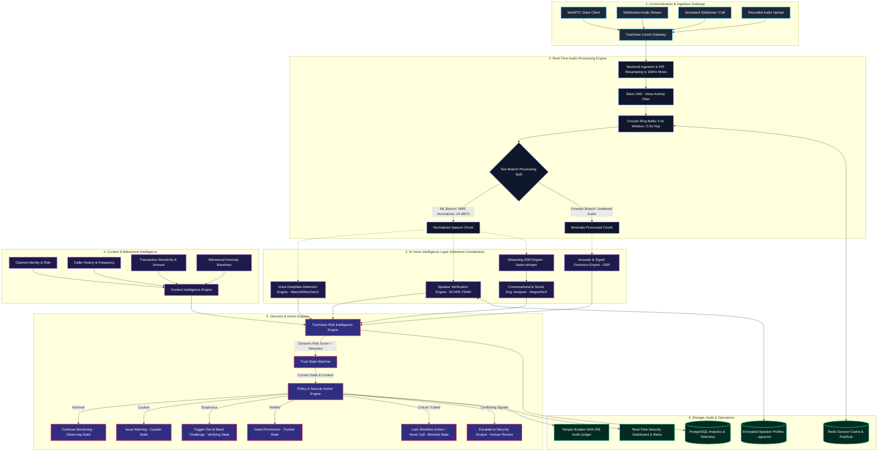
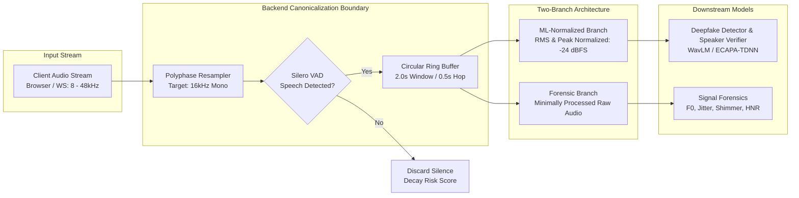
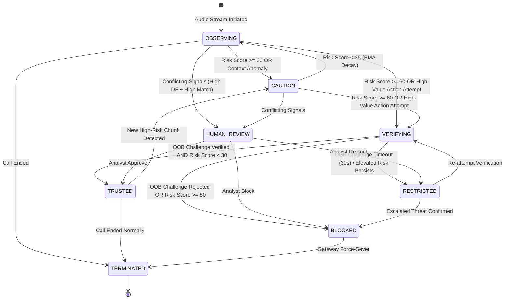
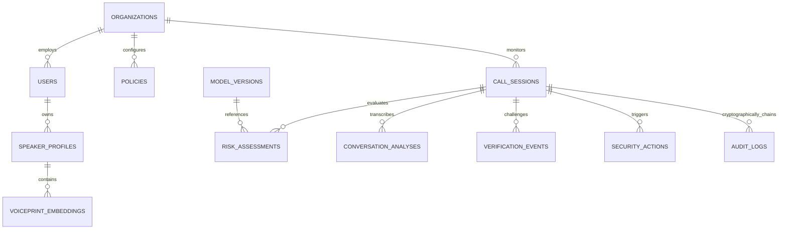
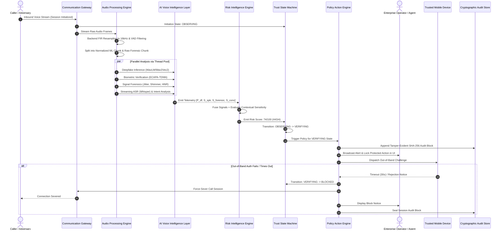

# TrueVoice: AI-Powered Real-Time Voice Integrity & Impersonation Attack Prevention System
## Enterprise High-Level Design (HLD) Document — Version 1.2 (Audited & Scoped)

---

## Document Control Metadata
* **Project Name:** TrueVoice
* **Target System:** Real-Time Voice Integrity & Impersonation Attack Prevention Platform
* **Classification:** Production-Oriented Architecture / SIH Innovation Challenge Specification
* **Status:** Approved Baseline Architecture
* **Target Audience:** Cybersecurity Reviewers, System Architects, SIH Evaluation Committee, ML Engineers

---

# 1. Executive Summary

The democratization of generative neural audio models, diffusion-based text-to-speech (TTS), and real-time voice conversion (VC) algorithms has weaponized voice communications. Attackers can now clone an individual's voice with low latency using short samples of reference audio. This presents acute operational risk across corporate finance, banking operations, government administration, and enterprise contact centers.

**TrueVoice** is an applied voice security and identity intelligence platform. It is explicitly **not** presented as a standalone binary deepfake detector. Instead, TrueVoice enforces a **Zero-Trust Voice Architecture** that treats voice as an untrusted carrier signal. The platform continuously evaluates five independent security vectors:
1. **Acoustic Authenticity:** Neural speech representation artifacts, phase discontinuities, and high-frequency spectral characteristics.
2. **Speaker Verification:** Biometric embedding similarity against enrolled reference profiles.
3. **Signal & Channel Forensics:** Spectral flux, pitch dynamics (F0), jitter, shimmer, harmonic-to-noise ratios (HNR), and device/codec anomalies.
4. **Conversational Intent:** Real-time automatic speech recognition (ASR) coupled with social-engineering intent extraction (urgency, secrecy, authority, credential harvesting).
5. **Contextual & Operational Baselines:** Transaction velocity, beneficiary novelty, call time, and claimed identity parameters.

These continuous telemetry streams feed into the deterministic **TrueVoice Dynamic Risk Intelligence Engine**, which computes an explainable contextual risk score ($R \in [0, 100]$). A decoupled **Policy & Security Action Engine** evaluates tenant-defined rules to trigger operational responses: issuing analyst warnings, initiating out-of-band secondary verification, requesting application-level workflow restrictions, or severing the interaction. All telemetry and decisions are chained into a tamper-evident audit ledger, ensuring evidentiary accountability without storing raw conversational audio.

---

# 2. Problem Definition & Threat Landscape

### 2.1 The Operational Vulnerability
Voice communication has historically relied on implicit trust: operators assume that familiarity of voice equates to authenticity of identity. Generative AI fundamentally invalidates this heuristic:
* **Few-Shot Neural Cloning:** Modern architectures replicate timbre, inflection, and prosody using short audio samples scraped from public recordings.
* **Real-Time Voice Conversion (VC):** Voice conversion pipelines allow an attacker to speak naturally while mapping their vocal tract characteristics to a target profile in real-time calls.
* **Social Engineering Amplification:** Attackers combine cloned voices with pretexting—fabricating emergencies, time-critical wire transfers, or IT credential validations.

### 2.2 Attack Vectors Addressed
```text
┌──────────────────────────────┬──────────────────────────────────────────┬───────────────────────────────────────┐
│ Attack Class                 │ Adversarial Vector                       │ Vulnerability Exploited               │
├──────────────────────────────┼──────────────────────────────────────────┼───────────────────────────────────────┤
│ Neural Voice Cloning         │ Parametric/Diffusion TTS synthesis       │ Human inability to hear latent cues   │
│ Real-Time Voice Conversion   │ Low-latency voice conversion stream      │ Interactive dialogue, dynamic replies │
│ High-Fidelity Replay Attack  │ Genuine audio captured and replayed      │ Defeats standalone deepfake detectors │
│ Social Engineering Pretext   │ Genuine caller voice + malicious request │ Traditional biometric verification    │
│ Impersonation (No AI)        │ Human mimicry or forged credentials      │ Single-factor voice familiarity       │
│ Adversarial Evasion          │ Audio perturbations / noise injection    │ Brittle single-model ML detectors     │
└──────────────────────────────┴──────────────────────────────────────────┴───────────────────────────────────────┘
```

---

# 3. System Objectives & Measurable Engineering Targets

TrueVoice is engineered around strict operational, security, and latency benchmarks. Because this is an applied engineering prototype, all metrics represent **design objectives and validation targets** to be evaluated under empirical test conditions rather than unverified production claims.

### 3.1 Security Objectives
* **Multi-Signal Defense:** Eliminate single points of failure by refusing to make decisions on audio authenticity alone; decisions must synthesize identity, content, and context.
* **Unseen Model Generalization Target:** Formulate deepfake and forensic detection heads capable of identifying synthetic speech generated by unseen architectures and vocoders (evaluated via cross-dataset testing).
* **Explainability:** Output transparent risk breakdowns (radar factors and textual rationale) for human security analysts and compliance officers.

### 3.2 Engineering Design Targets (Validation Goals)
* **Preliminary Latency Target:** Engineering latency budget targets **$\le 450\text{ ms}$** compute latency from chunk ingestion to risk broadcast; actual performance must be validated through profiling on target deployment hardware.
* **Equal Error Rate (EER) Target:** Speaker verification designed to target $\le 2.5\%$ EER under controlled test conditions, with validation planned across typical telephony/VoIP codecs ($8\text{ kHz} - 16\text{ kHz}$).
* **Detection Robustness Target:** Cross-dataset validation target of Area Under the ROC Curve (AUC) $\ge 0.90$ across unseen TTS/VC generators in benchmark suites (e.g., ASVspoof 2021).
* **Concurrency Target:** Target capacity of $\ge 30 - 50$ concurrent bidirectional audio streams per standard GPU-accelerated worker node in benchmark load testing.
* **Graceful Degradation:** Continuous operation under packet loss, network jitter, or individual subsystem failure with deterministic fail-safe fallbacks.

---

# 4. Core Design Principles

TrueVoice adheres to eight foundational architectural tenets:

1. **Zero-Trust Voice Principle:** Never trust an incoming voice stream. A low risk score does NOT equal a "trusted caller"; it merely indicates the absence of active threat telemetry. Trust is an explicit state granted only when positive identity proof and policy requirements are satisfied.
2. **Three-Dimensional Separation:** Explicitly decouple:
   * **Identity Dimension:** `UNVERIFIED` vs `VERIFIED` (Does the voice match the enrolled profile?)
   * **Risk Dimension:** `LOW`, `MODERATE`, `HIGH`, `CRITICAL` (What is the anomaly & intent intensity?)
   * **Trust State Dimension:** `OBSERVING`, `CAUTION`, `VERIFYING`, `TRUSTED`, `RESTRICTED`, `BLOCKED`, `HUMAN_REVIEW` (What is the current session lifecycle state?)
3. **Context-Aware Intent Fusion:** Acoustic analysis without semantic intent is blind. A high deepfake score on a casual greeting requires monitoring; a moderate deepfake score paired with an urgent wire transfer request requires immediate intervention.
4. **Adaptive Policy Enforcement:** Separate the assessment of risk from the action taken. The Risk Engine answers *"How risky is this interaction?"*; the Policy Engine answers *"What action should the organization take?"*.
5. **Human-in-the-Loop Safeguards:** When AI signals present strong internal conflict (e.g., high synthetic probability alongside high speaker match), the system does not make an irreversible automated decision; it transitions to `HUMAN_REVIEW`.
6. **Privacy-by-Design & Ephemeral Processing:** Raw audio is processed in volatile memory buffers, analyzed, and immediately discarded. Only mathematical embeddings, acoustic metrics, and redacted transcripts are retained.
7. **Model-Agnostic Modular AI Layer:** Individual ML models (ASR, speaker verification, synthetic audio detection) are decoupled behind standard interfaces, allowing upgrades without redesigning the platform.
8. **Tamper-Evident Accountability:** Every risk escalation, verification event, and policy action generates a cryptographic record linked across time via an in-database SHA-256 hash chain.

---

# 5. System Scope: MVP vs. Future Enterprise

```text
┌─────────────────────────┬──────────────────────────────────┬───────────────────────────────────────┐
│ Functional Area         │ Phase 1: SIH MVP Prototype Scope │ Phase 2: Enterprise Roadmap Scope     │
├─────────────────────────┼──────────────────────────────────┼───────────────────────────────────────┤
│ Telephony Ingestion     │ WebSocket Streaming, Simulated   │ Carrier SIP/RTP Trunking, PBX         │
│                         │ WebRTC, Audio File Upload        │ Intercept (Kamailio / Asterisk)       │
│ Audio Preprocessing     │ Backend 16kHz FIR Resampling,    │ Hardware DSP Acceleration, Dedicated  │
│                         │ Silero VAD, Two-Branch Pipeline  │ Neural Speech Enhancement             │
│ Deepfake Detection      │ Fine-Tuned Wav2Vec2 / WavLM Head │ Multi-Model Ensemble (WavLM + AASIST) │
│ Speaker Verification    │ ECAPA-TDNN 192-d Embeddings      │ Multi-Session Centroid Adaptation     │
│ Signal Forensics        │ DSP F0, Jitter, Shimmer, HNR     │ Room Impulse Response & Cross-Channel │
│ Speech Recognition      │ faster-whisper INT8 (En / Hi)    │ Multilingual IndicConformer (12+ Lang)│
│ Conversational Intent   │ Regex Trie + NLP Intent Scorer   │ Fine-Tuned LLM Security Co-Pilot      │
│ Risk Architecture       │ In-Process Async Coordinator     │ Redis Streams Distributed Worker Fleet│
│ Policy Enforcement      │ Declarative Policy Evaluator,    │ Core Banking ISO 20022 Integration,   │
│                         │ Simulated UI Transaction Lock    │ Automated PBX Call Termination        │
│ Secondary Verification  │ Simulated Out-of-Band Challenge  │ FIDO2 / WebAuthn Hardware Push        │
│ Audit Ledger            │ In-Database SHA-256 Hash Chain   │ Periodic Public/Consortium Blockchain │
│ Deployment Topology     │ Docker Compose Single Instance   │ Multi-AZ Kubernetes with KEDA Scaling │
└─────────────────────────┴──────────────────────────────────┴───────────────────────────────────────┘
```

---

# 6. Non-Goals

To maintain security integrity and architectural realism, the following are explicitly **out of scope**:
* **Direct Cellular Interception:** TrueVoice does not claim to tap public SS7/cellular carrier networks without carrier-level gateway integration.
* **100% Unconditional Detection Claims:** No ML system can guarantee 100% detection of zero-day generative synthesis. TrueVoice relies on defense-in-depth, context, and secondary verification to mitigate false negatives.
* **Permanent Raw Audio Archival:** TrueVoice will never store unencrypted, raw conversational audio for operational convenience.
* **Autonomous Financial Ledger Reversals:** TrueVoice provides decision-support and initiates application-level locks; it does not directly debit or credit core banking ledgers without banking workflow integration.
* **Psychological/Lie Detection:** The system analyzes linguistic patterns for recognized social engineering indicators; it does not claim to perform pseudo-scientific lie detection.

---

# 7. System Overview

TrueVoice functions as an intelligent inline/sidecar inspection platform. Voice traffic arriving from communication endpoints is routed through the **Communication Gateway**, converted into standardized audio frames, and processed across decoupled analytical pipelines.

The platform continuously streams feature vectors to the **TrueVoice Risk Intelligence Engine**, which updates the call session's trust state machine. The **Policy Engine** evaluates tenant-defined rules against the risk state and triggers security operations. Analysts observe live calls, review alerts, and inspect evidentiary metrics through the **TrueVoice Security Dashboard**.

---

# 8. Architecture Style

TrueVoice leverages an **Asynchronous Modular Pipeline Architecture for the MVP**, engineered with clear separation for horizontal scaling:
* **MVP Pipeline Execution:** Ingestion, buffering, and inference orchestration execute locally via an asynchronous coordination service using a managed thread pool executor for blocking ML workloads.
* **State & Persistence:** Relational entity metadata and audit logs reside in PostgreSQL 16 (with `pgvector` for biometric embeddings); Redis 7 handles ephemeral session caching, ring buffers, and real-time pub/sub telemetry broadcasts.
* **Future Scalability Path:** Redis Streams is designated as the architectural upgrade path to decouple stateless gateways from distributed GPU worker fleets.

---

# 9. High-Level Architecture Diagram



---

# 10. Component Architecture

### 10.1 Communication Gateway
* **Protocol Support:** WebSocket audio streaming (16-bit PCM), simulated WebRTC clients, and secure REST multipart uploads for testing and offline forensic analysis.
* **Session Handshake:** Generates unique cryptographically random `session_id`, authenticates tenant API tokens, validates caller claimed identity, and establishes initial session state.
* **Resilience:** Circuit breakers and backpressure controls drop non-essential frames under network degradation while logging telemetry loss.

### 10.2 Real-Time Audio Processing Engine
* Ingests heterogeneous client sample rates (e.g., 44.1kHz / 48kHz from browser AudioWorklets) and resamples at the backend format boundary to **16 kHz, 16-bit, Single-Channel Mono PCM**.
* Runs Voice Activity Detection (VAD) via Silero VAD to prune non-speech packets (silence, breathing, background noise).
* Splits audio into two dedicated processing branches:
  1. **ML-Normalized Branch:** Peak and RMS volume normalized to $-24\text{ dBFS}$ for transformer and neural embedding models.
  2. **Minimally Processed Forensic Branch:** Raw audio without amplitude normalization to preserve channel, microphone, and shimmer characteristics.

### 10.3 AI Voice Intelligence Cluster
* Houses Deepfake Classifier, Speaker Verifier, Acoustic Extractor, and ASR+NLP engines orchestrated via an asynchronous coordinator managing thread pool workers.

### 10.4 TrueVoice Risk Intelligence Engine (RIE)
* Normalizes heterogeneous inputs into standardized risk vectors, calculates historical moving averages, and handles missing, uncertain, or conflicting signals.

### 10.5 Policy & Security Action Engine (PAE)
* Evaluates dynamic risk against organizationally defined security rules (declarative policies).
* Triggers synchronous interventions (WebSocket control frames to client) and asynchronous events (MFA dispatch, webhook notifications, SOC alerts).

### 10.6 Cryptographic Audit & Evidence Store
* Maintains SHA-256 state-chained audit blocks for every session transition.
* Secures evidentiary records for post-incident forensics and regulatory compliance without requiring mandatory blockchain deployment.

---

# 11. Two-Branch Audio Processing Pipeline



---

# 12. AI Voice Deepfake Detection Engine

The Deepfake Detection Engine evaluates acoustic and latent representations for physical generation artifacts and neural vocoder footprints.

### 12.1 Mathematical & Model Architecture
* **Primary Speech Representation (MVP):** Pre-trained self-supervised model fine-tuned for anti-spoofing (**Wav2Vec 2.0 XLS-R** or **WavLM Base/Large**). These extract deep contextual speech representations sensitive to neural vocoder artifacts.
* **Generalization & Validation Requirements:** Training on academic benchmarks (such as ASVspoof 2021) does not guarantee universal generalization against arbitrary zero-day voice cloning. The detection head requires continuous empirical validation against:
  - Known neural vocoders (HiFi-GAN, WaveGlow, BigVGAN, MelGAN).
  - Unseen commercial zero-shot generators.
  - Lossy telephony/VoIP codecs (Opus, G.711, AMR-WB).
  - High-fidelity acoustic replay conditions.
* **Temporal Smoothing:** Raw chunk probabilities $p_t$ are smoothed using an **Exponential Moving Average (EMA)** with asymmetric attack and decay:
  $$\bar{P}_t = \alpha \cdot p_t + (1 - \alpha) \cdot \bar{P}_{t-1}$$
  where $\alpha = 0.60$ on risk increase (rapid alerting) and $\alpha = 0.20$ on risk decrease (preventing premature all-clear signals).

---

# 13. Speaker Verification Engine

The Speaker Verification Engine resolves whether the incoming voice matches the claimed speaker's pre-enrolled identity.

### 13.1 Acoustic Biometric Architecture
* **Backbone:** **ECAPA-TDNN** (Emphasized Channel Attention, Propagation, and Aggregation Time-Delay Neural Network) via SpeechBrain.
* **Embedding Dimensionality:** 192-dimensional compact speaker embedding vectors.
* **Enrollment Strategy:** Enrollment requires $\ge 3$ distinct speech samples ($5 - 10$ seconds each) captured under verified conditions. The stored profile consists of the **normalized centroid embedding**:
  $$\mathbf{e}_{\text{centroid}} = \frac{\sum_{i=1}^{N} \mathbf{e}_i}{\left\| \sum_{i=1}^{N} \mathbf{e}_i \right\|}$$
* **Score Calibration:** Cosine similarity scores are remapped into a **normalized cosine similarity** score in $[0.0, 1.0]$:
  $$S_{\text{speaker}} = \max\left(0.0, \min\left(1.0, \frac{\text{CosineSim}(\mathbf{e}_{\text{live}}, \mathbf{e}_{\text{ref}}) + 1.0}{2.0}\right)\right)$$
  *Note: This metric represents normalized geometric similarity, not a calibrated posterior probability.*
* **Biometric Data Protection:** Raw enrollment audio is discarded immediately post-vectorization. Speaker embeddings are treated as sensitive biometric-derived data protected through AES-256 encryption at rest, strict tenant isolation, role-based access control, and audited lifecycle deletion.

---

# 14. Acoustic & Signal Forensics Engine

The Forensics Engine operates as an independent, explainable acoustic telemetry layer. It extracts deterministic digital signal processing (DSP) metrics that provide critical corroborating evidence when neural classifiers produce borderline results.

```text
┌──────────────────────────────────────┬──────────────────────────────────────────┬───────────────────────────────────────┐
│ Forensic Metric                      │ Physical Phenomenon Analyzed             │ Synthetic / Cloned Indicators         │
├──────────────────────────────────────┼──────────────────────────────────────────┼───────────────────────────────────────┤
│ Fundamental Frequency (F0) Dynamics  │ Vocal fold vibration & pitch contour     │ Unnatural pitch flattening or leaps   │
│ Jitter (Local, DDP, RAP)             │ Cycle-to-cycle pitch frequency variance  │ Micro-instability absence or excess   │
│ Shimmer (Local, APQ3, APQ5)          │ Cycle-to-cycle wave amplitude variation  │ Robotic amplitude rigidity            │
│ Harmonics-to-Noise Ratio (HNR)       │ Ratio of periodic vocal cord energy      │ High-frequency metallic buzzy noise   │
│ Spectral Flux & Spectral Tilt        │ Rate of spectral frame energy shift      │ Over-smoothed phoneme transitions     │
│ Formant Trajectory Stability (F1-F4) │ Vocal tract resonance dynamics           │ Unphysical formant shape preservation │
│ Spectral Roll-off & Bandwidth        │ Energy cut-off frequency distribution    │ Sharp artificial brick-wall cutoffs   │
└──────────────────────────────────────┴──────────────────────────────────────────┴───────────────────────────────────────┘
```

*All forensic thresholds represent configurable heuristic baselines that must be empirically calibrated across bona fide, synthetic, replayed, and compressed speech.*

---

# 15. Speech & Conversational Intelligence

The Conversational Intelligence layer transcribes the voice stream in real time and evaluates social-engineering indicators.

### 15.1 Real-Time ASR Pipeline (MVP Implementation)
* **Model:** Streaming Whisper (`faster-whisper` INT8 / `base` or `small`).
* **Transcript Privacy:** Transient transcripts in memory are used for real-time intent extraction. Persisted transcripts undergo automated PII redaction before storage.

### 15.2 Social Engineering Heuristics & NLP Scoring
The engine processes sliding transcript windows using regex pattern extractors combined with lightweight intent classifiers targeting:
* **Urgency/Pressure:** *"Right away"*, *"within 10 minutes"*, *"don't hang up"*, *"emergency approval"*.
* **Authority Claims:** *"Per the Chairman's direct orders"*, *"board authorization"*, *"auditor demands"*.
* **Bypass Requests:** *"Skip standard verification"*, *"override the dual-control"*, *"I'll sign later"*.
* **Critical Payloads:** Demands for One-Time Passwords (OTPs), account numbers, wire transfers, credentials.

The output $S_{\text{conv}} \in [0.0, 1.0]$ represents the semantic threat intensity of the dialogue.

---

# 16. Context & Behavioral Intelligence

Context transforms acoustic signals into threat intelligence:
$$S_{\text{context}} = \min\left(1.0, \; w_1 \cdot \text{Sensitivity}(\text{Request}) + w_2 \cdot \text{Novelty}(\text{Beneficiary}) + w_3 \cdot \text{TemporalAnomaly} + w_4 \cdot \text{RoleWeight}\right)$$

Lightweight rule-based evaluation assesses claimed identity privilege, transaction value, beneficiary novelty, off-hours deviation, and caller ANI consistency without requiring heavy LLM dependencies.

---

# 17. TrueVoice Risk Intelligence Engine (RIE)

The **TrueVoice Risk Intelligence Engine** aggregates heterogeneous, asynchronous, and potentially conflicting inputs into a coherent, dynamic risk score $R_t \in [0, 100]$.

### 17.1 Mathematical Formulation of Risk Fusion
Under standard conditions with all signals present, the raw instantaneous risk score is:
$$R_{\text{raw}} = 100 \cdot \left( w_{\text{df}} S_{\text{df}} + w_{\text{spk}} (1 - S_{\text{spk}}) + w_{\text{conv}} S_{\text{conv}} + w_{\text{context}} S_{\text{context}} + w_{\text{forensic}} S_{\text{forensic}} \right) \cdot \Gamma$$

**Standard Baseline Weights ($\sum w_i = 1.0$):**
* $w_{\text{df}} = 0.35$ (Synthetic Voice Probability)
* $w_{\text{spk}} = 0.25$ (Speaker Mismatch Score)
* $w_{\text{conv}} = 0.15$ (Conversational Social Engineering Threat)
* $w_{\text{context}} = 0.15$ (Transaction & Metadata Sensitivity)
* $w_{\text{forensic}} = 0.10$ (Acoustic Forensic Anomaly)

**Handling Missing or Unavailable Signals:**
* If a signal is unavailable (e.g., claimed speaker is unenrolled, ASR fails, or audio is silent), the system does **not** insert an arbitrary pseudo-risk value.
* Instead, the unavailable signal is omitted and remaining active weights re-normalize dynamically:
  $$w'_j = \frac{w_j}{\sum_{k \in \mathcal{A}} w_k}$$
* If the speaker profile is un-enrolled, Identity is flagged as `UNVERIFIED`, strictly preventing the session from transitioning to `TRUSTED`.

**Non-Linear Compounding Threat Multiplier ($\Gamma$):**
If synthetic probability is high ($S_{\text{df}} \ge 0.85$) **and** conversational threat is elevated ($S_{\text{conv}} \ge 0.70$), a non-linear multiplier ($\Gamma = 1.35$, bounded to max 100) triggers immediately.

---

# 18. Zero-Trust State Machine & Policy Engine

### 18.1 Deterministic Trust State Machine
TrueVoice enforces an explicit Zero-Trust lifecycle. A low risk score does **not** grant trust; it merely keeps the session in `OBSERVING`. Only explicit verification grants `TRUSTED` status.



### 18.2 Risk Tiers (Decision-Support Categorization)
* **$0 - 29$ (LOW):** No Significant Risk Detected. Baseline nominal monitoring.
* **$30 - 59$ (MODERATE):** Caution. Elevated telemetry sampling; yellow operator warning.
* **$60 - 79$ (HIGH):** Enhanced Verification Required. Out-of-band secondary verification challenge triggered; workflow actions locked.
* **$80 - 100$ (CRITICAL):** Immediate Security Action Required. Forcible call severing, simulated transaction lock, high-priority SOC alert.

---

# 19. Secondary Verification System (Out-of-Band Workflows)

When an interaction triggers elevated risk ($R_t \ge 60$) or initiates a privileged workflow, TrueVoice activates the **Independent Secondary Verification Workflow**.

### 19.1 Verification Modalities
1. **Out-of-Band (OOB) Authentication Ceremony:**
   * High-level flow: Registered trusted device $\to$ WebAuthn/FIDO2 authentication ceremony $\to$ challenge + authenticator response $\to$ server validates credential, origin, and signature requirements $\to$ verification result.
   * *MVP Scope:* Simulated out-of-band challenge with signed nonce validation; real hardware-enclave WebAuthn is an enterprise roadmap feature.
2. **Dynamic In-Band Acoustic Challenge-Response:**
   * The operator prompts the caller with a randomized phonetically balanced phrase: *"Repeat phrase: Horizon Echo 42"*.
   * Increases the difficulty of replay and pre-generated audio attacks because the response must be generated dynamically after the challenge; effectiveness depends on attacker synthesis latency and soundboard agility.
3. **Automated Secure Callback:** Gateway severs inbound call and initiates a direct encrypted call to the registered enterprise directory number.

---

# 20. Real-Time Streaming Latency Taxonomy & Budget

To maintain clarity between accumulation delays and processing speed, TrueVoice defines three distinct latency metrics:
1. **Audio Accumulation Latency:** $2.0\text{ seconds}$ required to collect the initial sliding window.
2. **Detection Update Interval:** $0.5\text{ seconds}$ (hop size) producing 2 risk updates per second.
3. **Compute Latency (Inference Pipeline):** Time required to process a 2.0s window through models:

```text
┌──────────────────────────────────────┬────────────────────────┬──────────────────────────────────────────┐
│ Pipeline Stage                       │ Preliminary Budget     │ Optimization Mechanism                   │
├──────────────────────────────────────┼────────────────────────┼──────────────────────────────────────────┤
│ Audio Ingestion & FIR Resampling     │ 15 ms                  │ Zero-copy buffer, C++ libsamplerate      │
│ Silero VAD Filtering (ONNX)          │ 10 ms                  │ ONNX Runtime CPU execution               │
│ Deepfake Inference (WavLM/Wav2Vec2)  │ 120 ms                 │ INT8/FP16 TorchScript on GPU             │
│ Speaker Verification (ECAPA-TDNN)    │ 45 ms                  │ Vectorized TorchScript embedding         │
│ Signal Forensics Extraction (DSP)    │ 25 ms                  │ NumPy / SciPy signal processing          │
│ Streaming ASR (Whisper INT8)         │ 110 ms                 │ Chunked faster-whisper beam search       │
│ NLP Intent & Context Evaluation      │ 20 ms                  │ Regex pattern trie + distilled model     │
│ Risk Scoring & State Machine         │ 10 ms                  │ In-memory state + matrix math            │
│ WebSocket Broadcast                  │ 15 ms                  │ Non-blocking async event loop            │
├──────────────────────────────────────┼────────────────────────┼──────────────────────────────────────────┤
│ TOTAL END-TO-END COMPUTE BUDGET      │ 370 ms                 │ Target budget comfortably under 450 ms   │
└──────────────────────────────────────┴────────────────────────┴──────────────────────────────────────────┘
```
*Note: All latency figures represent preliminary engineering design budgets to be empirically validated through benchmarking on target hardware.*

---

# 21. Database Architecture & Data Modeling

TrueVoice utilizes **PostgreSQL 16** with **`pgvector`** for persistent relational and biometric data, paired with **Redis 7** for ephemeral session caching and real-time pub/sub.



---

# 22. API Architecture

### 22.1 REST API Specification
* `POST /v1/auth/login` — Authenticate operators and security analysts (JWT).
* `POST /v1/speakers/enroll` — Submit reference speech samples to generate an encrypted biometric profile.
* `GET  /v1/speakers/{id}` — Retrieve speaker profile metadata (biometric vectors are never exposed).
* `POST /v1/sessions/create` — Initialize a monitored call session and obtain WebSocket session credentials.
* `GET  /v1/sessions/{session_id}/risk` — Retrieve current risk state, trust state, and historical trajectory.
* `POST /v1/verify/challenge` — Trigger an out-of-band verification challenge.
* `POST /v1/verify/response` — Validate verification response and transition trust state.
* `POST /v1/sessions/{session_id}/action` — Dispatch security action (lock workflow, terminate, escalate).
* `GET  /v1/audit/events` — Query audit chain records by session.

### 22.2 Real-Time Streaming WebSocket Protocol (`/v1/stream/{session_id}`)
* Binary PCM16 audio chunks streamed client-to-server; JSON risk telemetry broadcast server-to-client.
* *Security Hardening:* While token query parameters are used for MVP development convenience, production hardening requires short-lived ticket-based or handshake header authentication.

---

# 23. Authentication, Authorization & RBAC

Every session lookup and API interaction strictly follows the four-tier authorization hierarchy:
$$\text{Authenticated User} \longrightarrow \text{Organization / Tenant Authorization} \longrightarrow \text{Resource Ownership Check} \longrightarrow \text{Session Access Granted}$$

Roles supported: `OPERATOR`, `SECURITY_ANALYST`, `ORG_ADMIN`, `FORENSIC_AUDITOR`.

---

# 24. Privacy-by-Design Architecture

* **Ephemeral In-Memory Buffers:** Live audio is held strictly in volatile RAM ring buffers and purged immediately post-feature extraction.
* **Biometric Embedding Protection:** Speaker profiles consist of 192-dimensional latent mathematical representations protected via AES-256-GCM encryption at rest, tenant isolation, and strict access controls.
* **PII Redaction in Transcripts:** The streaming ASR pipeline redacts sensitive financial and identification entities before transcript persistence.

---

# 25. Cybersecurity & System Hardening

* Mandatory TLS 1.3 encryption in transit.
* Bounded memory allocation to prevent buffer exhaustion attacks.
* Adversarial audio testing evaluates model robustness against synthetic perturbation noise.

---

# 26. Audit & Tamper-Evident Evidence Layer

Every security-relevant event appends a cryptographically chained block to the audit log:
$$\text{Hash}_i = \text{SHA-256}\left(\text{Hash}_{i-1} \parallel \text{Timestamp}_i \parallel \text{SessionID} \parallel \text{TrustState}_i \parallel \text{RiskSnapshot}_i \parallel \text{ActionEnforced}_i \parallel \text{ModelVersion}_i\right)$$

* **Tamper-Evident Posture:** A database administrator can theoretically modify database records; however, modifying any previous record breaks the cryptographic SHA-256 chain, providing immediate proof of tampering.
* **Core Detection Independence:** The entire real-time detection, risk scoring, and audit chain operates autonomously without blockchain dependencies.
* **Future Blockchain Anchoring:** Terminal session hashes may optionally be anchored to a public or enterprise distributed ledger as a post-session notary feature. Raw audio and biometric vectors are **never** placed on-chain.

---

# 27. Alerting & Security Dashboard Architecture

The **TrueVoice Operations Center** delivers real-time situational awareness: live call risk gauge ($0-100$), Trust State badge (`OBSERVING`, `CAUTION`, `VERIFYING`, `TRUSTED`, `RESTRICTED`, `BLOCKED`, `HUMAN_REVIEW`), factor radar chart, verbatim transcripts, and an incident chronology log.

---

# 28. Multilingual & Regional Accent Architecture

* **Acoustic Anti-Spoofing Independence:** Neural vocoder artifacts and phase discontinuities operate largely independently of spoken language.
* **ASR Model Routing:** Whisper-based transcription handles English and Hindi code-switching (Hinglish). Multilingual Indic-dialect expansion is preserved as a post-MVP roadmap capability.

---

# 29. Anti-Replay & Physical Playback Defense

TrueVoice explicitly distinguishes:
1. AI-Generated Synthetic Speech (neural vocoder cues).
2. Genuine Live Speaker (organic micro-tremors, dynamic responses).
3. Replayed Genuine Recording (loudspeaker double-convolution, high-frequency driver cutoffs).
4. Spliced/Manipulated Recording (boundary phase discontinuities).
5. Degraded Channel Audio (telephony compression).

---

# 30. Failure Handling & Graceful Degradation (Fail-Safe Strategy)

Deterministic fail-safe security posture: **system failure never defaults to a trusted state**.
* ASR failure $\to$ Conversational threat marked `UNKNOWN`; active weights dynamically re-normalize.
* Unenrolled speaker $\to$ Identity marked `UNVERIFIED`; session prohibited from entering `TRUSTED`.
* Conflicting AI signals $\to$ Session transitions to `HUMAN_REVIEW`.

---

# 31. Scalability & Elastic Inference Architecture

* MVP uses an in-process asynchronous coordinator with managed thread pool executors.
* Future enterprise scalability leverages Redis Streams to distribute audio chunks to partitioned worker fleets.

---

# 32. Deployment Architecture (Development vs. Production)

* **SIH MVP Deployment:** Single-node Docker Compose (`FastAPI Backend`, `PostgreSQL 16 + pgvector`, `Redis 7`, `Next.js 14 Frontend`).
* **Enterprise Roadmap Deployment:** Multi-AZ Kubernetes cluster with ingress load balancing and isolated GPU node pools.

---

# 33. Technology Stack Justification Matrix

* **Backend:** Python 3.11, FastAPI (High-speed ASGI async I/O).
* **AI/ML:** PyTorch, SpeechBrain (ECAPA-TDNN), faster-whisper, SciPy/librosa.
* **Persistence:** PostgreSQL 16 with `pgvector` (ACID transactions + HNSW vector indexing), Redis 7 (Session cache & pub/sub).
* **Frontend:** Next.js 14, React, TypeScript, Tailwind CSS, Web Audio API `AudioWorklet`.

---

# 34. Complete End-to-End Data Flow



---

# 35. End-to-End Attack Scenarios & Walkthroughs

Walkthroughs for **Executive Voice Clone Wire Request** and **Spliced Replay Attack** demonstrate multi-signal defense, out-of-band challenge triggering, and simulated transaction locking.

---

# 36. Architectural Decisions & Trade-Offs (ADR Summary)

* **ADR-01 (Ephemeral Audio vs Permanent Storage):** Purge raw audio chunks immediately post-inference; store only mathematical embeddings and redacted transcripts. Eliminates biometric liability under GDPR/DPDP.
* **ADR-02 (2.0s Sliding Window with 0.5s Hop):** Balances phonemic context with sub-second alerting intervals.
* **ADR-03 (Two-Branch Preprocessing):** Prevents amplitude normalization from corrupting forensic DSP micro-variations.
* **ADR-04 (In-Database Hash Chaining vs Blockchain Core):** Uses SHA-256 hash chains in PostgreSQL for lightweight auditability; blockchain anchoring is strictly an optional external notary.

---

# 37. HLD to LLD Traceability & Transition

Every component in this HLD corresponds directly to concrete classes, schemas, and endpoints specified in [`docs/LLD.md`](file:///c:/Projects/SIH/docs/LLD.md).
