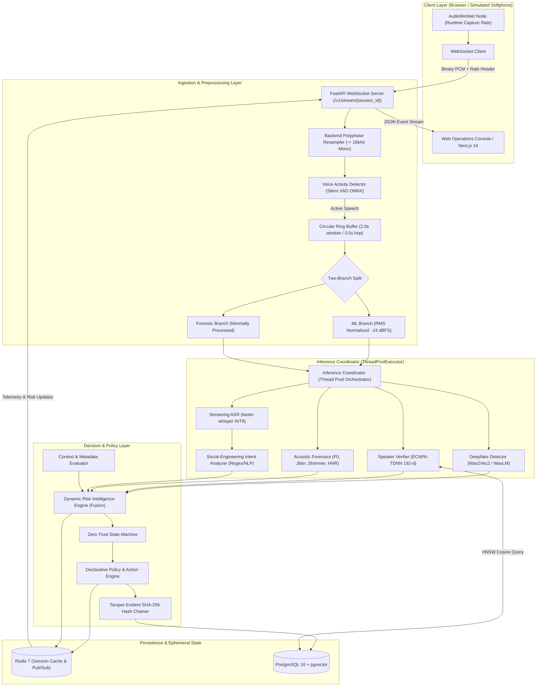

# Low-Level Design (LLD): TrueVoice
## AI-Powered Real-Time Voice Integrity & Impersonation Attack Prevention System
### Document Version: 1.2.0-SCOPED (Implementation-Ready Baseline)

---

### Document Control & Metadata

| Attribute | Specification |
| :--- | :--- |
| **Project Name** | TrueVoice |
| **Document Type** | Low-Level Design (LLD) Document |
| **Document Version**| 1.2.0-SCOPED |
| **Status** | Approved for Implementation |
| **Target Platforms** | Linux (Ubuntu 22.04 LTS / Debian 12), Containerized (Docker Compose / Single VM) |
| **Language Runtimes** | Python 3.11+ (Backend / ML Workers), Node.js v20 LTS (Frontend Console) |
| **Primary Frameworks**| FastAPI, PyTorch, SpeechBrain, faster-whisper, Next.js 14, Tailwind CSS |
| **Classification** | Enterprise Security Architecture / SIH Innovation Challenge Baseline |

---

## Table of Contents
1. [Executive Summary & Architectural Baseline](#1-executive-summary--architectural-baseline)
2. [Concrete Project Directory Layout (MVP)](#2-concrete-project-directory-layout-mvp)
3. [Subsystem 1: Audio Ingestion, Sample-Rate Negotiation & Preprocessing](#3-subsystem-1-audio-ingestion-sample-rate-negotiation--preprocessing)
4. [Subsystem 2: Parallel AI/ML Inference & Feature Extraction Pipeline](#4-subsystem-2-parallel-aiml-inference--feature-extraction-pipeline)
5. [Subsystem 3: Context & Behavioral Intelligence Engine](#5-subsystem-3-context--behavioral-intelligence-engine)
6. [Subsystem 4: Dynamic Risk Intelligence & Multi-Signal Fusion](#6-subsystem-4-dynamic-risk-intelligence--multi-signal-fusion)
7. [Subsystem 5: Zero-Trust State Machine & Declarative Policy Engine](#7-subsystem-5-zero-trust-state-machine--declarative-policy-engine)
8. [Subsystem 6: Secondary Verification & Out-of-Band Workflows](#8-subsystem-6-secondary-verification--out-of-band-workflows)
9. [Subsystem 7: Database Persistence & Vector Schema (PostgreSQL + pgvector)](#9-subsystem-7-database-persistence--vector-schema-postgresql--pgvector)
10. [Subsystem 8: API & Streaming Protocol Specifications (REST & WebSockets)](#10-subsystem-8-api--streaming-protocol-specifications-rest--websockets)
11. [Subsystem 9: Cryptographic Audit Ledger & Tamper Evidence](#11-subsystem-9-cryptographic-audit-ledger--tamper-evidence)
12. [Subsystem 10: Frontend Operations Console & AudioWorklet Client](#12-subsystem-10-frontend-operations-console--audioworklet-client)
13. [Subsystem 11: Failure Handling, Signal Conflicts & Fail-Safe Mitigations](#13-subsystem-11-failure-handling-signal-conflicts--fail-safe-mitigations)
14. [Subsystem 12: Engineering Latency Budgets & Validation Checklist](#14-subsystem-12-engineering-latency-budgets--validation-checklist)

---

## 1. Executive Summary & Architectural Baseline

TrueVoice is an applied voice security and identity intelligence platform that continuously evaluates voice authenticity, biometric speaker identity, conversational intent, signal forensics, and operational context to detect and mitigate voice cloning and impersonation attacks.

### 1.1 Architectural Scope Distinction
* **Implemented in SIH MVP**: Streaming audio ingestion over WebSockets, runtime sample-rate canonicalization, two-branch preprocessing (ML-normalized vs minimally processed forensic branch), Silero VAD, fine-tuned Wav2Vec 2.0 / WavLM deepfake detection head, ECAPA-TDNN speaker verification, DSP acoustic forensics, faster-whisper streaming ASR, rule-based social-engineering intent extraction, rule-based context intelligence, multi-signal risk fusion with temporal smoothing, deterministic Zero-Trust State Machine with human review exits, declarative policy action evaluator, simulated out-of-band verification challenge, simulated application workflow locking, PostgreSQL with pgvector, and in-database SHA-256 hash-chained audit logging.
* **Future Enterprise Scope**: AASIST graph neural network ensembles, carrier-grade SIP/RTP PBX trunking (Kamailio / Asterisk), multi-lingual Dravidian IndicConformer models, hardware-backed FIDO2 mobile enclave integration, ISO 20022 banking core API connectors, Redis Streams distributed worker clusters, and external blockchain anchor notaries.

### 1.2 End-to-End Component Flow (MVP In-Process Execution)



---

## 2. Concrete Project Directory Layout (MVP)

```text
truevoice/
├── backend/
│   ├── app/
│   │   ├── __init__.py
│   │   ├── main.py                     # FastAPI application factory & lifespan
│   │   ├── api/
│   │   │   ├── __init__.py
│   │   │   ├── v1/
│   │   │   │   ├── auth.py             # Login, JWT issuance, RBAC dependencies
│   │   │   │   ├── sessions.py         # Session lifecycle management
│   │   │   │   ├── speakers.py         # Biometric speaker profile enrollment
│   │   │   │   ├── verify.py           # Out-of-band verification challenge endpoints
│   │   │   │   ├── audit.py            # Audit ledger verification & query endpoints
│   │   │   │   └── websocket.py        # Streaming audio ingest & broadcast endpoint
│   │   ├── core/
│   │   │   ├── config.py               # Pydantic v2 settings & environment variables
│   │   │   ├── database.py             # SQLAlchemy 2.0 async engine & sessionmaker
│   │   │   ├── redis.py                # Redis client connection pool
│   │   │   └── security.py             # Password hashing, JWT token validation
│   │   ├── models/                     # SQLAlchemy ORM entity models
│   │   │   ├── organization.py
│   │   │   ├── user.py
│   │   │   ├── speaker_profile.py
│   │   │   ├── call_session.py
│   │   │   ├── risk_assessment.py
│   │   │   ├── conversation.py
│   │   │   ├── verification_event.py
│   │   │   ├── security_action.py
│   │   │   ├── model_version.py
│   │   │   └── audit_log.py
│   │   ├── schemas/                    # Pydantic validation models (DTOs)
│   │   │   ├── session.py
│   │   │   ├── speaker.py
│   │   │   ├── telemetry.py
│   │   │   ├── policy.py
│   │   │   └── audit.py
│   │   ├── services/                   # Business logic layer
│   │   │   ├── session_service.py
│   │   │   ├── enrollment_service.py
│   │   │   └── verification_service.py
│   │   ├── ml/                         # AI & Digital Signal Processing adapters
│   │   │   ├── audio_buffer.py         # Circular audio buffer & windowing
│   │   │   ├── resampler.py            # Polyphase FIR resampler (client -> 16kHz)
│   │   │   ├── vad.py                  # Silero VAD ONNX wrapper
│   │   │   ├── deepfake_detector.py    # Wav2Vec2 / WavLM classification head
│   │   │   ├── speaker_verifier.py     # SpeechBrain ECAPA-TDNN 192-d extractor
│   │   │   ├── forensics.py            # DSP Jitter, Shimmer, HNR, F0 extractor
│   │   │   ├── asr_engine.py           # faster-whisper streaming transcription
│   │   │   ├── intent_analyzer.py      # Regex trie + lightweight NLP classifier
│   │   │   └── coordinator.py          # Thread pool executor for blocking inference
│   │   ├── context/
│   │   │   └── engine.py               # Rule-based context & metadata risk scorer
│   │   ├── risk/
│   │   │   ├── engine.py               # Multi-signal mathematical fusion & EMA
│   │   │   └── normalizer.py           # Dynamic weight re-normalization
│   │   ├── policy/
│   │   │   ├── state_machine.py        # Zero-Trust State Machine implementation
│   │   │   └── engine.py               # Declarative tenant policy evaluator
│   │   ├── audit/
│   │   │   ├── hasher.py               # Canonical JSON & SHA-256 block chainer
│   │   │   └── verifier.py             # Chain integrity validation script
│   │   └── utils/
│   │       └── logging.py              # Structured JSON logging
│   ├── tests/
│   │   ├── test_audio_buffer.py
│   │   ├── test_risk_engine.py
│   │   ├── test_state_machine.py
│   │   └── test_audit_chain.py
│   ├── Dockerfile
│   └── requirements.txt
├── frontend/
│   ├── app/
│   │   ├── layout.tsx
│   │   ├── page.tsx
│   │   └── dashboard/
│   │       ├── page.tsx                # Active calls overview
│   │       └── live/[id]/page.tsx      # Real-time monitored session console
│   ├── components/
│   │   ├── AudioSpectrumVisualizer.tsx
│   │   ├── DynamicRiskGauge.tsx
│   │   ├── FactorBreakdownRadar.tsx
│   │   ├── IncidentTimeline.tsx
│   │   ├── SecurityActionPanel.tsx
│   │   └── TrustStateBadge.tsx
│   ├── hooks/
│   │   ├── useAudioStream.ts           # WebAudio API AudioWorklet hook
│   │   └── useSessionRisk.ts           # WebSocket telemetry listener
│   ├── public/
│   │   └── truevoice-worklet.js        # Runtime capture AudioWorkletProcessor script
│   ├── types/
│   │   └── telemetry.ts
│   ├── package.json
│   └── Dockerfile
├── infra/
│   ├── docker-compose.yml              # Complete multi-service local deployment
│   ├── postgres/
│   │   └── init.sql                    # Initial schema DDL and pgvector extension
│   └── nginx/
│       └── default.conf                # Reverse proxy for REST & WebSockets
└── README.md
```

---

## 3. Subsystem 1: Audio Ingestion, Sample-Rate Negotiation & Preprocessing

### 3.1 Runtime Sample-Rate Negotiation & Backend Canonicalization
* **Browser Capture Reality:** Web browsers capture audio at the operating system's hardware rate (commonly 44,100 Hz or 48,000 Hz). The client AudioWorklet captures samples at the native `sampleRate` and streams signed 16-bit linear PCM frames along with a handshake header specifying the source rate.
* **Backend Format Boundary:** The backend receives raw PCM frames and executes polyphase FIR resampling using `scipy.signal.resample_poly` or C++ `libsamplerate` to convert incoming audio to the internal master standard: **16,000 Hz, 16-bit Signed Linear PCM, Mono channel**.
* **Sliding Window Sizing:**
  - Window Size: $2.0 \text{ seconds}$ ($32,000 \text{ samples} @ 16\text{kHz}$).
  - Stride / Hop Size: $0.5 \text{ seconds}$ ($8,000 \text{ samples}$).
  - Refresh Rate: $2.0 \text{ updates / second}$.

### 3.2 Two-Branch Audio Processing Pipeline
To prevent artificial volume adjustments from corrupting delicate forensic micro-tremors:
1. **ML-Normalized Branch:** Audio chunks destined for deepfake detection (Wav2Vec2/WavLM), speaker verification (ECAPA-TDNN), and ASR (Whisper) are scaled via Root Mean Square (RMS) normalization to $-24\text{ dBFS}$ with a $-1.0\text{ dBFS}$ peak limiter.
2. **Minimally Processed Forensic Branch:** Audio chunks routed to the Acoustic Forensics Engine (F0, Jitter, Shimmer, HNR) bypass amplitude normalization, preserving the natural physical dynamics and transmission artifacts.

```python
# backend/app/ml/audio_buffer.py
import numpy as np
from typing import Tuple, Optional

class CircularAudioBuffer:
    def __init__(self, capacity_seconds: float = 10.0, sample_rate: int = 16000):
        self.capacity: int = int(capacity_seconds * sample_rate)
        self.sample_rate: int = sample_rate
        self.buffer: np.ndarray = np.zeros(self.capacity, dtype=np.float32)
        self.write_head: int = 0
        self.available_samples: int = 0

    def write_pcm16_samples(self, samples: np.ndarray) -> None:
        """Writes float32 [-1.0, 1.0] samples into the ring buffer."""
        n = len(samples)
        if n == 0:
            return
        if n >= self.capacity:
            samples = samples[-self.capacity:]
            n = self.capacity

        end_head = (self.write_head + n) % self.capacity
        if self.write_head + n <= self.capacity:
            self.buffer[self.write_head : self.write_head + n] = samples
        else:
            first_part = self.capacity - self.write_head
            self.buffer[self.write_head :] = samples[:first_part]
            self.buffer[:end_head] = samples[first_part:]

        self.write_head = end_head
        self.available_samples = min(self.capacity, self.available_samples + n)

    def extract_two_branch_window(self, window_seconds: float = 2.0) -> Optional[Tuple[np.ndarray, np.ndarray]]:
        """
        Extracts synchronized audio chunks for both branches:
        Returns: (normalized_ml_chunk, raw_forensic_chunk)
        """
        window_samples = int(window_seconds * self.sample_rate)
        if self.available_samples < window_samples:
            return None

        start_head = (self.write_head - window_samples) % self.capacity
        if start_head + window_samples <= self.capacity:
            raw_chunk = self.buffer[start_head : start_head + window_samples].copy()
        else:
            first_len = self.capacity - start_head
            raw_chunk = np.concatenate([
                self.buffer[start_head:],
                self.buffer[: window_samples - first_len]
            ])

        # Forensic Branch: Raw unaltered audio chunk
        forensic_chunk = raw_chunk.copy()

        # ML Branch: Peak and RMS normalized to -24 dBFS
        rms = np.sqrt(np.mean(raw_chunk**2) + 1e-9)
        target_rms = 10.0 ** (-24.0 / 20.0)
        gain = target_rms / rms
        normalized_chunk = np.clip(raw_chunk * gain, -1.0, 1.0)

        return normalized_chunk, forensic_chunk
```

---

## 4. Subsystem 2: Parallel AI/ML Inference & Feature Extraction Pipeline

### 4.1 Asynchronous Execution via ThreadPoolExecutor
Running PyTorch and NumPy operations directly inside an `async def` coroutine blocks the asyncio event loop. The `InferenceCoordinator` uses `loop.run_in_executor` with a managed `concurrent.futures.ThreadPoolExecutor` to execute blocking ML workloads concurrently without event loop starvation:

```python
# backend/app/ml/coordinator.py
import asyncio
from concurrent.futures import ThreadPoolExecutor
from typing import Dict, Any, Optional
import numpy as np

class InferenceCoordinator:
    def __init__(self, deepfake_detector, speaker_verifier, forensics_analyzer, asr_engine, intent_analyzer):
        self.df = deepfake_detector
        self.sv = speaker_verifier
        self.af = forensics_analyzer
        self.asr = asr_engine
        self.nlp = intent_analyzer
        self.executor = ThreadPoolExecutor(max_workers=4)

    async def coordinate_chunk_inference(self, ml_chunk: np.ndarray, forensic_chunk: np.ndarray, 
                                         claimed_speaker_id: Optional[str]) -> Dict[str, Any]:
        loop = asyncio.get_running_loop()

        # Dispatch CPU/GPU blocking calls into thread pool
        task_df = loop.run_in_executor(self.executor, self.df.predict, ml_chunk)
        task_sv = loop.run_in_executor(self.executor, self.sv.verify, ml_chunk, claimed_speaker_id)
        task_af = loop.run_in_executor(self.executor, self.af.analyze, forensic_chunk)
        task_asr = loop.run_in_executor(self.executor, self.asr.transcribe, ml_chunk)

        df_res, sv_res, af_res, asr_res = await asyncio.gather(task_df, task_sv, task_af, task_asr)

        # NLP intent evaluation on the resulting transcript
        intent_res = self.nlp.evaluate(asr_res.transcript)

        return {
            "deepfake": df_res,
            "speaker": sv_res,
            "forensics": af_res,
            "asr": asr_res,
            "intent": intent_res
        }
```

### 4.2 Deepfake Detection Engine (`DeepfakeDetector`)
* **Model Baseline**: Pretrained **Wav2Vec 2.0 XLS-R** or **WavLM** with a mean-pooling transformer classification head, fine-tuned on binary bonafide vs spoof datasets.
* **Output**: Synthetic voice probability $P_{\text{synth}} \in [0.0, 1.0]$.
* **Validation Requirement**: Generalization must be validated across known neural vocoders, unseen zero-shot generators, lossy codecs (Opus, G.711), and acoustic replay conditions.

### 4.3 Speaker Verification Engine (`SpeakerVerifier`)
* **Model Baseline**: **ECAPA-TDNN** (SpeechBrain) generating 192-dimensional embeddings.
* **Enrollment Profile**: Calculates normalized centroid $\mathbf{e}_{\text{centroid}}$ over $\ge 3$ reference samples.
* **Metric**: **Normalized cosine similarity** in $[0.0, 1.0]$:
  $$S_{\text{speaker}} = \max\left(0.0, \min\left(1.0, \frac{\text{CosineSim}(\mathbf{e}_{\text{live}}, \mathbf{e}_{\text{ref}}) + 1.0}{2.0}\right)\right)$$
  *(Explicitly designated as normalized geometric similarity, not calibrated posterior probability).*

### 4.4 Acoustic Forensics Engine (`ForensicAnalyzer`)
Extracts explainable DSP metrics from the raw forensic chunk:
* **Fundamental Frequency ($F_0$) Contour Dynamics:** Evaluated via pYIN.
* **Jitter (Local):** Cycle-to-cycle frequency variation.
* **Shimmer (Local):** Cycle-to-cycle amplitude variation.
* **Harmonics-to-Noise Ratio (HNR):** Periodic vocal cord energy ratio.
* *All detection thresholds are configurable heuristic baselines to be calibrated empirically.*

### 4.5 Streaming ASR & Intent Analysis
* **ASR**: `faster-whisper` INT8 running on the ML-normalized audio chunk.
* **Intent Analyzer**: Regex trie parsing sliding transcript windows for urgency, authority claims, credential solicitation, and wire transfer payloads, outputting $S_{\text{conv}} \in [0.0, 1.0]$.

---

## 5. Subsystem 3: Context & Behavioral Intelligence Engine

The `ContextEngine` evaluates operational and transactional metadata surrounding the call without requiring heavy LLM dependencies:

```python
# backend/app/context/engine.py
from dataclasses import dataclass
from typing import Dict, Any, List

@dataclass
class ContextResult:
    context_score: float         # Range: [0.0, 1.0]
    risk_factors: List[str]

class ContextEngine:
    def evaluate(self, request_context: Dict[str, Any], session_context: Dict[str, Any]) -> ContextResult:
        factors = []
        score = 0.0

        amount = float(request_context.get("amount", 0.0))
        if amount >= 1000000.0:  # >= ₹10 Lakh / $12,000
            score += 0.35
            factors.append(f"High-value financial request ({amount:,.2f})")
        elif amount > 250000.0:
            score += 0.15
            factors.append(f"Elevated financial request ({amount:,.2f})")

        if request_context.get("beneficiary_is_new", False):
            score += 0.30
            factors.append("Transfer requested to unfamiliar beneficiary account")

        if session_context.get("is_off_hours", False):
            score += 0.15
            factors.append("Call initiated outside normal operational business hours")

        if not session_context.get("caller_ani_matches_profile", True):
            score += 0.20
            factors.append("Caller ANI / CLI mismatch with registered contact directory")

        return ContextResult(
            context_score=min(1.0, score),
            risk_factors=factors
        )
```

---

## 6. Subsystem 4: Dynamic Risk Intelligence & Multi-Signal Fusion

### 6.1 Mathematical Formulation of Risk Fusion
Under standard conditions with all 5 signals available:
$$R_{\text{raw}} = 100 \cdot \left( w_{\text{df}} S_{\text{df}} + w_{\text{spk}} (1.0 - S_{\text{speaker}}) + w_{\text{conv}} S_{\text{conv}} + w_{\text{context}} S_{\text{context}} + w_{\text{forensic}} S_{\text{forensic}} \right) \cdot \Gamma$$

**Standard Baseline Weights ($\sum w_i = 1.0$):**
* $w_{\text{df}} = 0.35$ (Synthetic Voice Probability)
* $w_{\text{spk}} = 0.25$ (Speaker Mismatch Score)
* $w_{\text{conv}} = 0.15$ (Conversational Threat Score)
* $w_{\text{context}} = 0.15$ (Transaction & Metadata Sensitivity)
* $w_{\text{forensic}} = 0.10$ (Acoustic Forensic Anomaly Score)

### 6.2 Handling Missing Signals (Dynamic Re-Normalization)
If a signal is unavailable (e.g., claimed speaker is unenrolled, ASR stream fails, or audio is silent), TrueVoice does **not** insert an arbitrary pseudo-risk value (e.g. 0.30). Instead, the unavailable signal is omitted and remaining active weights $\mathcal{A}$ dynamically re-normalize:
$$w'_j = \frac{w_j}{\sum_{k \in \mathcal{A}} w_k}$$
* If claimed identity is unenrolled, Identity is flagged as `UNVERIFIED`; the session cannot transition to `TRUSTED` state regardless of how low $R_{\text{raw}}$ is.

### 6.3 Non-Linear Compounding Multiplier ($\Gamma$)
If synthetic probability is elevated ($S_{\text{df}} \ge 0.85$) **and** conversational intent indicates malicious activity ($S_{\text{conv}} \ge 0.70$):
$$\Gamma = 1.35 \quad (\text{bounded such that } R_{\text{raw}} \le 100.0)$$

### 6.4 Asymmetric Temporal Smoothing (EMA)
$$R_t = \alpha \cdot R_{\text{raw}} + (1 - \alpha) \cdot R_{t-1}$$
$$\alpha = \begin{cases} 
0.60 & \text{if } R_{\text{raw}} > R_{t-1} \quad (\text{Fast Attack: rapid alerting}) \\ 
0.20 & \text{if } R_{\text{raw}} \le R_{t-1} \quad (\text{Slow Decay: warnings persist safely}) 
\end{cases}$$

---

## 7. Subsystem 5: Zero-Trust State Machine & Declarative Policy Engine

### 7.1 Separation of Identity, Risk, and Trust Dimensions
* **Identity Dimension:** `UNVERIFIED` vs `VERIFIED`
* **Risk Dimension:** `LOW` (0-29), `MODERATE` (30-59), `HIGH` (60-79), `CRITICAL` (80-100)
* **Trust State Dimension:** `OBSERVING`, `CAUTION`, `VERIFYING`, `TRUSTED`, `RESTRICTED`, `BLOCKED`, `HUMAN_REVIEW`

### 7.2 Deterministic State Machine with Human Review Exits

```python
# backend/app/policy/state_machine.py
from enum import Enum
from typing import Tuple, Optional

class TrustState(str, Enum):
    OBSERVING = "OBSERVING"
    CAUTION = "CAUTION"
    VERIFYING = "VERIFYING"
    TRUSTED = "TRUSTED"
    RESTRICTED = "RESTRICTED"
    BLOCKED = "BLOCKED"
    HUMAN_REVIEW = "HUMAN_REVIEW"

class TrustStateMachine:
    def __init__(self, session_id: str):
        self.session_id = session_id
        self.current_state = TrustState.OBSERVING

    def transition(self, risk_score: float, event: Optional[str] = None, 
                   identity_verified: bool = False, signals_conflict: bool = False) -> Tuple[TrustState, str]:
        
        # 1. Conflicting signals escalate to human security review
        if signals_conflict and self.current_state not in (TrustState.BLOCKED, TrustState.TRUSTED):
            self.current_state = TrustState.HUMAN_REVIEW
            return self.current_state, "ESCALATE_TO_SECURITY_ANALYST"

        # 2. Deterministic Analyst Overrides for HUMAN_REVIEW
        if self.current_state == TrustState.HUMAN_REVIEW:
            if event == "ANALYST_APPROVE":
                self.current_state = TrustState.TRUSTED
                return self.current_state, "UNLOCK_PROTECTED_ACTION"
            elif event == "ANALYST_RESTRICT":
                self.current_state = TrustState.RESTRICTED
                return self.current_state, "ENFORCE_READ_ONLY_LOCK"
            elif event == "ANALYST_BLOCK":
                self.current_state = TrustState.BLOCKED
                return self.current_state, "FORCE_TERMINATE_AND_LOCK"
            return self.current_state, "AWAITING_ANALYST_DECISION"

        # 3. Standard State Lifecycle
        if self.current_state == TrustState.OBSERVING:
            if risk_score >= 80.0:
                self.current_state = TrustState.BLOCKED
                return self.current_state, "FORCE_TERMINATE_AND_LOCK"
            elif risk_score >= 60.0 or event == "SENSITIVE_ACTION_REQUESTED":
                self.current_state = TrustState.VERIFYING
                return self.current_state, "DISPATCH_OUT_OF_BAND_CHALLENGE"
            elif risk_score >= 30.0:
                self.current_state = TrustState.CAUTION
                return self.current_state, "DISPLAY_YELLOW_WARNING"

        elif self.current_state == TrustState.CAUTION:
            if risk_score >= 80.0:
                self.current_state = TrustState.BLOCKED
                return self.current_state, "FORCE_TERMINATE_AND_LOCK"
            elif risk_score >= 60.0 or event == "SENSITIVE_ACTION_REQUESTED":
                self.current_state = TrustState.VERIFYING
                return self.current_state, "DISPATCH_OUT_OF_BAND_CHALLENGE"
            elif risk_score < 25.0:
                self.current_state = TrustState.OBSERVING
                return self.current_state, "CLEAR_WARNING"

        elif self.current_state == TrustState.VERIFYING:
            if event == "OOB_VERIFIED" and identity_verified and risk_score < 40.0:
                self.current_state = TrustState.TRUSTED
                return self.current_state, "UNLOCK_PROTECTED_ACTION"
            elif event == "OOB_TIMEOUT":
                self.current_state = TrustState.RESTRICTED
                return self.current_state, "ENFORCE_READ_ONLY_LOCK"
            elif event == "OOB_REJECTED" or risk_score >= 80.0:
                self.current_state = TrustState.BLOCKED
                return self.current_state, "FORCE_TERMINATE_AND_LOCK"

        elif self.current_state == TrustState.TRUSTED:
            if risk_score >= 60.0:
                self.current_state = TrustState.CAUTION
                return self.current_state, "REVOKE_TRUST_AND_WARN"

        elif self.current_state == TrustState.RESTRICTED:
            if event == "REATTEMPT_VERIFY":
                self.current_state = TrustState.VERIFYING
                return self.current_state, "DISPATCH_OUT_OF_BAND_CHALLENGE"
            elif risk_score >= 80.0:
                self.current_state = TrustState.BLOCKED
                return self.current_state, "FORCE_TERMINATE_AND_LOCK"

        return self.current_state, "NONE"
```

### 7.3 Declarative Policy Evaluator
```python
# backend/app/policy/engine.py
from dataclasses import dataclass
from typing import Dict, Any

@dataclass
class PolicyRule:
    rule_id: str
    caution_threshold: float = 30.0
    verify_threshold: float = 60.0
    block_threshold: float = 80.0
    lock_sensitive_actions: bool = True
    policy_version: str = "1.0.0"

class DeclarativePolicyEngine:
    def __init__(self, rule: PolicyRule):
        self.rule = rule

    def evaluate(self, risk_score: float, request_context: Dict[str, Any]) -> str:
        is_sensitive = float(request_context.get("amount", 0)) > 250000.0 or request_context.get("is_credential_request", False)
        
        if risk_score >= self.rule.block_threshold:
            return "TERMINATE_CALL"
        if risk_score >= self.rule.verify_threshold or (is_sensitive and risk_score >= self.rule.caution_threshold):
            return "REQUIRE_SECONDARY_VERIFICATION"
        if risk_score >= self.rule.caution_threshold:
            return "WARN_OPERATOR"
        return "ALLOW_AND_MONITOR"
```

---

## 8. Subsystem 6: Secondary Verification & Out-of-Band Workflows

* **Out-of-Band Authentication Ceremony:** In enterprise architecture, the claimed user's device executes a WebAuthn/FIDO2 ceremony where local biometric unlock authorizes a hardware-enclave signed assertion returned to the server. For the SIH MVP, an asynchronous challenge nonce with a 30-second TTL is dispatched to a simulated push endpoint (`/v1/verify/challenge`), returning an HMAC signature to `/v1/verify/response`.
* **Dynamic Challenge-Response:** The operator prompts the caller with a randomized phonetic phrase displayed on the console (*"Repeat phrase: Crimson Falcon 19"*). This increases replay difficulty by requiring immediate dynamic speech generation.

---

## 9. Subsystem 7: Database Persistence & Vector Schema (PostgreSQL + pgvector)

```sql
-- infra/postgres/init.sql
CREATE EXTENSION IF NOT EXISTS "uuid-ossp";
CREATE EXTENSION IF NOT EXISTS "vector";

-- 1. Organizations (Multi-Tenancy)
CREATE TABLE organizations (
    id UUID PRIMARY KEY DEFAULT uuid_generate_v4(),
    name VARCHAR(150) NOT NULL,
    tenant_code VARCHAR(64) UNIQUE NOT NULL,
    is_active BOOLEAN NOT NULL DEFAULT TRUE,
    created_at TIMESTAMPTZ NOT NULL DEFAULT NOW()
);

-- 2. Users Table
CREATE TABLE users (
    id UUID PRIMARY KEY DEFAULT uuid_generate_v4(),
    org_id UUID NOT NULL REFERENCES organizations(id) ON DELETE CASCADE,
    email VARCHAR(255) UNIQUE NOT NULL,
    full_name VARCHAR(150) NOT NULL,
    role VARCHAR(50) NOT NULL CHECK (role IN ('OPERATOR', 'SECURITY_ANALYST', 'ORG_ADMIN', 'FORENSIC_AUDITOR')),
    password_hash VARCHAR(255) NOT NULL,
    is_active BOOLEAN NOT NULL DEFAULT TRUE,
    created_at TIMESTAMPTZ NOT NULL DEFAULT NOW()
);

-- 3. Declarative Security Policies
CREATE TABLE policies (
    id UUID PRIMARY KEY DEFAULT uuid_generate_v4(),
    org_id UUID NOT NULL REFERENCES organizations(id) ON DELETE CASCADE,
    policy_name VARCHAR(100) NOT NULL,
    caution_threshold FLOAT NOT NULL DEFAULT 30.0,
    verify_threshold FLOAT NOT NULL DEFAULT 60.0,
    block_threshold FLOAT NOT NULL DEFAULT 80.0,
    enforce_transaction_lock BOOLEAN NOT NULL DEFAULT TRUE,
    oob_timeout_seconds INT NOT NULL DEFAULT 30,
    version VARCHAR(32) NOT NULL DEFAULT '1.0.0',
    created_at TIMESTAMPTZ NOT NULL DEFAULT NOW()
);

-- 4. Speaker Profiles (Enrolled Biometric Identities)
CREATE TABLE speaker_profiles (
    id UUID PRIMARY KEY DEFAULT uuid_generate_v4(),
    org_id UUID NOT NULL REFERENCES organizations(id) ON DELETE CASCADE,
    user_id UUID REFERENCES users(id) ON DELETE SET NULL,
    display_name VARCHAR(150) NOT NULL,
    designation VARCHAR(100) NOT NULL,
    consent_timestamp TIMESTAMPTZ NOT NULL,
    is_active BOOLEAN NOT NULL DEFAULT TRUE,
    created_at TIMESTAMPTZ NOT NULL DEFAULT NOW()
);

-- 5. Voiceprint Embeddings (Vector Storage)
CREATE TABLE voiceprint_embeddings (
    id UUID PRIMARY KEY DEFAULT uuid_generate_v4(),
    speaker_profile_id UUID NOT NULL REFERENCES speaker_profiles(id) ON DELETE CASCADE,
    embedding vector(192) NOT NULL,
    quality_score FLOAT NOT NULL CHECK (quality_score BETWEEN 0.0 AND 1.0),
    sample_duration_seconds FLOAT NOT NULL,
    enrolled_at TIMESTAMPTZ NOT NULL DEFAULT NOW()
);

CREATE INDEX idx_voiceprint_cosine ON voiceprint_embeddings 
USING hnsw (embedding vector_cosine_ops) WITH (m = 16, ef_construction = 64);

-- 6. Model Versions
CREATE TABLE model_versions (
    id UUID PRIMARY KEY DEFAULT uuid_generate_v4(),
    model_name VARCHAR(100) NOT NULL,
    version_tag VARCHAR(50) NOT NULL UNIQUE,
    weights_digest VARCHAR(64) NOT NULL,
    deployed_at TIMESTAMPTZ NOT NULL DEFAULT NOW()
);

-- 7. Call Sessions
CREATE TABLE call_sessions (
    id UUID PRIMARY KEY DEFAULT uuid_generate_v4(),
    org_id UUID NOT NULL REFERENCES organizations(id) ON DELETE CASCADE,
    session_token VARCHAR(64) UNIQUE NOT NULL,
    claimed_speaker_id UUID REFERENCES speaker_profiles(id),
    caller_ani VARCHAR(32) NOT NULL,
    context_metadata JSONB NOT NULL DEFAULT '{}'::jsonb,
    current_trust_state VARCHAR(32) NOT NULL DEFAULT 'OBSERVING'
        CHECK (current_trust_state IN ('OBSERVING', 'CAUTION', 'VERIFYING', 'TRUSTED', 'RESTRICTED', 'BLOCKED', 'HUMAN_REVIEW', 'TERMINATED')),
    peak_risk_score FLOAT NOT NULL DEFAULT 0.0,
    started_at TIMESTAMPTZ NOT NULL DEFAULT NOW(),
    ended_at TIMESTAMPTZ
);

-- 8. Risk Assessments (Chunk Telemetry)
CREATE TABLE risk_assessments (
    id UUID PRIMARY KEY DEFAULT uuid_generate_v4(),
    session_id UUID NOT NULL REFERENCES call_sessions(id) ON DELETE CASCADE,
    model_version_id UUID REFERENCES model_versions(id),
    sequence_id INT NOT NULL,
    synthetic_prob FLOAT NOT NULL,
    speaker_similarity FLOAT,
    forensic_score FLOAT NOT NULL,
    conversational_score FLOAT NOT NULL,
    composite_risk FLOAT NOT NULL,
    risk_tier VARCHAR(16) NOT NULL CHECK (risk_tier IN ('LOW', 'MODERATE', 'HIGH', 'CRITICAL')),
    primary_factors JSONB NOT NULL,
    recorded_at TIMESTAMPTZ NOT NULL DEFAULT NOW()
);

-- 9. Conversation Analyses
CREATE TABLE conversation_analyses (
    id UUID PRIMARY KEY DEFAULT uuid_generate_v4(),
    session_id UUID NOT NULL REFERENCES call_sessions(id) ON DELETE CASCADE,
    sequence_id INT NOT NULL,
    transcript_redacted TEXT NOT NULL,
    detected_intent_flags JSONB NOT NULL DEFAULT '[]'::jsonb,
    recorded_at TIMESTAMPTZ NOT NULL DEFAULT NOW()
);

-- 10. Secondary Verification Events
CREATE TABLE verification_events (
    id UUID PRIMARY KEY DEFAULT uuid_generate_v4(),
    session_id UUID NOT NULL REFERENCES call_sessions(id) ON DELETE CASCADE,
    challenge_type VARCHAR(32) NOT NULL CHECK (challenge_type IN ('OOB_PUSH', 'IN_BAND_CHALLENGE', 'SECURE_CALLBACK')),
    challenge_token VARCHAR(64) NOT NULL,
    status VARCHAR(32) NOT NULL DEFAULT 'PENDING' CHECK (status IN ('PENDING', 'SUCCESS', 'TIMEOUT', 'REJECTED')),
    dispatched_at TIMESTAMPTZ NOT NULL DEFAULT NOW(),
    resolved_at TIMESTAMPTZ
);

-- 11. Security Actions
CREATE TABLE security_actions (
    id UUID PRIMARY KEY DEFAULT uuid_generate_v4(),
    session_id UUID NOT NULL REFERENCES call_sessions(id) ON DELETE CASCADE,
    action_type VARCHAR(64) NOT NULL CHECK (action_type IN ('ALERT_DISPLAYED', 'TRIGGER_VERIFICATION', 'WORKFLOW_LOCKED', 'CALL_TERMINATED', 'HUMAN_ESCALATION')),
    triggered_by VARCHAR(32) NOT NULL CHECK (triggered_by IN ('POLICY_AUTO', 'OPERATOR_MANUAL', 'ANALYST_OVERRIDE')),
    triggering_reason TEXT NOT NULL,
    policy_id UUID REFERENCES policies(id),
    execution_status VARCHAR(32) NOT NULL DEFAULT 'PENDING' CHECK (execution_status IN ('PENDING', 'EXECUTED', 'FAILED')),
    executed_at TIMESTAMPTZ NOT NULL DEFAULT NOW()
);

-- 12. Cryptographic Audit Ledger
CREATE TABLE audit_logs (
    id UUID PRIMARY KEY DEFAULT uuid_generate_v4(),
    session_id UUID NOT NULL REFERENCES call_sessions(id) ON DELETE CASCADE,
    sequence_id INT NOT NULL,
    event_type VARCHAR(64) NOT NULL,
    prev_event_hash CHAR(64) NOT NULL,
    event_hash CHAR(64) NOT NULL UNIQUE,
    trust_state VARCHAR(32) NOT NULL,
    payload JSONB NOT NULL,
    logged_at TIMESTAMPTZ NOT NULL DEFAULT NOW()
);

CREATE INDEX idx_audit_chain ON audit_logs(session_id, sequence_id);
```

---

## 10. Subsystem 8: API & Streaming Protocol Specifications (REST & WebSockets)

### 10.1 REST API Contracts
* `POST /v1/sessions/create`: Initializes session with context metadata; returns session token and WebSocket URL.
* `POST /v1/verify/challenge`: Triggers secondary verification challenge.
* `POST /v1/verify/response`: Validates challenge assertion; returns updated trust state.
* `POST /v1/sessions/{session_id}/action`: Dispatches manual analyst actions (`ANALYST_APPROVE`, `ANALYST_RESTRICT`, `ANALYST_BLOCK`).
* `GET  /v1/audit/events`: Retrieves audit chain blocks with hash integrity verification.

### 10.2 Real-Time WebSocket Protocol (`/v1/stream/{session_id}`)
* **Client $\to$ Server (Binary Audio Chunk)**: Raw PCM16 frames captured at client rate.
* **Server $\to$ Client (JSON Telemetry Broadcast)**:
  ```json
  {
    "type": "TELEMETRY_UPDATE",
    "session_id": "sess_9c8b72e1_f823",
    "sequence_number": 18,
    "timestamp": "2026-09-18T10:49:12.500Z",
    "risk_score": 74.5,
    "risk_tier": "HIGH",
    "trust_state": "VERIFYING",
    "factors": {
      "synthetic_probability": 0.82,
      "speaker_similarity": 0.31,
      "forensic_anomaly": 0.65,
      "conversational_threat": 0.78,
      "contextual_risk": 0.85
    },
    "action_enforced": "DISPATCH_OUT_OF_BAND_CHALLENGE",
    "active_warnings": ["High synthetic probability detected", "Wire transfer request to new beneficiary"]
  }
  ```

---

## 11. Subsystem 9: Cryptographic Audit Ledger & Tamper Evidence

Every security event calculates a deterministic SHA-256 block hash:
$$\text{Hash}_i = \text{SHA-256}\left(\text{Hash}_{i-1} \parallel \text{SessionID} \parallel \text{SeqID} \parallel \text{TrustState} \parallel \text{EventType} \parallel \text{Timestamp} \parallel \text{CanonicalJSON}(\text{Payload}) \parallel \text{ModelVersion}\right)$$

* A database administrator can theoretically modify rows; however, modifying any historic row invalidates all subsequent hashes, providing immediate mathematical proof of tampering.
* The system operates 100% autonomously on PostgreSQL; external blockchain anchoring is strictly an optional post-session notary feature.

---

## 12. Subsystem 10: Frontend Operations Console & AudioWorklet Client

The Next.js 14 console captures microphone input using an AudioWorklet script that reads `currentFrame` and transfers buffers to the main thread for WebSocket transmission. The UI maintains a real-time risk gauge, Trust State badge, factor radar chart, and simulated wire-transfer approval button that disables automatically upon entering `VERIFYING`, `RESTRICTED`, or `BLOCKED` states.

---

## 13. Subsystem 11: Failure Handling, Signal Conflicts & Fail-Safe Mitigations

```text
┌──────────────────────────────┬──────────────────────────┬───────────────────────────────────────────────────────┐
│ Subsystem Failure Mode       │ Operational Impact       │ Deterministic Fail-Safe Mitigation                    │
├──────────────────────────────┼──────────────────────────┼───────────────────────────────────────────────────────┤
│ GPU Worker Offline           │ Deepfake inference fails │ Fall back to CPU execution; retain previous score;    │
│                              │                          │ log degraded inference warning to console             │
│ ASR Engine Crash             │ Transcripts unavailable  │ Mark S_conv as UNAVAILABLE; re-normalize active       │
│                              │                          │ weights; do not assume safe                           │
│ Speaker Profile Unenrolled   │ Biometrics unavailable   │ Set Identity = UNVERIFIED; re-normalize weights;      │
│                              │                          │ strictly block transition to TRUSTED state            │
│ Signal Conflict:             │ Ambiguous threat profile │ Transition session to HUMAN_REVIEW state; lock target │
│ High DF Prob + High Spk Match│                          │ workflow actions; await analyst review                │
│ Redis Cache Unreachable      │ Ephemeral pub/sub down   │ Fall back to in-memory local cache & direct DB write; │
│                              │                          │ dispatch infrastructure health alarm                  │
│ Sustained Silence / Noise    │ VAD SpeechRatio < 0.50   │ Discard chunk; decay smoothed risk score via slow EMA │
└──────────────────────────────┴──────────────────────────┴───────────────────────────────────────────────────────┘
```

---

## 14. Subsystem 12: Engineering Latency Budgets & Validation Checklist

### 14.1 Latency Taxonomy & Preliminary Design Budget
* **Audio Accumulation Latency:** $2.0\text{ seconds}$ (fixed window buffer size).
* **Detection Update Interval:** $0.5\text{ seconds}$ (hop size, yielding 2 updates/sec).
* **Compute Latency Budget:** $\le 370\text{ ms}$ (budgeted threshold: $<450\text{ ms}$):
  - Ingestion & Resampling: $15\text{ ms}$
  - Silero VAD (ONNX): $10\text{ ms}$
  - Deepfake Inference: $120\text{ ms}$
  - Speaker Verification: $45\text{ ms}$
  - Signal Forensics: $25\text{ ms}$
  - Streaming ASR: $110\text{ ms}$
  - NLP Intent & Context: $20\text{ ms}$
  - Risk Fusion & State Machine: $10\text{ ms}$
  - WebSocket Broadcast: $15\text{ ms}$

### 14.2 Open Acceptance Criteria Checklist
- [ ] **Latency Budget Validation**: Empirically profile chunk ingest-to-broadcast latency on target hardware under active stream load.
- [ ] **Zero Raw Audio Retention**: Validate memory buffers are purged immediately post-feature extraction.
- [ ] **Biometric Vector Encryption**: Verify enrolled 192-d vectors are encrypted at rest via AES-256-GCM.
- [ ] **Zero-Trust State Validation**: Unit tests verify that low risk alone never transitions an unverified session to `TRUSTED`.
- [ ] **Dynamic Weight Re-Normalization**: Verify weight math when speaker profile or ASR stream is absent.
- [ ] **Human Review State Transitions**: Test analyst exit actions (`ANALYST_APPROVE`, `ANALYST_RESTRICT`, `ANALYST_BLOCK`).
- [ ] **Audit Hash Chain Verifiability**: Automated verification script confirms that modifying any database row breaks the subsequent SHA-256 chain.
