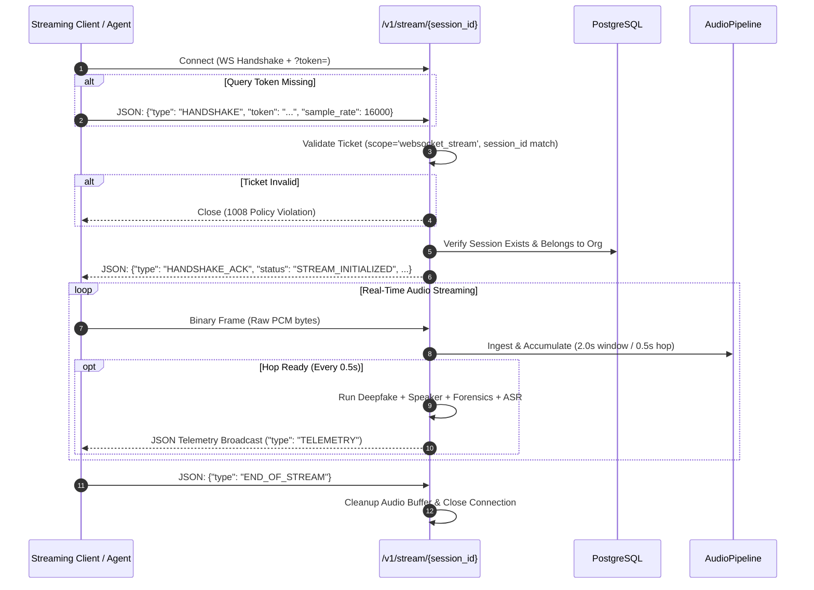
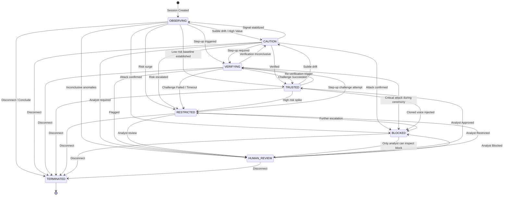
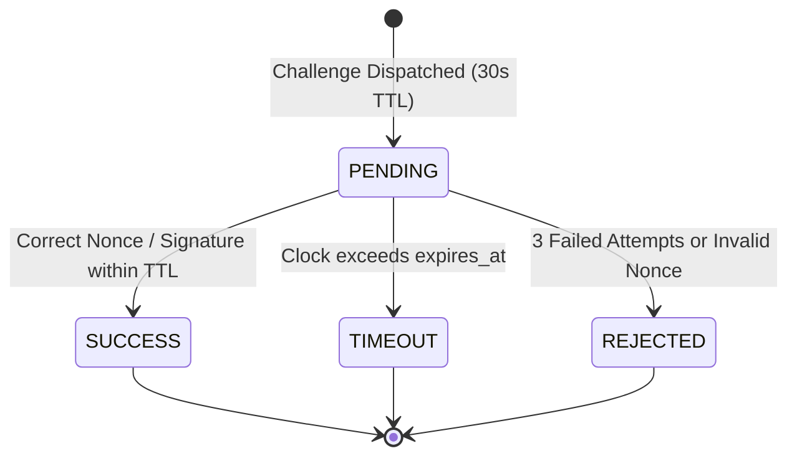

# TrueVoice API Contract Specification

**Document Version:** 1.0.0  
**Target API Version:** v1 (Backend Version: 1.2.0)  
**Status:** Baseline Implementation Grounded  
**Source of Truth:** Codebase Routes, Schemas, Dependencies, and Service Layer  

---

## 1. API Overview

The TrueVoice API is the real-time interaction and control plane for the TrueVoice voice integrity and impersonation attack prevention system. It provides RESTful endpoints for session lifecycle, authentication, declarative security policy administration, speaker biometrics enrollment, out-of-band secondary verification, risk telemetry history, and tamper-evident audit ledger inspection, alongside a high-throughput WebSocket streaming endpoint for live voice chunk ingestion and bidirectional telemetry broadcasting.

### 1.1 Technical Conventions

| Attribute | Specification | Evidence in Codebase |
| :--- | :--- | :--- |
| **API Name** | TrueVoice API | [`backend/app/main.py:61`](file:///c:/Projects/SIH/backend/app/main.py#L61) |
| **Current API Version** | `1.2.0` (API Route Prefix: `/v1`) | [`backend/app/config.py:14`](file:///c:/Projects/SIH/backend/app/config.py#L14) |
| **Base URLs** | REST: `/v1`, Root Health: `/health`, WebSocket: `/v1/stream/{session_id}` | [`backend/app/api/routes/__init__.py`](file:///c:/Projects/SIH/backend/app/api/routes/__init__.py) |
| **Framework** | FastAPI 0.115+ (ASGI on Uvicorn) with Pydantic v2 | [`backend/requirements.txt`](file:///c:/Projects/SIH/backend/requirements.txt) |
| **Protocol** | HTTP/1.1 & HTTP/2 (TLS recommended in production) + RFC 6455 WebSocket | [`backend/app/api/websocket/audio_stream.py`](file:///c:/Projects/SIH/backend/app/api/websocket/audio_stream.py) |
| **Authentication** | 1. HTTP Bearer JWT (`Authorization: Bearer <token>`)<br>2. WebSocket Ticket Token (5-minute TTL via query parameter or initial JSON `HANDSHAKE`) | [`backend/app/core/security.py`](file:///c:/Projects/SIH/backend/app/core/security.py) |
| **Payload Formats** | `application/json` (REST default)<br>`multipart/form-data` (Speaker enrollment audio upload)<br>Binary raw PCM (`bytes`) over WebSocket | [`backend/app/api/routes/speakers.py`](file:///c:/Projects/SIH/backend/app/api/routes/speakers.py) |
| **ID Format** | Universally Unique Identifiers (UUIDv4 strings, 36 chars) | [`backend/app/models/base.py:18`](file:///c:/Projects/SIH/backend/app/models/base.py#L18) |
| **Timestamp Format** | ISO 8601 UTC with timezone offset: `YYYY-MM-DDTHH:MM:SS.mmmmmmZ` or `+00:00` | [`backend/app/models/base.py:80`](file:///c:/Projects/SIH/backend/app/models/base.py#L80) |
| **Pagination** | Query parameters `skip: int = 0`, `limit: int = 50` (or `100`) | [`backend/app/api/routes/sessions.py:34`](file:///c:/Projects/SIH/backend/app/api/routes/sessions.py#L34) |
| **Interactive Docs** | Swagger UI: `/docs`, ReDoc: `/redoc`, OpenAPI schema: `/openapi.json` | Default FastAPI endpoints |

---

## 2. API Endpoint Inventory

### 2.1 Implemented Endpoints (23 Total: 22 HTTP REST + 1 WebSocket)

The following endpoints are implemented in `backend/app/api/`:

| Method | Path | Purpose | Auth Required | Required Role | Request Body | Response Body | HTTP Status & Error Codes |
| :---: | :--- | :--- | :---: | :---: | :---: | :---: | :--- |
| **GET** | `/health` | System health check and component diagnostics | No | Public | None | Health JSON object | `200 OK` |
| **GET** | `/v1/health` | Subsystem diagnostics and detector status | No | Public | None | Health JSON object | `200 OK` |
| **POST** | `/v1/auth/login` | Authenticate user credentials and issue tenant JWT | No | Public | [`LoginRequest`](#loginrequest) | [`TokenResponse`](#tokenresponse) | `200 OK`, `401 Unauthorized`, `403 Forbidden` |
| **POST** | `/v1/auth/session-token` | Issue 5-minute session-scoped ticket for WebSocket stream | Yes (Bearer) | Any | [`SessionTokenRequest`](#sessiontokenrequest) | [`SessionTokenResponse`](#sessiontokenresponse) | `200 OK`, `401 Unauthorized`, `404 Not Found` |
| **GET** | `/v1/auth/me` | Retrieve authenticated user profile and tenant scope | Yes (Bearer) | Any | None | [`UserResponse`](#userresponse) | `200 OK`, `401 Unauthorized`, `404 Not Found` |
| **POST** | `/v1/sessions` | Initialize new voice session under tenant boundary | Yes (Bearer) | Any | [`SessionCreate`](#sessioncreate) | [`SessionResponse`](#sessionresponse) | `201 Created`, `401 Unauthorized`, `404 Not Found` |
| **GET** | `/v1/sessions` | List sessions belonging to authenticated organization | Yes (Bearer) | Any | Query (`skip`, `limit`) | `List[`[`SessionResponse`](#sessionresponse)`]` | `200 OK`, `401 Unauthorized` |
| **GET** | `/v1/sessions/{session_id}` | Retrieve session details, trust state, and metadata | Yes (Bearer) | Any | Path (`session_id`) | [`SessionDetailResponse`](#sessiondetailresponse) | `200 OK`, `401`, `403 Forbidden`, `404 Not Found` |
| **POST** | `/v1/sessions/{session_id}/terminate` | Conclude session and transition state to `TERMINATED` | Yes (Bearer) | Any | Path (`session_id`) | [`SessionResponse`](#sessionresponse) | `200 OK`, `401`, `403`, `404` |
| **POST** | `/v1/sessions/{session_id}/override` | Security analyst override exit (`APPROVE`/`RESTRICT`/`BLOCK`) | Yes (Bearer) | `SECURITY_ANALYST`, `ORG_ADMIN` | [`AnalystOverrideRequest`](#analystoverriderequest) | [`SessionResponse`](#sessionresponse) | `200 OK`, `401`, `403`, `404`, `409 Conflict` |
| **POST** | `/v1/speakers/enroll` | Enroll voiceprint embedding from 1+ audio files | Yes (Bearer) | `SECURITY_ANALYST`, `ORG_ADMIN` | `multipart/form-data` | [`SpeakerResponse`](#speakerresponse) | `201 Created`, `400 Bad Request`, `401`, `403` |
| **GET** | `/v1/speakers` | List active enrolled speaker profiles for tenant | Yes (Bearer) | Any | Query (`skip`, `limit`) | `List[`[`SpeakerResponse`](#speakerresponse)`]` | `200 OK`, `401 Unauthorized` |
| **GET** | `/v1/speakers/{speaker_id}` | Retrieve speaker profile and enrollment status | Yes (Bearer) | Any | Path (`speaker_id`) | [`SpeakerResponse`](#speakerresponse) | `200 OK`, `401`, `403`, `404` |
| **DELETE**| `/v1/speakers/{speaker_id}` | Soft-deactivate a speaker biometric profile | Yes (Bearer) | `SECURITY_ANALYST`, `ORG_ADMIN` | Path (`speaker_id`) | [`SpeakerResponse`](#speakerresponse) | `200 OK`, `401`, `403`, `404` |
| **POST** | `/v1/verification/dispatch` | Dispatch out-of-band cryptographic challenge (30s TTL) | Yes (Bearer) | Any | [`ChallengeDispatch`](#challengedispatch) | [`ChallengeResponse`](#challengeresponse) | `201 Created`, `401`, `403`, `404` |
| **POST** | `/v1/verification/verify` | Submit challenge response / biometric proof | Yes (Bearer) | Any | [`VerificationSubmit`](#verificationsubmit) + Query `session_id` | [`VerificationResultSummary`](#verificationresultsummary) | `200 OK`, `401`, `403`, `404` |
| **GET** | `/v1/risk/{session_id}/timeline` | Retrieve historical risk progression across hops | Yes (Bearer) | Any | Path (`session_id`), Query (`skip`, `limit`) | `List[`[`RiskAssessmentResponse`](#riskassessmentresponse)`]` | `200 OK`, `401`, `403`, `404` |
| **GET** | `/v1/risk/{session_id}/latest` | Retrieve latest windowed risk assessment | Yes (Bearer) | Any | Path (`session_id`) | `Optional[`[`RiskAssessmentResponse`](#riskassessmentresponse)`]` | `200 OK`, `401`, `403`, `404` |
| **GET** | `/v1/policies` | Retrieve active tenant declarative security policy | Yes (Bearer) | Any | None | `Optional[`[`PolicyResponse`](#policyresponse)`]` | `200 OK`, `401 Unauthorized` |
| **POST** | `/v1/policies` | Create or update organization declarative policy | Yes (Bearer) | `ORG_ADMIN` | [`PolicyCreate`](#policycreate) | [`PolicyResponse`](#policyresponse) | `201 Created`, `401`, `403 Forbidden` |
| **GET** | `/v1/audit/{session_id}/logs` | Retrieve sequential audit log records | Yes (Bearer) | `SECURITY_ANALYST`, `ORG_ADMIN`, `FORENSIC_AUDITOR` | Path (`session_id`) | `List[`[`AuditLogResponse`](#auditlogresponse)`]` | `200 OK`, `401`, `403 Forbidden`, `404` |
| **GET** | `/v1/audit/{session_id}/verify-chain` | Run mathematical SHA-256 chain integrity check | Yes (Bearer) | `SECURITY_ANALYST`, `ORG_ADMIN`, `FORENSIC_AUDITOR` | Path (`session_id`) | [`AuditChainValidationResult`](#auditchainvalidationresult) | `200 OK`, `401`, `403`, `404`, `500 Internal Error` |
| **WS** | `/v1/stream/{session_id}` | Real-time audio ingestion and telemetry broadcast | Ticket Token | Any (Ticket verified) | Binary PCM chunk or JSON text | JSON Telemetry Broadcast | `101 Switching Protocols`, `WS 1008 Policy Violation` |

---

### 2.2 Planned / Not Implemented Endpoints

The following endpoints were described in PRD v1.1 or HLD v1.2 but **do not exist** in the actual route files:

| Planned Method | Planned Path | Reason for Absence / Architectural Status |
| :---: | :--- | :--- |
| **GET** | `/ready` | Deep readiness probe for container orchestrators (PostgreSQL connection and model memory check). |
| **GET** | `/v1/audit/{session_id}/export` | Standalone canonical RFC 8785 JSON download endpoint with optional digital signature. |
| **GET** | `/v1/policies/rules` | Granular declarative rules query endpoint (subsumed by `GET /v1/policies`). |
| **POST** | `/v1/policies/evaluate` | Standalone manual policy simulation endpoint (policy evaluation is embedded in `AudioService`). |
| **GET** | `/v1/models` | AI model catalog and weights digest inventory endpoint. |

---

## 3. Request Contracts

### 3.1 `LoginRequest`
Endpoint: `POST /v1/auth/login`  
Content-Type: `application/json`

| Field | Type | Required | Nullable | Default | Constraints | Description |
| :--- | :--- | :---: | :---: | :---: | :--- | :--- |
| `email` | `string` (EmailStr) | **Yes** | No | — | Valid email format | User account email address |
| `password` | `string` | **Yes** | No | — | `min_length=6` | Plaintext account password |

```json
/* Example */
{
  "email": "analyst@apexfin.com",
  "password": "AnalystSecurePass123!"
}
```

---

### 3.2 `SessionTokenRequest`
Endpoint: `POST /v1/auth/session-token`  
Content-Type: `application/json`

| Field | Type | Required | Nullable | Default | Constraints | Description |
| :--- | :--- | :---: | :---: | :---: | :--- | :--- |
| `session_id` | `string` | **Yes** | No | — | UUID format string | Target session ID to bind WebSocket streaming ticket |

```json
/* Example */
{
  "session_id": "4c94b7c1-8451-419b-a320-b0b92e76f9d7"
}
```

---

### 3.3 `SessionCreate`
Endpoint: `POST /v1/sessions`  
Content-Type: `application/json`

| Field | Type | Required | Nullable | Default | Constraints | Description |
| :--- | :--- | :---: | :---: | :---: | :--- | :--- |
| `claimed_speaker_id` | `string` | No | **Yes** | `null` | UUID of enrolled speaker | Enrolled identity claimed by caller |
| `caller_ani` | `string` | No | No | `"UNKNOWN"` | Max length 32 chars | Telecom gateway ANI/CLI telephone number |
| `context_metadata` | `object` | No | No | `{}` | Key-value dictionary | Business context (e.g. `{"transaction_amount": 150000.0}`) |

```json
/* Example */
{
  "claimed_speaker_id": "7b8e1f2a-5d3c-4a90-b112-9c0d3e5f7a11",
  "caller_ani": "+919876543210",
  "context_metadata": {
    "transaction_amount": 350000.0,
    "channel": "telecom_sip_trunk"
  }
}
```

---

### 3.4 `AnalystOverrideRequest`
Endpoint: `POST /v1/sessions/{session_id}/override`  
Content-Type: `application/json`

| Field | Type | Required | Nullable | Default | Constraints | Description |
| :--- | :--- | :---: | :---: | :---: | :--- | :--- |
| `action` | `string` | **Yes** | No | — | One of: `ANALYST_APPROVE`, `ANALYST_RESTRICT`, `ANALYST_BLOCK` | Manual decision applied by analyst |
| `reason` | `string` | **Yes** | No | — | `min_length=3` | Required audit justification for override |

```json
/* Example */
{
  "action": "ANALYST_APPROVE",
  "reason": "Callback completed on registered corporate mobile line; identity verified."
}
```

---

### 3.5 `SpeakerEnrollRequest` (Multipart Form)
Endpoint: `POST /v1/speakers/enroll`  
Content-Type: `multipart/form-data`

| Form Field | Type | Required | Nullable | Default | Constraints | Description |
| :--- | :--- | :---: | :---: | :---: | :--- | :--- |
| `display_name` | `string` | **Yes** | No | — | 1–150 characters | Full legal or display name of the individual |
| `designation` | `string` | **Yes** | No | — | 1–100 characters | Job role or VIP designation (e.g. "Chief Executive Officer") |
| `user_id` | `string` | No | **Yes** | `null` | UUID string | Optional link to an internal system user record |
| `audio_files` | `file[]` | **Yes** | No | — | $\ge 1$ audio files | One or more audio files (WAV, PCM, FLAC) |

---

### 3.6 `ChallengeDispatch`
Endpoint: `POST /v1/verification/dispatch`  
Content-Type: `application/json`

| Field | Type | Required | Nullable | Default | Constraints | Description |
| :--- | :--- | :---: | :---: | :---: | :--- | :--- |
| `session_id` | `string` | **Yes** | No | — | UUID format string | Active session identifier |
| `challenge_type` | `string` (Enum) | No | No | `"OOB_PUSH"` | One of: `OOB_PUSH`, `IN_BAND_CHALLENGE`, `SECURE_CALLBACK` | Channel selected for challenge |

```json
/* Example */
{
  "session_id": "4c94b7c1-8451-419b-a320-b0b92e76f9d7",
  "challenge_type": "OOB_PUSH"
}
```

---

### 3.7 `VerificationSubmit`
Endpoint: `POST /v1/verification/verify?session_id={session_id}`  
Content-Type: `application/json`

| Field | Type | Required | Nullable | Default | Constraints | Description |
| :--- | :--- | :---: | :---: | :---: | :--- | :--- |
| `challenge_token` | `string` | **Yes** | No | — | Issued challenge token | Token returned during challenge dispatch |
| `nonce` | `string` | **Yes** | No | — | High-entropy random nonce | Nonce returned during dispatch |
| `signature` | `string` | **Yes** | No | — | Cryptographic signature or token | User biometric authorization signature or nonce |

```json
/* Example */
{
  "challenge_token": "ctk_8fa2c03b12d9",
  "nonce": "748291",
  "signature": "748291"
}
```

---

### 3.8 `PolicyCreate`
Endpoint: `POST /v1/policies`  
Content-Type: `application/json`

| Field | Type | Required | Nullable | Default | Constraints | Description |
| :--- | :--- | :---: | :---: | :---: | :--- | :--- |
| `policy_name` | `string` | **Yes** | No | — | 1–100 characters | Descriptive name of the policy configuration |
| `caution_threshold` | `float` | No | No | `30.0` | $0.0 \le x \le 100.0$ | Risk threshold transitioning session to CAUTION |
| `verify_threshold` | `float` | No | No | `60.0` | $0.0 \le x \le 100.0$ | Risk threshold triggering secondary verification |
| `block_threshold` | `float` | No | No | `80.0` | $0.0 \le x \le 100.0$ | Risk threshold triggering immediate BLOCK |
| `enforce_transaction_lock` | `boolean` | No | No | `true` | Boolean flag | Whether to issue external workflow lock directive |
| `sensitive_amount_threshold` | `float` | No | No | `250000.0` | $x \ge 0.0$ | Currency threshold triggering step-up verification |
| `oob_timeout_seconds` | `integer` | No | No | `30` | $5 \le x \le 300$ | Time-to-live for challenge nonces |
| `version` | `string` | No | No | `"1.0.0"` | Semver string | Version identifier for audit traceability |

```json
/* Example */
{
  "policy_name": "Apex Enterprise Fraud Rules",
  "caution_threshold": 35.0,
  "verify_threshold": 65.0,
  "block_threshold": 85.0,
  "enforce_transaction_lock": true,
  "sensitive_amount_threshold": 500000.0,
  "oob_timeout_seconds": 30,
  "version": "1.0.0"
}
```

---

## 4. Response Contracts

### 4.1 `TokenResponse`
Returned by: `POST /v1/auth/login` (HTTP 200)

```json
/* Example */
{
  "access_token": "eyJhbGciOiJIUzI1NiIsInR5cCI6IkpXVCJ9...",
  "token_type": "bearer",
  "expires_in_minutes": 15,
  "user_id": "e4b2d398-38c2-4911-bfa6-847e096236b2",
  "org_id": "c1f7a408-1120-4e3b-9a4f-561bcf704712",
  "role": "ORG_ADMIN"
}
```

---

### 4.2 `SessionTokenResponse`
Returned by: `POST /v1/auth/session-token` (HTTP 200)

```json
/* Example */
{
  "ticket_token": "eyJhbGciOiJIUzI1NiIsInR5cCI6IkpXVCJ9...",
  "token_type": "ticket",
  "expires_in_seconds": 300,
  "session_id": "4c94b7c1-8451-419b-a320-b0b92e76f9d7"
}
```

---

### 4.3 `UserResponse`
Returned by: `GET /v1/auth/me` (HTTP 200)

```json
/* Example */
{
  "id": "e4b2d398-38c2-4911-bfa6-847e096236b2",
  "org_id": "c1f7a408-1120-4e3b-9a4f-561bcf704712",
  "email": "admin@apexfin.com",
  "full_name": "Alice Admin",
  "role": "ORG_ADMIN",
  "is_active": true,
  "created_at": "2026-09-18T10:00:00.000000Z"
}
```

---

### 4.4 `SessionResponse`
Returned by: `POST /v1/sessions`, `GET /v1/sessions`, `POST /terminate`, `POST /override` (HTTP 200 / 201)

```json
/* Example */
{
  "id": "4c94b7c1-8451-419b-a320-b0b92e76f9d7",
  "org_id": "c1f7a408-1120-4e3b-9a4f-561bcf704712",
  "session_token": "tvs_a8f3b201948c21e7d48392019482bca1",
  "claimed_speaker_id": "7b8e1f2a-5d3c-4a90-b112-9c0d3e5f7a11",
  "caller_ani": "+919876543210",
  "current_trust_state": "OBSERVING",
  "peak_risk_score": 0.0,
  "started_at": "2026-09-18T10:15:30.123456Z",
  "ended_at": null
}
```

---

### 4.5 `SessionDetailResponse`
Returned by: `GET /v1/sessions/{session_id}` (HTTP 200)

```json
/* Example */
{
  "id": "4c94b7c1-8451-419b-a320-b0b92e76f9d7",
  "org_id": "c1f7a408-1120-4e3b-9a4f-561bcf704712",
  "session_token": "tvs_a8f3b201948c21e7d48392019482bca1",
  "claimed_speaker_id": "7b8e1f2a-5d3c-4a90-b112-9c0d3e5f7a11",
  "caller_ani": "+919876543210",
  "current_trust_state": "CAUTION",
  "peak_risk_score": 42.5,
  "started_at": "2026-09-18T10:15:30.123456Z",
  "ended_at": null,
  "context_metadata": {
    "transaction_amount": 350000.0,
    "channel": "telecom_sip_trunk"
  },
  "recent_assessments_count": 8
}
```

---

### 4.6 `SpeakerResponse`
Returned by: `POST /v1/speakers/enroll`, `GET /v1/speakers`, `GET /v1/speakers/{id}`, `DELETE /v1/speakers/{id}`

```json
/* Example */
{
  "id": "7b8e1f2a-5d3c-4a90-b112-9c0d3e5f7a11",
  "org_id": "c1f7a408-1120-4e3b-9a4f-561bcf704712",
  "display_name": "Vikram Malhotra",
  "designation": "Managing Director",
  "is_active": true,
  "created_at": "2026-09-18T09:00:00.000000Z",
  "has_enrolled_voiceprint": true
}
```

---

### 4.7 `ChallengeResponse`
Returned by: `POST /v1/verification/dispatch` (HTTP 201)

```json
/* Example */
{
  "challenge_token": "ctk_8fa2c03b12d94820",
  "session_id": "4c94b7c1-8451-419b-a320-b0b92e76f9d7",
  "challenge_type": "OOB_PUSH",
  "nonce": "748291",
  "expires_at": "2026-09-18T10:16:00.123456Z",
  "ttl_seconds": 30,
  "instructions": "Simulated OOB challenge dispatched to enrolled user device"
}
```

---

### 4.8 `VerificationResultSummary`
Returned by: `POST /v1/verification/verify` (HTTP 200)

```json
/* Example */
{
  "session_id": "4c94b7c1-8451-419b-a320-b0b92e76f9d7",
  "status": "SUCCESS",
  "message": "Challenge signature verified successfully",
  "verified_at": "2026-09-18T10:15:45.678901Z"
}
```

---

### 4.9 `RiskAssessmentResponse`
Returned by: `GET /v1/risk/{session_id}/timeline`, `GET /v1/risk/{session_id}/latest` (HTTP 200)

```json
/* Example */
{
  "id": "3e9b1042-881c-4b51-9f9b-640982312abc",
  "session_id": "4c94b7c1-8451-419b-a320-b0b92e76f9d7",
  "sequence_id": 4,
  "synthetic_prob": 78.4,
  "speaker_similarity": 0.32,
  "forensic_score": 65.0,
  "conversational_score": 0.85,
  "composite_risk": 72.8,
  "risk_tier": "HIGH",
  "primary_factors": [
    "High synthetic probability (Wav2Vec2: 78.4%)",
    "Speaker voice mismatch (Similarity: 0.32)",
    "Compounding risk escalation (Gamma=1.35x applied)"
  ],
  "evidence_provenance": {
    "deepfake": {
      "model": "wav2vec2",
      "version": "1.0.0",
      "raw_score": 78.4,
      "weight": 0.35
    },
    "speaker": {
      "model": "ecapa-tdnn",
      "similarity": 0.32,
      "weight": 0.25
    },
    "compounding_applied": true
  },
  "recorded_at": "2026-09-18T10:15:32.000000Z"
}
```

---

### 4.10 `PolicyResponse`
Returned by: `GET /v1/policies`, `POST /v1/policies` (HTTP 200 / 201)

```json
/* Example */
{
  "id": "1182cf91-382a-4311-9ab2-827391029381",
  "org_id": "c1f7a408-1120-4e3b-9a4f-561bcf704712",
  "policy_name": "Apex Enterprise Fraud Rules",
  "caution_threshold": 35.0,
  "verify_threshold": 65.0,
  "block_threshold": 85.0,
  "enforce_transaction_lock": true,
  "sensitive_amount_threshold": 500000.0,
  "oob_timeout_seconds": 30,
  "version": "1.0.0",
  "created_at": "2026-09-18T08:30:00.000000Z"
}
```

---

### 4.11 `AuditLogResponse`
Returned by: `GET /v1/audit/{session_id}/logs` (HTTP 200)

```json
/* Example */
{
  "id": "90812ab3-412c-4911-87ab-518293019283",
  "session_id": "4c94b7c1-8451-419b-a320-b0b92e76f9d7",
  "sequence_id": 1,
  "event_type": "SESSION_CREATED",
  "prev_event_hash": "0000000000000000000000000000000000000000000000000000000000000000",
  "event_hash": "e3b0c44298fc1c149afbf4c8996fb92427ae41e4649b934ca495991b7852b855",
  "trust_state": "OBSERVING",
  "payload_json": {
    "caller_ani": "+919876543210",
    "claimed_speaker_id": "7b8e1f2a-5d3c-4a90-b112-9c0d3e5f7a11",
    "org_id": "c1f7a408-1120-4e3b-9a4f-561bcf704712",
    "session_token": "tvs_a8f3b201948c21e7d48392019482bca1"
  },
  "created_at": "2026-09-18T10:15:30.123456Z"
}
```

---

### 4.12 `AuditChainValidationResult`
Returned by: `GET /v1/audit/{session_id}/verify-chain` (HTTP 200)

```json
/* Example */
{
  "session_id": "4c94b7c1-8451-419b-a320-b0b92e76f9d7",
  "total_events": 5,
  "is_valid": true,
  "verified_at": "2026-09-18T10:16:05.123456Z",
  "tampered_at_sequence": null,
  "message": "Chain integrity verified across 5 records."
}
```

---

### 4.13 Health Check Diagnostic Response
Returned by: `GET /health`, `GET /v1/health` (HTTP 200)

```json
/* Example */
{
  "status": "ONLINE",
  "service": "TrueVoice MVP Backend",
  "version": "1.2.0",
  "database": "HEALTHY",
  "primary_detector": {
    "name": "wav2vec2",
    "version": "1.0.0",
    "mode": "mock"
  },
  "target_specifications": {
    "analysis_window_seconds": 2.0,
    "hop_seconds": 0.5,
    "initial_accumulation_target": "approx. 2.0s audio accumulation + target processing latency",
    "target_processing_latency_ms": 120
  }
}
```

---

## 5. Error Contract

TrueVoice implements structured, typed domain exceptions registered in [`backend/app/main.py`](file:///c:/Projects/SIH/backend/app/main.py#L81-L140).

### 5.1 Standard Error Response Schema

For all domain exceptions (`TrueVoiceException` and its subclasses):

```json
{
  "detail": "Descriptive human-readable error explanation",
  "error_code": "MACHINE_READABLE_ERROR_ENUM",
  "details": {
    "resource": "CallSession",
    "identifier": "4c94b7c1-8451-419b-a320-b0b92e76f9d7"
  }
}
```

### 5.2 Error Code Mapping Table

| HTTP Status | Domain Exception Class | `error_code` | Trigger Condition |
| :---: | :--- | :--- | :--- |
| **400 Bad Request** | `AudioProcessingError` | `AUDIO_PROCESSING_ERROR` | Empty or malformed audio file uploaded during enrollment. |
| **400 Bad Request** | `VerificationError` | `VERIFICATION_ERROR` | Challenge response format invalid or processing failed. |
| **401 Unauthorized** | `AuthenticationError` | `AUTHENTICATION_FAILED` | Missing, expired, or cryptographically invalid Bearer JWT or ticket. |
| **403 Forbidden** | `AuthorizationError` | `PERMISSION_DENIED` | User authenticated, but lacks required role for RBAC-protected endpoint. |
| **403 Forbidden** | `TenantAccessViolation` | `TENANT_ACCESS_VIOLATION` | Authenticated user attempted to query or mutate an entity belonging to another `org_id`. |
| **404 Not Found** | `ResourceNotFoundError` | `RESOURCE_NOT_FOUND` | Requested entity ID does not exist within the tenant scope. |
| **409 Conflict** | `InvalidStateTransitionException`| `INVALID_STATE_TRANSITION` | Attempted illegal state transition in Zero-Trust State Machine. |
| **500 Internal Error** | `AuditTamperDetectedError` | `AUDIT_TAMPER_DETECTED` | SHA-256 hash mismatch detected during chain integrity check. |
| **500 Internal Error** | `ModelUnavailableError` | `MODEL_UNAVAILABLE` | Configured ML model failed to initialize or execute during startup. |
| **500 Internal Error** | `TrueVoiceException` | `INTERNAL_ERROR` | Unhandled internal domain error. |

> [!NOTE]
> **CONTRACT GAP:** FastAPI built-in request validation errors (`RequestValidationError`) return the default format `{"detail": [{"loc": [...], "msg": "...", "type": "..."}]}` rather than the structured `{detail, error_code, details}` format. This inconsistency is documented in `CONTRACT_GAPS.md`.

---

## 6. Authentication & Authorization Contract

### 6.1 Authentication Mechanisms

#### A. Bearer JWT (REST Endpoints)
- **Algorithm:** HMAC-SHA256 (`HS256`).
- **Header:** `Authorization: Bearer <access_token>`.
- **Token Lifetime:** Default 15 minutes (`ACCESS_TOKEN_EXPIRE_MINUTES`).
- **Payload Claims:**
  ```json
  {
    "sub": "<user_uuid>",
    "org_id": "<organization_uuid>",
    "role": "OPERATOR | SECURITY_ANALYST | ORG_ADMIN | FORENSIC_AUDITOR",
    "exp": 1758190000
  }
  ```

#### B. Session-Scoped WebSocket Ticket Token
- **Issuance Endpoint:** `POST /v1/auth/session-token`
- **Lifetime:** 5 minutes (`300` seconds).
- **Delivery:** Transmitted via URL query parameter `?token=<ticket>` or in the initial JSON `HANDSHAKE` frame.
- **Payload Claims:**
  ```json
  {
    "sub": "<user_uuid>",
    "org_id": "<organization_uuid>",
    "role": "<role>",
    "scope": "websocket_stream",
    "session_id": "<session_uuid>",
    "exp": 1758189500
  }
  ```

### 6.2 Role-Based Access Control (RBAC) Matrix

| Endpoint | `OPERATOR` | `SECURITY_ANALYST` | `ORG_ADMIN` | `FORENSIC_AUDITOR` |
| :--- | :---: | :---: | :---: | :---: |
| `POST /v1/auth/session-token` | ✅ | ✅ | ✅ | ✅ |
| `GET /v1/auth/me` | ✅ | ✅ | ✅ | ✅ |
| `POST /v1/sessions` | ✅ | ✅ | ✅ | ✅ |
| `GET /v1/sessions` & `GET /sessions/{id}` | ✅ | ✅ | ✅ | ✅ |
| `POST /v1/sessions/{id}/terminate` | ✅ | ✅ | ✅ | ✅ |
| `POST /v1/sessions/{id}/override` | ❌ | ✅ | ✅ | ❌ |
| `POST /v1/speakers/enroll` | ❌ | ✅ | ✅ | ❌ |
| `GET /v1/speakers` & `GET /speakers/{id}` | ✅ | ✅ | ✅ | ✅ |
| `DELETE /v1/speakers/{id}` | ❌ | ✅ | ✅ | ❌ |
| `POST /v1/verification/dispatch` & `verify` | ✅ | ✅ | ✅ | ✅ |
| `GET /v1/risk/{session_id}/*` | ✅ | ✅ | ✅ | ✅ |
| `GET /v1/policies` | ✅ | ✅ | ✅ | ✅ |
| `POST /v1/policies` | ❌ | ❌ | ✅ | ❌ |
| `GET /v1/audit/{session_id}/logs` | ❌ | ✅ | ✅ | ✅ |
| `GET /v1/audit/{session_id}/verify-chain` | ❌ | ✅ | ✅ | ✅ |
| `WS /v1/stream/{session_id}` | ✅ | ✅ | ✅ | ✅ |

### 6.3 Tenant Isolation Contract
Every database query in the service layer is strictly filtered by the authenticated user's `org_id`:
- Sessions: `where(CallSession.org_id == org_id)`
- Speakers: `where(SpeakerProfile.org_id == org_id)`
- Policies: `where(Policy.org_id == org_id)`
- Audit: Session ownership is validated before returning records.

Cross-tenant access attempts immediately raise `TenantAccessViolation` (HTTP 403) or `ResourceNotFoundError` (HTTP 404).

---

## 7. WebSocket / Real-Time Audio Contract

Endpoint: `WS /v1/stream/{session_id}`

### 7.1 Connection & Handshake Lifecycle



### 7.2 Incoming Client Messages

#### A. Binary Frame (Audio Chunk)
- **Format:** Uncompressed Linear PCM.
- **Bit Depth:** Signed 16-bit Little-Endian (`int16`).
- **Sample Rate:** Typically 16,000 Hz (or native capture rate declared in handshake, polyphase resampled to 16 kHz).
- **Channels:** 1 (Mono).
- **Chunk Size:** Arbitrary streaming packet size (typically 100ms = 3,200 bytes or 200ms = 6,400 bytes).

#### B. JSON Handshake Frame
```json
{
  "type": "HANDSHAKE",
  "token": "eyJhbGciOiJIUzI1Ni...",
  "sample_rate": 16000,
  "channels": 1,
  "claimed_speaker_id": "7b8e1f2a-5d3c-4a90-b112-9c0d3e5f7a11"
}
```

#### C. JSON Heartbeat (PING)
```json
{
  "type": "PING",
  "timestamp": 1758189600000
}
```

#### D. JSON End of Stream
```json
{
  "type": "END_OF_STREAM"
}
```

---

### 7.3 Outgoing Server Telemetry Messages

#### A. `HANDSHAKE_ACK`
```json
{
  "type": "HANDSHAKE_ACK",
  "session_id": "4c94b7c1-8451-419b-a320-b0b92e76f9d7",
  "status": "STREAM_INITIALIZED",
  "source_sample_rate": 16000,
  "analysis_window_seconds": 2.0,
  "hop_seconds": 0.5
}
```

#### B. `TELEMETRY` (`RiskTelemetryBroadcast`)
Streamed to the client/analyst console every 0.5 seconds once the initial 2.0-second accumulation window is satisfied.

| Field | Type | Description |
| :--- | :--- | :--- |
| `type` | `string` | Constant `"TELEMETRY"` |
| `session_id` | `string` | Active session UUID string |
| `sequence_id` | `integer` | Monotonically increasing hop evaluation sequence number |
| `timestamp` | `string` | ISO 8601 UTC timestamp of evaluation |
| `risk_score` | `float` | Composite risk score ($0.0 \le x \le 100.0$) |
| `risk_tier` | `string` (Enum) | `LOW`, `MODERATE`, `HIGH`, `CRITICAL` |
| `trust_state` | `string` (Enum) | Current Zero-Trust state: `OBSERVING`, `CAUTION`, `VERIFYING`, `TRUSTED`, `RESTRICTED`, `BLOCKED`, `HUMAN_REVIEW` |
| `breakdown` | `object` | Component score breakdown: `deepfake`, `speaker_similarity`, `forensic_anomaly`, `conversational_threat`, `context_sensitivity` |
| `provenance` | `object` | Detailed ML detector and signal provenance metadata |
| `security_action` | `string` (Enum) | Emitted policy action: `ALLOW`, `WARN`, `REQUEST_VERIFICATION`, `RESTRICT`, `BLOCK`, `HUMAN_REVIEW` |
| `detected_intents`| `string[]` | Array of detected threat intent tags (e.g. `["URGENCY_PRESSURE", "FINANCIAL_PROMPT"]`) |
| `transcript_snippet` | `string` / `null` | Redacted text snippet (max 100 chars) or `null` if silent |

```json
/* Example */
{
  "type": "TELEMETRY",
  "session_id": "4c94b7c1-8451-419b-a320-b0b92e76f9d7",
  "sequence_id": 5,
  "timestamp": "2026-09-18T10:15:32.500000Z",
  "risk_score": 74.2,
  "risk_tier": "HIGH",
  "trust_state": "CAUTION",
  "breakdown": {
    "deepfake": 78.4,
    "speaker_similarity": 0.32,
    "forensic_anomaly": 65.0,
    "conversational_threat": 85.0,
    "context_sensitivity": 40.0
  },
  "provenance": {
    "deepfake": {"model": "wav2vec2", "weight": 0.35},
    "speaker": {"model": "ecapa-tdnn", "weight": 0.25},
    "compounding_applied": true
  },
  "security_action": "REQUEST_VERIFICATION",
  "detected_intents": ["URGENCY_PRESSURE", "FINANCIAL_PROMPT"],
  "transcript_snippet": "Please process the urgent wire transfer to the new account immediately"
}
```

#### C. `PONG`
```json
{
  "type": "PONG",
  "timestamp": 1758189600000
}
```

---

## 8. API State Machines

### 8.1 Zero-Trust Session State Machine

The Zero-Trust State Machine ([`backend/app/policy/state_machine.py`](file:///c:/Projects/SIH/backend/app/policy/state_machine.py)) governs the operational trust state of each voice interaction session:



### 8.2 Secondary Verification Challenge Lifecycle

Governed by [`backend/app/verification/oob.py`](file:///c:/Projects/SIH/backend/app/verification/oob.py):



---

## 9. API ↔ Database Mapping

| API Endpoint / Operation | Primary Service | Database Tables Read | Database Tables Written |
| :--- | :--- | :--- | :--- |
| `POST /v1/auth/login` | Direct DB select | `users` | None |
| `POST /v1/auth/session-token` | `SessionService` | `call_sessions` | None |
| `GET /v1/auth/me` | Direct DB get | `users` | None |
| `POST /v1/sessions` | `SessionService`, `AuditService` | `speaker_profiles` | `call_sessions`, `audit_logs` |
| `GET /v1/sessions` | `SessionService` | `call_sessions` | None |
| `GET /v1/sessions/{id}` | `SessionService` | `call_sessions` | None |
| `POST /v1/sessions/{id}/terminate` | `SessionService`, `AuditService` | `call_sessions` | `call_sessions`, `audit_logs` |
| `POST /v1/sessions/{id}/override` | `SessionService`, `AuditService` | `call_sessions` | `call_sessions`, `audit_logs` |
| `POST /v1/speakers/enroll` | `SpeakerService` | None | `speaker_profiles`, `voiceprint_embeddings` |
| `GET /v1/speakers` | `SpeakerService` | `speaker_profiles`, `voiceprint_embeddings` | None |
| `GET /v1/speakers/{id}` | `SpeakerService` | `speaker_profiles` | None |
| `DELETE /v1/speakers/{id}` | `SpeakerService` | `speaker_profiles` | `speaker_profiles` (sets `is_active=False`) |
| `POST /v1/verification/dispatch`| `VerificationService`, `AuditService` | `call_sessions` | `verification_events`, `call_sessions`, `audit_logs` |
| `POST /v1/verification/verify` | `VerificationService`, `AuditService` | `call_sessions`, `verification_events` | `verification_events`, `call_sessions`, `audit_logs` |
| `GET /v1/risk/{id}/timeline` | `RiskService`, `SessionService` | `call_sessions`, `risk_assessments` | None |
| `GET /v1/risk/{id}/latest` | `RiskService`, `SessionService` | `call_sessions`, `risk_assessments` | None |
| `GET /v1/policies` | `PolicyService` | `policies` | None |
| `POST /v1/policies` | `PolicyService` | None | `policies` |
| `GET /v1/audit/{id}/logs` | `AuditService`, `SessionService` | `call_sessions`, `audit_logs` | None |
| `GET /v1/audit/{id}/verify-chain`| `AuditService`, `SessionService` | `call_sessions`, `audit_logs` | None |
| `WS /v1/stream/{session_id}` | `AudioService`, `RiskService`, `PolicyService`, `SpeakerService` | `call_sessions`, `speaker_profiles`, `voiceprint_embeddings`, `policies` | `risk_assessments`, `conversation_analyses`, `security_actions`, `call_sessions`, `audit_logs` |

---

## 10. Planned Frontend Consumption Contract

*(Note: Frontend application code is not yet committed to this repository. The following table defines the intended contract between the planned UI views and the implemented backend APIs.)*

| Frontend View / Component | Backend API Endpoint | Request Data | Response Data | Real-Time? |
| :--- | :--- | :--- | :--- | :---: |
| **Login View** | `POST /v1/auth/login` | `email`, `password` | JWT access token, user role, `org_id` | No |
| **Operator Console (Session Init)** | `POST /v1/sessions` | `claimed_speaker_id`, `caller_ani`, `context` | `SessionResponse` with `session_token` | No |
| **Operator Console (WS Stream)** | `WS /v1/stream/{session_id}` | Audio PCM binary stream | Telemetry frames (`risk_score`, tier, action) | **Yes** |
| **Analyst Live Monitoring HUD** | `WS /v1/stream/{session_id}` | WebSocket listen-only connection | Telemetry frames, breakdown, intents | **Yes** |
| **Risk Progression Chart** | `GET /v1/risk/{session_id}/timeline` | `session_id`, `skip`, `limit` | Chronological array of `RiskAssessmentResponse` | Polling fallback |
| **Step-Up Verification Modal** | `POST /v1/verification/dispatch` | `session_id`, `challenge_type` | `ChallengeResponse` (token, nonce, TTL) | No |
| **Analyst Manual Override Panel**| `POST /v1/sessions/{id}/override` | `action`, `reason` | Updated `SessionResponse` | No |
| **Speaker Enrollment Studio** | `POST /v1/speakers/enroll` | `multipart/form-data` with audio files | `SpeakerResponse` with enrollment status | No |
| **Policy Configuration Panel** | `GET /v1/policies` & `POST /v1/policies` | Policy thresholds (`caution`, `verify`, `block`) | Active `PolicyResponse` | No |
| **Cryptographic Audit Inspector**| `GET /v1/audit/{session_id}/logs` | `session_id` | Paginated `AuditLogResponse` records | No |
| **Audit Chain Verifier Widget** | `GET /v1/audit/{id}/verify-chain`| `session_id` | `is_valid`, `total_events`, tampered seq | No |
