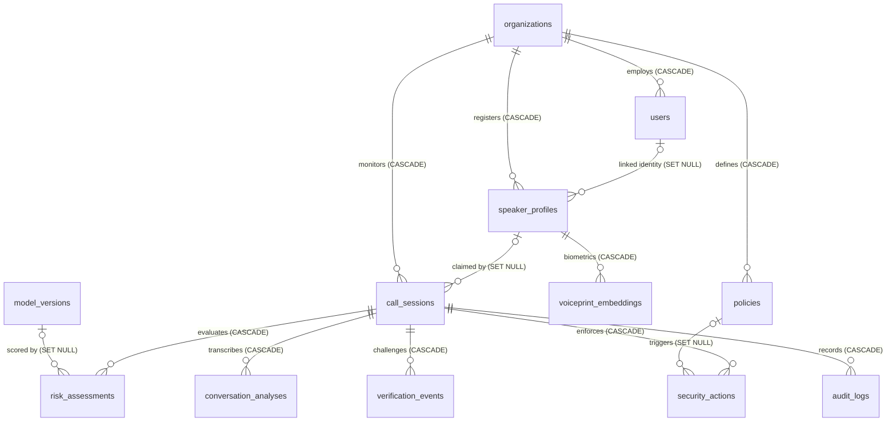
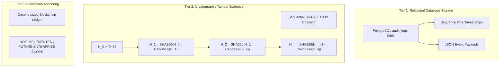

# TrueVoice Database Contract Specification

**Document Version:** 1.0.0  
**Target Schema Version:** `001_initial_schema` (Alembic)  
**Status:** Baseline Implementation Grounded  
**Source of Truth:** SQLAlchemy Models (`backend/app/models/`), Alembic Migration (`backend/alembic/versions/001_initial_schema.py`), and Service Persistence Code  

---

## 1. Database Overview

The TrueVoice persistence layer is designed to support real-time forensic streaming, multi-tenant enterprise isolation, biometric speaker verification, declarative security policy administration, and cryptographic auditability with zero raw audio persistence.

| Architectural Dimension | Implementation Specification | Evidence in Codebase |
| :--- | :--- | :--- |
| **Primary Database Engine** | PostgreSQL 16+ with native `pgvector` extension enabled (`CREATE EXTENSION IF NOT EXISTS "vector"`) | [`backend/alembic/versions/001_initial_schema.py:26`](file:///c:/Projects/SIH/backend/alembic/versions/001_initial_schema.py#L26) |
| **Testing / CI Engine** | SQLite in-memory with `aiosqlite` dialect fallback | [`backend/app/config.py:32`](file:///c:/Projects/SIH/backend/app/config.py#L32) |
| **ORM / Query Engine** | SQLAlchemy 2.0 async (`AsyncSession`, `asyncpg` driver) | [`backend/app/db/session.py`](file:///c:/Projects/SIH/backend/app/db/session.py) |
| **Migration Framework** | Alembic (async execution environment in `env.py`) | [`backend/alembic/`](file:///c:/Projects/SIH/backend/alembic/) |
| **Naming Conventions** | Lowercase snake_case for tables (plural nouns) and columns | All model files |
| **Primary Key Strategy** | `UniversalUUID`: Native PostgreSQL `UUID(as_uuid=True)` / SQLite `String(36)` | [`backend/app/models/base.py:18`](file:///c:/Projects/SIH/backend/app/models/base.py#L18) |
| **Timestamp Strategy** | `DateTime(timezone=True)` storing UTC timestamps defaulted via `utc_now()` | [`backend/app/models/base.py:80`](file:///c:/Projects/SIH/backend/app/models/base.py#L80) |
| **Vector Biometrics** | `Vector192`: Native `pgvector.sqlalchemy.Vector(192)` / SQLite JSON `String` | [`backend/app/models/base.py:44`](file:///c:/Projects/SIH/backend/app/models/base.py#L44) |
| **Multi-Tenancy** | Foreign key `org_id` on tenant entities; cascade deletion on organization drop | [`backend/app/models/organization.py`](file:///c:/Projects/SIH/backend/app/models/organization.py) |
| **Raw Audio Policy** | **Strict Zero Raw Audio Storage:** No audio chunks, binary blobs, or files are stored in the database. | Schema & code verified |

---

## 2. Table Inventory

The TrueVoice schema defines **12 relational entities** provisioned in Alembic migration `001_initial_schema.py`:

| # | Table Name | Purpose | Primary Key | Tenant Scoped? | Key Relationships |
|---|:--- | :--- | :---: | :---: | :--- |
| **1** | `organizations` | Multi-tenant customer account boundary | `id` (UUID) | **Root Tenant** | Parent to `users`, `policies`, `speaker_profiles`, `call_sessions` |
| **2** | `users` | Authenticated operators, analysts, and administrators | `id` (UUID) | Yes (`org_id`) | Child of `organizations`; optionally linked to `speaker_profiles` |
| **3** | `policies` | Declarative organizational risk thresholds and enforcement rules | `id` (UUID) | Yes (`org_id`) | Child of `organizations`; parent to `security_actions` |
| **4** | `speaker_profiles` | Biometric reference profiles for enrolled VIPs and trusted callers | `id` (UUID) | Yes (`org_id`) | Child of `organizations`; parent to `voiceprint_embeddings` |
| **5** | `voiceprint_embeddings` | 192-dimensional unit-hypersphere speaker embedding vectors | `id` (UUID) | Indirect (`speaker_profile_id`) | Child of `speaker_profiles` |
| **6** | `model_versions` | Traceability and checksum repository for AI/ML detector models | `id` (UUID) | Global System Catalog | Parent to `risk_assessments` |
| **7** | `call_sessions` | Active and historical voice interaction sessions | `id` (UUID) | Yes (`org_id`) | Child of `organizations`; parent to assessments, actions, events |
| **8** | `risk_assessments` | Windowed multi-signal risk evaluations per 0.5s audio hop | `id` (UUID) | Indirect (`session_id`) | Child of `call_sessions` and `model_versions` |
| **9** | `conversation_analyses`| Redacted speech transcripts and conversational intent flags | `id` (UUID) | Indirect (`session_id`) | Child of `call_sessions` |
| **10**| `verification_events` | Secondary challenge-response ceremonies and cryptographic nonces | `id` (UUID) | Indirect (`session_id`) | Child of `call_sessions` |
| **11**| `security_actions` | Emitted defensive actions and workflow lock directives | `id` (UUID) | Indirect (`session_id`) | Child of `call_sessions` and `policies` |
| **12**| `audit_logs` | Tamper-evident SHA-256 hash-chained event ledger | `id` (UUID) | Indirect (`session_id`) | Child of `call_sessions` |

---

## 3. Table-by-Table Contract

### 3.1 `organizations`
Multi-tenant boundary for customer organizations (banks, enterprises, contact centers).

| Column | Type | Nullable | Default | PK | FK | Unique | Description |
| :--- | :--- | :---: | :---: | :---: | :---: | :---: | :--- |
| `id` | `UUID` / `String(36)` | No | `uuid4()` | **Yes** | — | **Yes** | Primary key |
| `name` | `String(150)` | No | — | No | — | No | Full organization legal name |
| `tenant_code` | `String(64)` | No | — | No | — | **Yes** | Unique slug for tenant routing (indexed) |
| `is_active` | `Boolean` | No | `true` | No | — | No | Account operational status |
| `created_at` | `DateTime(TZ)` | No | `utc_now()` | No | — | No | Record creation timestamp |

---

### 3.2 `users`
System operators, security analysts, organization administrators, and forensic auditors.

| Column | Type | Nullable | Default | PK | FK | Unique | Description |
| :--- | :--- | :---: | :---: | :---: | :---: | :---: | :--- |
| `id` | `UUID` / `String(36)` | No | `uuid4()` | **Yes** | — | **Yes** | Primary key |
| `org_id` | `UUID` / `String(36)` | No | — | No | `organizations.id` | No | Foreign key to tenant (CASCADE) |
| `email` | `String(255)` | No | — | No | — | **Yes** | Unique login email address (indexed) |
| `full_name` | `String(150)` | No | — | No | — | No | User's full name |
| `role` | `String(50)` | No | — | No | — | No | RBAC Role (`OPERATOR`, `SECURITY_ANALYST`, `ORG_ADMIN`, `FORENSIC_AUDITOR`) |
| `password_hash` | `String(255)` | No | — | No | — | No | Bcrypt-hashed password salt and hash |
| `is_active` | `Boolean` | No | `true` | No | — | No | Account status |
| `created_at` | `DateTime(TZ)` | No | `utc_now()` | No | — | No | Creation timestamp |

---

### 3.3 `policies`
Declarative organization-level risk thresholds and security enforcement rules.

| Column | Type | Nullable | Default | PK | FK | Unique | Description |
| :--- | :--- | :---: | :---: | :---: | :---: | :---: | :--- |
| `id` | `UUID` / `String(36)` | No | `uuid4()` | **Yes** | — | **Yes** | Primary key |
| `org_id` | `UUID` / `String(36)` | No | — | No | `organizations.id` | No | Foreign key to tenant (CASCADE) |
| `policy_name` | `String(100)` | No | — | No | — | No | Policy rule set name |
| `caution_threshold` | `Float` | No | `30.0` | No | — | No | Score threshold transitioning to `CAUTION` |
| `verify_threshold` | `Float` | No | `60.0` | No | — | No | Score threshold triggering `VERIFYING` |
| `block_threshold` | `Float` | No | `80.0` | No | — | No | Score threshold triggering `BLOCKED` |
| `enforce_transaction_lock` | `Boolean` | No | `true` | No | — | No | Flag to emit workflow lock signals |
| `sensitive_amount_threshold` | `Float` | No | `250000.0`| No | — | No | High-value threshold for step-up challenge |
| `oob_timeout_seconds` | `Integer` | No | `30` | No | — | No | Challenge validity duration |
| `version` | `String(32)` | No | `'1.0.0'` | No | — | No | Policy version string |
| `created_at` | `DateTime(TZ)` | No | `utc_now()` | No | — | No | Timestamp of policy activation |

---

### 3.4 `speaker_profiles`
Enrolled voiceprint metadata for executives, VIPs, or customer accounts.

| Column | Type | Nullable | Default | PK | FK | Unique | Description |
| :--- | :--- | :---: | :---: | :---: | :---: | :---: | :--- |
| `id` | `UUID` / `String(36)` | No | `uuid4()` | **Yes** | — | **Yes** | Primary key |
| `org_id` | `UUID` / `String(36)` | No | — | No | `organizations.id` | No | Foreign key to tenant (CASCADE) |
| `user_id` | `UUID` / `String(36)` | **Yes** | `null` | No | `users.id` | No | Optional reference to internal user (SET NULL) |
| `display_name` | `String(150)` | No | — | No | — | No | Full name of enrolled speaker |
| `designation` | `String(100)` | No | — | No | — | No | Role designation (e.g. "CEO") |
| `consent_timestamp` | `DateTime(TZ)` | No | `utc_now()` | No | — | No | Explicit biometric consent timestamp |
| `is_active` | `Boolean` | No | `true` | No | — | No | Profile active status (soft-delete flag) |
| `created_at` | `DateTime(TZ)` | No | `utc_now()` | No | — | No | Profile registration timestamp |

---

### 3.5 `voiceprint_embeddings`
192-dimensional unit-hypersphere speaker embedding vectors extracted via ECAPA-TDNN.

| Column | Type | Nullable | Default | PK | FK | Unique | Description |
| :--- | :--- | :---: | :---: | :---: | :---: | :---: | :--- |
| `id` | `UUID` / `String(36)` | No | `uuid4()` | **Yes** | — | **Yes** | Primary key |
| `speaker_profile_id` | `UUID` / `String(36)` | No | — | No | `speaker_profiles.id` | No | Foreign key to profile (CASCADE) |
| `embedding` | `Vector(192)` / `String`| No | — | No | — | No | 192-dimensional floating-point vector |
| `quality_score` | `Float` | No | `1.0` | No | — | No | Enrollment audio quality metric |
| `sample_duration_seconds`| `Float` | No | — | No | — | No | Total audio duration used for enrollment |
| `enrolled_at` | `DateTime(TZ)` | No | `utc_now()` | No | — | No | Enrollment timestamp |

---

### 3.6 `model_versions`
System-wide registry tracking deployed machine learning model weights, architectures, and checksums.

| Column | Type | Nullable | Default | PK | FK | Unique | Description |
| :--- | :--- | :---: | :---: | :---: | :---: | :---: | :--- |
| `id` | `UUID` / `String(36)` | No | `uuid4()` | **Yes** | — | **Yes** | Primary key |
| `model_name` | `String(100)` | No | — | No | — | No | Architecture (`wav2vec2`, `rawnet2`, `ecapa`, `whisper`) |
| `version_tag` | `String(50)` | No | — | No | — | **Yes** | Unique version identifier (indexed) |
| `weights_digest` | `String(64)` | No | — | No | — | No | SHA-256 checksum of model checkpoint |
| `checkpoint_uri` | `String(255)` | **Yes** | `null` | No | — | No | Checkpoint storage URI or registry path |
| `configuration` | `JSON` | No | `{}` | No | — | No | Hyperparameters and inference configuration |
| `deployed_at` | `DateTime(TZ)` | No | `utc_now()` | No | — | No | Deployment timestamp |

---

### 3.7 `call_sessions`
Active and concluded monitored voice interaction sessions.

| Column | Type | Nullable | Default | PK | FK | Unique | Description |
| :--- | :--- | :---: | :---: | :---: | :---: | :---: | :--- |
| `id` | `UUID` / `String(36)` | No | `uuid4()` | **Yes** | — | **Yes** | Primary key |
| `org_id` | `UUID` / `String(36)` | No | — | No | `organizations.id` | No | Foreign key to tenant (CASCADE) |
| `session_token` | `String(64)` | No | — | No | — | **Yes** | Unique session token string (`tvs_...`) |
| `claimed_speaker_id` | `UUID` / `String(36)` | **Yes** | `null` | No | `speaker_profiles.id`| No | Claimed identity (SET NULL on delete) |
| `caller_ani` | `String(32)` | No | `'UNKNOWN'` | No | — | No | Caller ID / ANI metadata from telecom gateway |
| `context_metadata` | `JSON` | No | `{}` | No | — | No | Contextual features (transaction amount, channel) |
| `current_trust_state` | `String(32)` | No | `'OBSERVING'`| No | — | No | Zero-Trust state machine operational state |
| `peak_risk_score` | `Float` | No | `0.0` | No | — | No | Highest composite risk recorded during call |
| `started_at` | `DateTime(TZ)` | No | `utc_now()` | No | — | No | Session initialization timestamp |
| `ended_at` | `DateTime(TZ)` | **Yes** | `null` | No | — | No | Session termination timestamp |

---

### 3.8 `risk_assessments`
Windowed multi-signal risk evaluations produced on every 0.5s hop.

| Column | Type | Nullable | Default | PK | FK | Unique | Description |
| :--- | :--- | :---: | :---: | :---: | :---: | :---: | :--- |
| `id` | `UUID` / `String(36)` | No | `uuid4()` | **Yes** | — | **Yes** | Primary key |
| `session_id` | `UUID` / `String(36)` | No | — | No | `call_sessions.id` | No | Foreign key to session (CASCADE) |
| `model_version_id` | `UUID` / `String(36)` | **Yes** | `null` | No | `model_versions.id`| No | Foreign key to model version (SET NULL) |
| `sequence_id` | `Integer` | No | — | No | — | No | Monotonically increasing hop sequence index |
| `synthetic_prob` | `Float` | No | — | No | — | No | Deepfake synthetic probability ($0.0 \le x \le 100.0$) |
| `speaker_similarity` | `Float` | **Yes** | `null` | No | — | No | Normalized speaker similarity ($0.0 \le x \le 1.0$) |
| `forensic_score` | `Float` | No | — | No | — | No | Acoustic forensic anomaly score ($0.0 \le x \le 100.0$) |
| `conversational_score`| `Float` | No | — | No | — | No | Social engineering / urgency score ($0.0 \le x \le 1.0$) |
| `composite_risk` | `Float` | No | — | No | — | No | Fused risk score ($0.0 \le x \le 100.0$) |
| `risk_tier` | `String(16)` | No | — | No | — | No | `LOW`, `MODERATE`, `HIGH`, `CRITICAL` |
| `primary_factors` | `JSON` | No | `[]` | No | — | No | Human-readable explanation factor strings |
| `evidence_provenance` | `JSON` | No | `{}` | No | — | No | Full signal weights, models, and flags |
| `recorded_at` | `DateTime(TZ)` | No | `utc_now()` | No | — | No | Timestamp of window evaluation |

---

### 3.9 `conversation_analyses`
Redacted speech transcripts and social engineering intent flags.

| Column | Type | Nullable | Default | PK | FK | Unique | Description |
| :--- | :--- | :---: | :---: | :---: | :---: | :---: | :--- |
| `id` | `UUID` / `String(36)` | No | `uuid4()` | **Yes** | — | **Yes** | Primary key |
| `session_id` | `UUID` / `String(36)` | No | — | No | `call_sessions.id` | No | Foreign key to session (CASCADE) |
| `sequence_id` | `Integer` | No | — | No | — | No | Evaluation sequence index |
| `transcript_redacted` | `Text` | No | — | No | — | No | Redacted speech-to-text transcript |
| `detected_intent_flags`| `JSON` | No | `[]` | No | — | No | Array of intent tags (`["URGENCY", "WIRE_TRANSFER"]`) |
| `recorded_at` | `DateTime(TZ)` | No | `utc_now()` | No | — | No | Transcription timestamp |

---

### 3.10 `verification_events`
Secondary challenge-response ceremonies and cryptographic tokens.

| Column | Type | Nullable | Default | PK | FK | Unique | Description |
| :--- | :--- | :---: | :---: | :---: | :---: | :---: | :--- |
| `id` | `UUID` / `String(36)` | No | `uuid4()` | **Yes** | — | **Yes** | Primary key |
| `session_id` | `UUID` / `String(36)` | No | — | No | `call_sessions.id` | No | Foreign key to session (CASCADE) |
| `challenge_type` | `String(32)` | No | `'OOB_PUSH'`| No | — | No | `OOB_PUSH`, `IN_BAND_CHALLENGE`, `SECURE_CALLBACK` |
| `challenge_token` | `String(64)` | No | — | No | — | **Yes** | Unique token bound to challenge (indexed) |
| `nonce` | `String(64)` | No | — | No | — | No | High-entropy random challenge nonce |
| `status` | `String(32)` | No | `'PENDING'` | No | — | No | `PENDING`, `SUCCESS`, `TIMEOUT`, `REJECTED` |
| `attempt_count` | `Integer` | No | `0` | No | — | No | Number of validation attempts (max 3) |
| `expires_at` | `DateTime(TZ)` | No | — | No | — | No | Timestamp of challenge expiry (30s TTL) |
| `dispatched_at` | `DateTime(TZ)` | No | `utc_now()` | No | — | No | Timestamp of dispatch |
| `resolved_at` | `DateTime(TZ)` | **Yes** | `null` | No | — | No | Timestamp of challenge completion |

---

### 3.11 `security_actions`
Defensive policy enforcement decisions and workflow lock directives.

| Column | Type | Nullable | Default | PK | FK | Unique | Description |
| :--- | :--- | :---: | :---: | :---: | :---: | :---: | :--- |
| `id` | `UUID` / `String(36)` | No | `uuid4()` | **Yes** | — | **Yes** | Primary key |
| `session_id` | `UUID` / `String(36)` | No | — | No | `call_sessions.id` | No | Foreign key to session (CASCADE) |
| `policy_id` | `UUID` / `String(36)` | **Yes** | `null` | No | `policies.id` | No | Policy triggered (SET NULL) |
| `action_type` | `String(64)` | No | `'ALLOW'` | No | — | No | `ALLOW`, `WARN`, `REQUEST_VERIFICATION`, `RESTRICT`, `BLOCK`, `HUMAN_REVIEW` |
| `triggered_by` | `String(32)` | No | `'POLICY_AUTO'` | No | — | No | `POLICY_AUTO`, `OPERATOR_MANUAL`, `ANALYST_OVERRIDE` |
| `triggering_reason` | `Text` | No | — | No | — | No | Explanation of policy match |
| `execution_status` | `String(32)` | No | `'PENDING'` | No | — | No | `PENDING`, `EXECUTED`, `FAILED` |
| `executed_at` | `DateTime(TZ)` | No | `utc_now()` | No | — | No | Execution timestamp |

---

### 3.12 `audit_logs`
Sequential, cryptographically chained tamper-evident audit ledger entries.

| Column | Type | Nullable | Default | PK | FK | Unique | Description |
| :--- | :--- | :---: | :---: | :---: | :---: | :---: | :--- |
| `id` | `UUID` / `String(36)` | No | `uuid4()` | **Yes** | — | **Yes** | Primary key |
| `session_id` | `UUID` / `String(36)` | No | — | No | `call_sessions.id` | No | Foreign key to session (CASCADE) |
| `sequence_id` | `Integer` | No | — | No | — | No | Sequential record counter (indexed) |
| `event_type` | `String(64)` | No | — | No | — | No | Standardized event type string |
| `prev_event_hash` | `String(64)` | No | — | No | — | No | SHA-256 hash of previous record ($H_{n-1}$) |
| `event_hash` | `String(64)` | No | — | No | — | **Yes** | Computed SHA-256 hash of this record ($H_n$) |
| `trust_state` | `String(32)` | No | — | No | — | No | Zero-Trust state at moment of event |
| `payload_json` | `JSON` | No | `{}` | No | — | No | Event data payload (RFC 8785 serialized) |
| `created_at` | `DateTime(TZ)` | No | `utc_now()` | No | — | No | Ledger entry creation timestamp |

---

## 4. Relationships & Entity-Relationship (ER) Diagram

---

## 5. Indexes and Constraints

### 5.1 Primary Key & Foreign Key Constraints

| Constraint Name | Target Table | Target Columns | Reference Table & Columns | On Delete Action |
| :--- | :--- | :--- | :--- | :--- |
| `fk_users_org_id` | `users` | `org_id` | `organizations(id)` | `CASCADE` |
| `fk_policies_org_id` | `policies` | `org_id` | `organizations(id)` | `CASCADE` |
| `fk_speaker_profiles_org_id` | `speaker_profiles` | `org_id` | `organizations(id)` | `CASCADE` |
| `fk_speaker_profiles_user_id`| `speaker_profiles` | `user_id` | `users(id)` | `SET NULL` |
| `fk_voiceprints_profile_id` | `voiceprint_embeddings` | `speaker_profile_id`| `speaker_profiles(id)` | `CASCADE` |
| `fk_sessions_org_id` | `call_sessions` | `org_id` | `organizations(id)` | `CASCADE` |
| `fk_sessions_speaker_id` | `call_sessions` | `claimed_speaker_id`| `speaker_profiles(id)` | `SET NULL` |
| `fk_risk_session_id` | `risk_assessments` | `session_id` | `call_sessions(id)` | `CASCADE` |
| `fk_risk_model_version_id` | `risk_assessments` | `model_version_id` | `model_versions(id)` | `SET NULL` |
| `fk_conv_session_id` | `conversation_analyses`| `session_id` | `call_sessions(id)` | `CASCADE` |
| `fk_verify_session_id` | `verification_events` | `session_id` | `call_sessions(id)` | `CASCADE` |
| `fk_actions_session_id` | `security_actions` | `session_id` | `call_sessions(id)` | `CASCADE` |
| `fk_actions_policy_id` | `security_actions` | `policy_id` | `policies(id)` | `SET NULL` |
| `fk_audit_session_id` | `audit_logs` | `session_id` | `call_sessions(id)` | `CASCADE` |

### 5.2 Performance & Vector Indexes

| Index Name | Table | Indexed Columns | Index Type | Purpose |
| :--- | :--- | :--- | :---: | :--- |
| `idx_org_tenant_code` | `organizations` | `tenant_code` | B-Tree (Unique) | O(1) tenant lookup during routing |
| `idx_user_org_id` | `users` | `org_id` | B-Tree | Fast filtering of users by tenant |
| `idx_user_email` | `users` | `email` | B-Tree (Unique) | Rapid credential lookup during login |
| `idx_policy_org_id` | `policies` | `org_id` | B-Tree | Tenant policy retrieval |
| `idx_speaker_org_id` | `speaker_profiles` | `org_id` | B-Tree | Tenant speaker profile listing |
| `idx_voiceprint_speaker_id` | `voiceprint_embeddings` | `speaker_profile_id` | B-Tree | Profile voiceprint resolution |
| `idx_voiceprint_cosine` | `voiceprint_embeddings` | `embedding` | **HNSW** (`vector_cosine_ops`) | Approximate Nearest Neighbor cosine search ($m=16, ef=64$) |
| `idx_model_version_tag` | `model_versions` | `version_tag` | B-Tree (Unique) | Model version resolution |
| `idx_session_org_id` | `call_sessions` | `org_id` | B-Tree | Tenant session queries |
| `idx_session_token` | `call_sessions` | `session_token` | B-Tree (Unique) | Session token resolution |
| `idx_risk_session_id` | `risk_assessments` | `session_id` | B-Tree | Risk history timeline assembly |
| `idx_conv_session_id` | `conversation_analyses`| `session_id` | B-Tree | Speech analysis history query |
| `idx_verify_session_id`| `verification_events` | `session_id` | B-Tree | Active challenge lookup |
| `idx_verify_token` | `verification_events` | `challenge_token` | B-Tree (Unique) | Fast challenge resolution on proof submission |
| `idx_action_session_id`| `security_actions` | `session_id` | B-Tree | Session security action history |
| `idx_audit_session_id` | `audit_logs` | `session_id` | B-Tree | Chronological audit retrieval |
| `idx_audit_event_hash` | `audit_logs` | `event_hash` | B-Tree (Unique) | Fast cryptographic link verification |

---

## 6. Security Database Contract

### 6.1 Multi-Tenant Isolation
1. **Foreign Key Segregation:** Every operational table (`users`, `policies`, `speaker_profiles`, `call_sessions`) has a direct `org_id` foreign key.
2. **Cascading Deletion:** Deleting an organization automatically cascades deletions to all associated users, policies, sessions, audio analysis records, and audit events.
3. **Session Verification:** All session-child entities (`risk_assessments`, `verification_events`, `security_actions`, `audit_logs`) resolve through `call_sessions.org_id`.

### 6.2 Sensitive Biometric & Voice Data Analysis

| Data Type | Stored in Database? | Exact Column / Table | Security Status & Risk Evaluation |
| :--- | :---: | :--- | :--- |
| **Raw Audio Chunks** | ❌ **NO** | None (Zero persistence) | **VERIFIED COMPLIANT:** Raw voice audio is kept only in ephemeral circular RAM buffers (`AudioRingBuffer`) and purged on WebSocket disconnect. |
| **Speaker Embeddings** | ⚠️ **YES** | `voiceprint_embeddings.embedding` | **SECURITY GAP:** Stored as unencrypted 192-dimensional floating-point vectors. Requires AES-256-GCM envelope encryption at rest. |
| **Transcripts** | ⚠️ **YES** | `conversation_analyses.transcript_redacted` | **COMPLIANT:** PII (PAN, Aadhaar, credit cards, OTP) is regex-redacted before database insertion. |
| **Verification Tokens**| ⚠️ **YES** | `verification_events.challenge_token`, `nonce` | **COMPLIANT:** Random 6-digit nonces with 30-second TTL; marked `consumed=True` / resolved upon verification. |
| **Password Hashes** | ⚠️ **YES** | `users.password_hash` | **COMPLIANT:** Salted bcrypt hashes; plaintext passwords never written. |
| **Audit Log Hashes** | ⚠️ **YES** | `audit_logs.event_hash`, `prev_event_hash` | **COMPLIANT:** SHA-256 hex digests providing mathematical tamper evidence. |

---

## 7. Data Retention Contract

| Data Entity | Persistence Storage | Storage Medium | Retention Policy | Purge / Deletion Mechanism |
| :--- | :--- | :--- | :--- | :--- |
| **Raw Audio Bytes** | In-Memory Only | Ephemeral RAM (`AudioRingBuffer`) | Max 2.0 seconds rolling buffer | Automatically purged from RAM when WebSocket closes or `cleanup_session()` runs |
| **Audio Resampling Cache**| In-Memory Only | Ephemeral RAM | Window duration only | Garbage collected upon hop completion |
| **Speaker Biometrics** | Database | `voiceprint_embeddings` | Indefinite until deactivated | Cascade deleted when `speaker_profiles` record is deleted |
| **Speech Transcripts** | Database | `conversation_analyses` | Retained for session duration | Cascade deleted on session deletion; redacted at ingestion |
| **Risk Telemetry** | Database | `risk_assessments` | Retained for compliance analysis | Cascade deleted on session deletion |
| **Challenge Nonces** | Database | `verification_events` | 30 seconds TTL | Marked `TIMEOUT` or `SUCCESS`; retained for forensic audit |
| **Audit Ledger Records**| Database | `audit_logs` | Permanent audit history | Immutable append-only hash chain; cascade deleted on session deletion |

---

## 8. Audit & Evidence Contract

The TrueVoice audit mechanism is categorized into three tiers of cryptographic and persistence guarantees:

### 8.1 Cryptographic Hash Formula
For every audit event $n$:
$$\text{CanonicalJSON}(E_n) = \text{RFC 8785 JSON}(\{\text{sequence\_id}, \text{session\_id}, \text{event\_type}, \text{trust\_state}, \text{payload}\})$$
$$H_n = \text{SHA-256}(H_{n-1} \parallel \text{CanonicalJSON}(E_n))$$
Where:
- $H_0 = \text{"0"}\times 64$ (Genesis previous hash).
- $\parallel$ denotes string concatenation.

### 8.2 Architectural Distinction
- **Relational Storage:** The records reside in standard PostgreSQL tables and are queryable via SQL.
- **Tamper Evidence:** If any row's payload, sequence, or status is altered directly in the database, `GET /v1/audit/{session_id}/verify-chain` recomputes the chain from $H_0$ and pinpoints the exact sequence number where the hash broke.
- **Blockchain Anchoring:** **NOT IMPLEMENTED.** TrueVoice does not use or require a public or private blockchain in the current MVP baseline. Any claims of blockchain storage are explicitly documented as unverified/not implemented.
