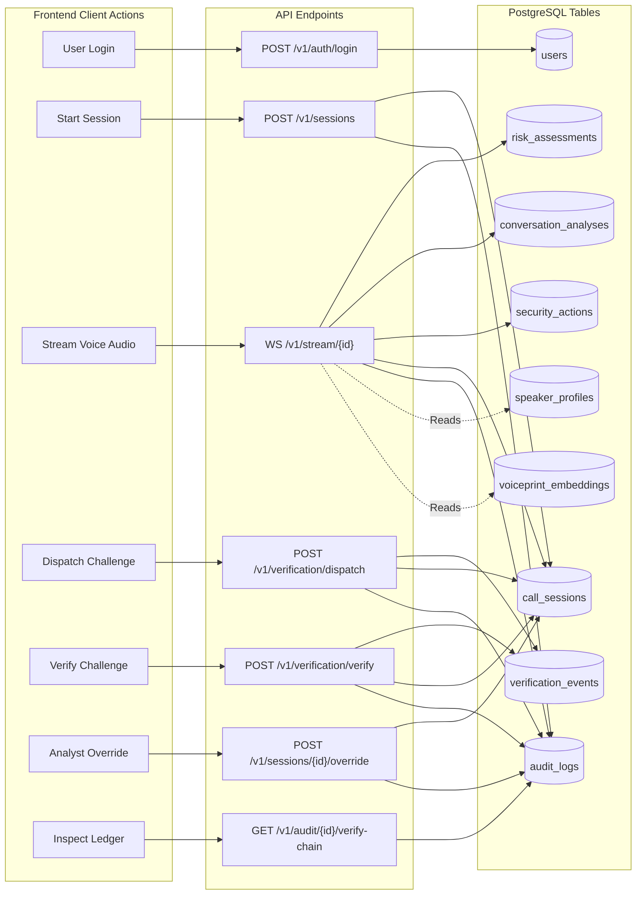
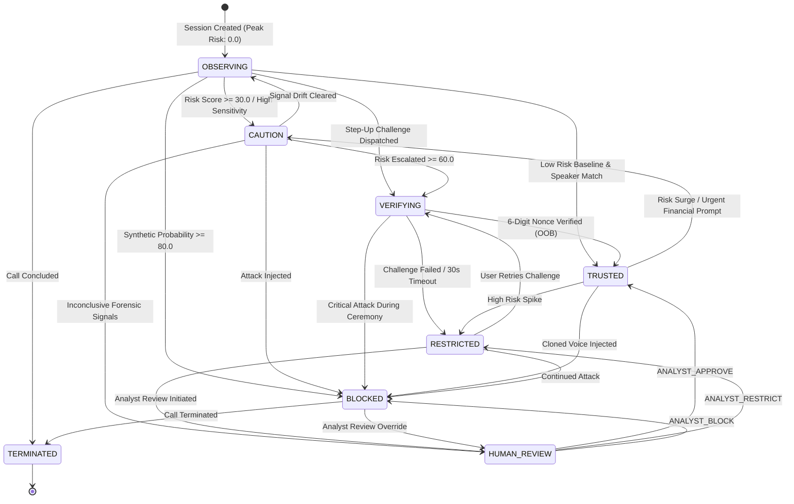
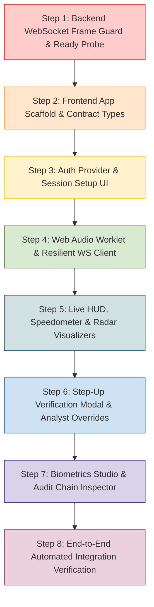

# TrueVoice Real-Time Platform & Frontend Integration Plan

**Branch:** `feature/realtime-platform`  
**Role:** PERSON 4 — Real-Time Platform + Frontend Architect  
**Scope:** WebSocket Pipeline → REST APIs → Existing Backend Services → Database → Frontend Console → Live Security Dashboard  
**Status:** Audit & Architecture Plan Only (Implementation Code Unmodified)  
**Date:** September 18, 2026  

---

## 1. Current Architecture

The TrueVoice real-time platform connects live voice communication streams from client capture interfaces to backend AI intelligence engines, dynamically updates operational trust states, and broadcasts live risk telemetry to analyst and operator consoles.

```mermaid
flowchart TD
    subgraph Client [Client / Operator / Analyst Console]
        MIC[Browser Microphone / Web Audio API]
        OP_UI[Operator Session Workspace]
        HUD_UI[Live Risk & Threat HUD]
        VERIF_UI[Step-Up Challenge Modal]
        AUDIT_UI[Forensic Chain Inspector]
        WS_CLIENT[Resilient WebSocket Client]
        HTTP_CLIENT[Axios / Fetch REST Client]
    end

    subgraph Ingestion_API [FastAPI API & WebSocket Layer]
        AUTH_EP["POST /v1/auth/login<br/>POST /v1/auth/session-token"]
        SESS_EP["POST /v1/sessions<br/>POST /v1/sessions/{id}/terminate<br/>POST /v1/sessions/{id}/override"]
        VERIF_EP["POST /v1/verification/dispatch<br/>POST /v1/verification/verify"]
        WS_EP["WS /v1/stream/{session_id}"]
        AUDIT_EP["GET /v1/audit/{id}/logs<br/>GET /v1/audit/{id}/verify-chain"]
    end

    subgraph Core_Services [Resident Backend Services]
        SESS_SRV[SessionService]
        AUDIO_SRV[AudioService]
        RISK_SRV[RiskService]
        POLICY_SRV[PolicyService]
        VERIF_SRV[VerificationService]
        AUDIT_SRV[AuditService]
    end

    subgraph Memory_Engines [In-Memory Ephemeral Engines]
        RING_BUF[AudioRingBuffer (2.0s win / 0.5s hop)]
        RISK_ENG[SessionRiskEngine (Asymmetric EMA)]
        FSM[ZeroTrustStateMachine (7 States)]
    end

    subgraph Persistence [PostgreSQL + pgvector]
        DB_SESS[(call_sessions)]
        DB_RISK[(risk_assessments)]
        DB_CONV[(conversation_analyses)]
        DB_ACT[(security_actions)]
        DB_VERIF[(verification_events)]
        DB_AUDIT[(audit_logs)]
    end

    MIC -->|Linear PCM16| WS_CLIENT
    WS_CLIENT -->|Binary Audio Frames| WS_EP
    WS_EP --> AUDIO_SRV
    AUDIO_SRV --> RING_BUF
    RING_BUF --> RISK_ENG
    RISK_ENG --> POLICY_SRV
    POLICY_SRV --> FSM
    
    AUDIO_SRV -->|RiskTelemetryBroadcast| WS_EP
    WS_EP -->|JSON Telemetry Frame| WS_CLIENT
    WS_CLIENT --> HUD_UI

    OP_UI --> HTTP_CLIENT
    HTTP_CLIENT --> AUTH_EP & SESS_EP & VERIF_EP & AUDIT_EP
    SESS_EP --> SESS_SRV
    VERIF_EP --> VERIF_SRV
    AUDIT_EP --> AUDIT_SRV

    SESS_SRV --> DB_SESS
    RISK_SRV --> DB_RISK & DB_CONV
    POLICY_SRV --> DB_ACT
    VERIF_SRV --> DB_VERIF
    AUDIT_SRV --> DB_AUDIT
```

---

## 2. Existing API Inventory

The backend currently exposes **23 operational endpoints** (22 HTTP + 1 WebSocket). All were verified directly against `backend/app/api/routes/`:

| Method | Path | Request Schema | Response Schema | Auth | Role | Tenant Scope | Implemented Status | Frontend Consumer |
| :---: | :--- | :--- | :--- | :---: | :---: | :---: | :---: | :--- |
| **POST** | `/v1/auth/login` | `LoginRequest` | `TokenResponse` | None | Public | Open | `IMPLEMENTED` | Login View |
| **POST** | `/v1/auth/session-token` | `SessionTokenRequest` | `SessionTokenResponse` | Bearer | Any | `org_id` | `IMPLEMENTED` | Streaming Client Setup |
| **GET** | `/v1/auth/me` | None | `UserResponse` | Bearer | Any | `org_id` | `IMPLEMENTED` | App Shell / User Profile |
| **POST** | `/v1/sessions` | `SessionCreate` | `SessionResponse` | Bearer | Any | `org_id` | `IMPLEMENTED` | Operator New Call Dialog |
| **GET** | `/v1/sessions` | Query (`skip`, `limit`) | `List[SessionResponse]` | Bearer | Any | `org_id` | `IMPLEMENTED` | Call History Table |
| **GET** | `/v1/sessions/{id}` | Path (`session_id`) | `SessionDetailResponse` | Bearer | Any | `org_id` | `IMPLEMENTED` | Call Inspection View |
| **POST** | `/v1/sessions/{id}/terminate` | Path (`session_id`) | `SessionResponse` | Bearer | Any | `org_id` | `IMPLEMENTED` | Call Termination Button |
| **POST** | `/v1/sessions/{id}/override` | `AnalystOverrideRequest` | `SessionResponse` | Bearer | `SECURITY_ANALYST`, `ORG_ADMIN` | `org_id` | `IMPLEMENTED` | Analyst Decision Panel |
| **POST** | `/v1/speakers/enroll` | `multipart/form-data` | `SpeakerResponse` | Bearer | `SECURITY_ANALYST`, `ORG_ADMIN` | `org_id` | `IMPLEMENTED` | Speaker Enrollment Studio |
| **GET** | `/v1/speakers` | Query (`skip`, `limit`) | `List[SpeakerResponse]` | Bearer | Any | `org_id` | `IMPLEMENTED` | Speaker Directory |
| **GET** | `/v1/speakers/{id}` | Path (`speaker_id`) | `SpeakerResponse` | Bearer | Any | `org_id` | `IMPLEMENTED` | Speaker Detail View |
| **DELETE**| `/v1/speakers/{id}` | Path (`speaker_id`) | `SpeakerResponse` | Bearer | `SECURITY_ANALYST`, `ORG_ADMIN` | `org_id` | `IMPLEMENTED` | Speaker Deactivate Action |
| **POST** | `/v1/verification/dispatch`| `ChallengeDispatch` | `ChallengeResponse` | Bearer | Any | `org_id` | `IMPLEMENTED` | Step-Up Trigger Modal |
| **POST** | `/v1/verification/verify` | `VerificationSubmit` + `session_id` | `VerificationResultSummary` | Bearer | Any | `org_id` | `IMPLEMENTED` | Step-Up Verify Action |
| **GET** | `/v1/risk/{id}/timeline` | Path (`id`), Query | `List[RiskAssessmentResponse]`| Bearer | Any | `org_id` | `IMPLEMENTED` | Historical Risk Chart |
| **GET** | `/v1/risk/{id}/latest` | Path (`id`) | `Optional[RiskAssessmentResponse]`| Bearer | Any | `org_id` | `IMPLEMENTED` | Polling HUD Fallback |
| **GET** | `/v1/policies` | None | `Optional[PolicyResponse]` | Bearer | Any | `org_id` | `IMPLEMENTED` | Policy Configuration Tab |
| **POST** | `/v1/policies` | `PolicyCreate` | `PolicyResponse` | Bearer | `ORG_ADMIN` | `org_id` | `IMPLEMENTED` | Policy Save Button |
| **GET** | `/v1/audit/{id}/logs` | Path (`session_id`) | `List[AuditLogResponse]` | Bearer | `SECURITY_ANALYST`, `ORG_ADMIN`, `AUDITOR` | `org_id` | `IMPLEMENTED` | Audit Trail Table |
| **GET** | `/v1/audit/{id}/verify-chain`| Path (`session_id`) | `AuditChainValidationResult` | Bearer | `SECURITY_ANALYST`, `ORG_ADMIN`, `AUDITOR` | `org_id` | `IMPLEMENTED` | Cryptographic Verifier |
| **GET** | `/health` & `/v1/health` | None | Health JSON Object | None | Public | Global | `IMPLEMENTED` | System Status Indicator |
| **WS** | `/v1/stream/{session_id}` | Binary Audio Chunk / JSON | `RiskTelemetryBroadcast` | Ticket Token | Any (Ticket verified) | `org_id` | `IMPLEMENTED` | Live Audio Streamer & HUD |

---

## 3. Existing WebSocket Contract

The streaming interface is defined in [`backend/app/api/websocket/audio_stream.py`](file:///c:/Projects/SIH/backend/app/api/websocket/audio_stream.py).

### 3.1 Connection Handshake & Authentication
1. **Endpoint URL:** `WS /v1/stream/{session_id}?token=<ticket_token>`
2. **Auth Token:** A short-lived (5 min / 300s) session-scoped ticket issued by `POST /v1/auth/session-token`.
3. **Alternative In-Band Handshake:** If `?token=` is omitted from the URL, the client must immediately transmit a JSON text frame:
   ```json
   {
     "type": "HANDSHAKE",
     "token": "eyJhbGciOiJIUzI1Ni...",
     "sample_rate": 16000,
     "channels": 1,
     "claimed_speaker_id": "7b8e1f2a-5d3c-4a90-b112-9c0d3e5f7a11"
   }
   ```
4. **Server Handshake Acknowledgment:** Upon successful ticket verification and session resolution:
   ```json
   {
     "type": "HANDSHAKE_ACK",
     "session_id": "4c94b7c1-8451-419b-a320-b0b92e76f9d7",
     "status": "STREAM_INITIALIZED",
     "source_sample_rate": 16000,
     "analysis_window_seconds": 2.0,
     "hop_seconds": 0.5
   }
   ```
5. **Rejection Behavior:** If the ticket is invalid, expired, or references another session/tenant, the socket immediately closes with RFC 6455 status code `1008 (Policy Violation)`.

### 3.2 Audio Ingestion Specification
- **Encoding:** Uncompressed Linear PCM.
- **Sample Format:** Signed 16-bit Little-Endian (`int16`, normalized in software to `float32 [-1.0, 1.0]`).
- **Target Processing Sample Rate:** 16,000 Hz. If client sends 44.1 kHz or 48 kHz, polyphase FIR resampling (`scipy.signal.resample_poly`) automatically converts to 16 kHz.
- **Channels:** 1 (Mono).
- **Chunk Ingestion Cadence:** Recommended 100ms chunks (3,200 bytes) or 200ms chunks (6,400 bytes).
- **Window Accumulation:** Ephemeral circular buffer holds 2.0s (32,000 samples). Telemetry fires on every 0.5s hop (8,000 samples).

### 3.3 Control Frames
- **Heartbeat:** Client sends `{"type": "PING", "timestamp": 1758189600000}`; server immediately replies with `{"type": "PONG", "timestamp": ...}`.
- **End of Stream:** Client sends `{"type": "END_OF_STREAM"}` to cleanly flush and disconnect.
- **Buffer Purge on Disconnect:** When the socket disconnects, `AudioService.cleanup_session(session_id)` purges the circular ring buffer, risk engine, and FSM from server RAM. Zero raw audio persists to disk or DB.

---

## 4. Backend Telemetry Contract

### 4.1 Data Pipeline Trace
```text
Audio Chunk (Binary PCM)
  → AudioPipeline.process_incoming_chunk()
  → AudioPipeline.extract_analysis_window() [2.0s window / 0.5s hop]
  → asyncio.gather(DeepfakeDetector, SpeakerVerifier, ForensicsAnalyzer, SpeechRecognizer)
  → IntentAnalyzer.evaluate(transcript) + ContextEngine.evaluate()
  → SessionRiskEngine.evaluate_chunk() [Multi-Signal Fusion + Asymmetric EMA]
  → PolicyService.evaluate_and_enforce() [Declarative Policy + ZeroTrustStateMachine]
  → RiskService.record_assessment() [PostgreSQL persistence]
  → RiskTelemetryBroadcast [JSON Serialization]
  → WebSocket.send_text()
```

### 4.2 Field Availability Status Matrix

| Field | Location in Telemetry Payload | Data Type | Current Implementation Status | Notes |
| :--- | :--- | :--- | :---: | :--- |
| `type` | Root (`"TELEMETRY"`) | `string` | `IMPLEMENTED` | Constant tag identifying telemetry frame |
| `session_id` | Root | `string` (UUID) | `IMPLEMENTED` | Active session identifier |
| `sequence_id` | Root | `integer` | `IMPLEMENTED` | Monotonically increasing hop counter ($1, 2, 3...$) |
| `timestamp` | Root | `string` (ISO 8601) | `IMPLEMENTED` | UTC execution timestamp |
| `risk_score` | Root | `float` ($0.0 - 100.0$) | `IMPLEMENTED` | Asymmetric EMA smoothed composite risk score |
| `risk_tier` | Root | `string` (Enum) | `IMPLEMENTED` | `LOW`, `MODERATE`, `HIGH`, `CRITICAL` |
| `trust_state` | Root | `string` (Enum) | `IMPLEMENTED` | `OBSERVING`, `CAUTION`, `VERIFYING`, `TRUSTED`, `RESTRICTED`, `BLOCKED`, `HUMAN_REVIEW` |
| `security_action` | Root | `string` (Enum) | `IMPLEMENTED` | `ALLOW`, `WARN`, `REQUEST_VERIFICATION`, `RESTRICT`, `BLOCK`, `HUMAN_REVIEW` |
| `detected_intents`| Root | `string[]` | `IMPLEMENTED` | e.g. `["URGENCY_PRESSURE", "FINANCIAL_PROMPT"]` |
| `transcript_snippet`| Root | `string` / `null` | `IMPLEMENTED` | Max 100-character redacted snippet |
| `breakdown.deepfake` | `breakdown` dict | `float` ($0.0 - 100.0$) | `IMPLEMENTED` | Raw deepfake model score |
| `breakdown.speaker_similarity` | `breakdown` dict | `float` ($0.0 - 1.0$) | `IMPLEMENTED` | Normalized geometric similarity |
| `breakdown.forensic_anomaly` | `breakdown` dict | `float` ($0.0 - 100.0$) | `IMPLEMENTED` | Composite DSP anomaly score |
| `breakdown.conversational_threat` | `breakdown` dict | `float` ($0.0 - 100.0$) | `IMPLEMENTED` | Intent score scaled $\times 100$ |
| `breakdown.context_sensitivity` | `breakdown` dict | `float` ($0.0 - 100.0$) | `IMPLEMENTED` | Transaction context scaled $\times 100$ |
| `provenance.deepfake.model_name` | `provenance.deepfake` | `string` | `IMPLEMENTED` | e.g. `"wav2vec2"` |
| `provenance.deepfake.score` | `provenance.deepfake` | `float` | `IMPLEMENTED` | Model prediction score |
| `provenance.deepfake.weight_applied` | `provenance.deepfake` | `float` | `IMPLEMENTED` | Normalized dynamic weight ($0.35$ baseline) |
| `provenance.deepfake.inference_time_ms`| `provenance.deepfake` | `float` | `IMPLEMENTED` | Wall-clock latency in milliseconds |
| `provenance.speaker.similarity` | `provenance.speaker` | `float` / `null` | `IMPLEMENTED` | Similarity score or null if unenrolled |
| `provenance.speaker.verified` | `provenance.speaker` | `boolean` / `null` | `IMPLEMENTED` | Threshold decision |
| `provenance.forensics.features` | `provenance.forensics`| `object` | `IMPLEMENTED` | Raw F0, pitch jump, jitter, shimmer, HNR |
| `provenance.compounding_applied` | `provenance` | `boolean` | `IMPLEMENTED` | Whether $1.35\times$ compounding multiplier fired |
| *Active Challenge Nonce* | N/A | — | **UNAVAILABLE IN TELEMETRY** | Kept out of telemetry for security; obtained via `POST /v1/verification/dispatch` |
| *Full Unredacted Transcript* | N/A | — | **NOT_IMPLEMENTED** | Intentionally suppressed for privacy; redacted snippet only |
| *Audio Packet Latency (Network)* | N/A | — | **NOT CURRENTLY AVAILABLE** | Client-side packet transit time must be calculated in UI via PING/PONG |

---

### 4.3 Proposed Frontend Telemetry TypeScript Interface

```typescript
/**
 * Strict TypeScript definition representing the ACTUAL real-time telemetry
 * broadcasted over WebSocket by the TrueVoice backend.
 * Derived from backend/app/schemas/risk.py:RiskTelemetryBroadcast
 */

export type RiskTier = 'LOW' | 'MODERATE' | 'HIGH' | 'CRITICAL';

export type TrustState =
  | 'OBSERVING'
  | 'CAUTION'
  | 'VERIFYING'
  | 'TRUSTED'
  | 'RESTRICTED'
  | 'BLOCKED'
  | 'HUMAN_REVIEW'
  | 'TERMINATED';

export type SecurityActionType =
  | 'ALLOW'
  | 'WARN'
  | 'REQUEST_VERIFICATION'
  | 'RESTRICT'
  | 'BLOCK'
  | 'HUMAN_REVIEW';

export type SignalAvailability = 'AVAILABLE' | 'UNAVAILABLE' | 'LOW_CONFIDENCE';

export interface SignalProvenanceDeepfake {
  model_name: string;
  model_version: string;
  score: number;
  availability: SignalAvailability;
  weight_applied: number;
  inference_time_ms: number;
}

export interface SignalProvenanceSpeaker {
  model_name: string;
  model_version: string;
  similarity: number | null;
  verified: boolean | null;
  availability: SignalAvailability;
  weight_applied: number;
  inference_time_ms: number;
}

export interface ForensicAcousticFeatures {
  mean_f0_hz: number;
  max_pitch_jump_hz: number;
  jitter_local: number;
  shimmer_local: number;
  hnr_db: number;
  spectral_flatness?: number;
  spectral_flux?: number;
}

export interface SignalProvenanceForensics {
  score: number;
  availability: SignalAvailability;
  weight_applied: number;
  features: ForensicAcousticFeatures;
}

export interface SignalProvenanceConversation {
  score: number;
  availability: SignalAvailability;
  weight_applied: number;
}

export interface SignalProvenanceContext {
  score: number;
  risk_factors: string[];
}

export interface TelemetryProvenance {
  deepfake: SignalProvenanceDeepfake;
  speaker: SignalProvenanceSpeaker;
  forensics: SignalProvenanceForensics;
  conversation: SignalProvenanceConversation;
  context: SignalProvenanceContext;
  compounding_applied: boolean;
  /* NOT CURRENTLY AVAILABLE: gpu_temperature, tensorrt_latency, blockchain_tx_id */
}

export interface TelemetrySignalBreakdown {
  deepfake: number;               // 0.0 - 100.0
  speaker_similarity: number;     // 0.0 - 1.0
  forensic_anomaly: number;       // 0.0 - 100.0
  conversational_threat: number;  // 0.0 - 100.0
  context_sensitivity: number;    // 0.0 - 100.0
}

export interface TrueVoiceTelemetryFrame {
  type: 'TELEMETRY';
  session_id: string;             // UUIDv4 string
  sequence_id: number;            // Monotonic hop sequence (1, 2, 3...)
  timestamp: string;              // ISO 8601 UTC
  risk_score: number;             // Composite smoothed score (0.0 - 100.0)
  risk_tier: RiskTier;
  trust_state: TrustState;
  breakdown: TelemetrySignalBreakdown;
  provenance: TelemetryProvenance;
  security_action: SecurityActionType;
  detected_intents: string[];     // e.g. ["URGENCY_PRESSURE", "FINANCIAL_PROMPT"]
  transcript_snippet: string | null; // Redacted snippet (max 100 chars)

  /* Fields explicitly NOT CURRENTLY AVAILABLE in backend telemetry payload:
   * - active_challenge_nonce: NOT CURRENTLY AVAILABLE (queried via /verification/dispatch)
   * - raw_pcm_waveform: NOT CURRENTLY AVAILABLE (client holds local mic buffer)
   * - client_network_latency_ms: NOT CURRENTLY AVAILABLE (calculated in UI via PING/PONG)
   * - full_unredacted_transcript: NOT CURRENTLY AVAILABLE (suppressed for privacy)
   */
}
```

---

## 5. Frontend Integration Map

| UI Feature / Component | Backend API / WebSocket Route | Trigger / Event | UI Reaction / Visual Element |
| :--- | :--- | :--- | :--- |
| **Authentication Form** | `POST /v1/auth/login` | Form submit | Stores JWT in memory, sets user context, redirects to dashboard |
| **Call Initialization** | `POST /v1/sessions` | Operator starts call | Generates session record, sets initial state to `OBSERVING` |
| **Ticket Acquisition** | `POST /v1/auth/session-token` | Call session ready | Obtains 5-min streaming ticket token |
| **Audio Capture Streamer** | `WS /v1/stream/{session_id}` | Mic input active | Captures PCM16-LE via AudioWorklet, transmits binary chunks |
| **Live Risk Gauge & HUD** | `WS /v1/stream/{session_id}` | Telemetry frame received | Renders speedometer needle, risk tier color badge, action pulse |
| **Temporal Risk Chart** | `WS /v1/stream` + `/v1/risk/timeline` | Every 0.5s hop | Appends point to real-time SVG line chart ($0-100$) |
| **Acoustic Radar Chart** | `WS /v1/stream/{session_id}` | Every 0.5s hop | Plots 5 dimensions: Deepfake, Speaker, Forensics, Intent, Context |
| **Threat Intent Badges** | `WS /v1/stream/{session_id}` | `detected_intents` present | Renders warning pills (e.g. "Urgency Detected", "Wire Transfer Prompt") |
| **Step-Up Verification Modal**| `POST /v1/verification/dispatch` | Policy emits `REQUEST_VERIFICATION` | Opens modal with 30s countdown timer and 6-digit nonce challenge |
| **Challenge Proof Submission**| `POST /v1/verification/verify` | User inputs OTP/signature | Submits proof; updates trust state to `TRUSTED` or `RESTRICTED` |
| **Analyst Manual Override** | `POST /v1/sessions/{id}/override` | Analyst clicks Approve/Block | Dispatches decision with required justification; transitions state |
| **Speaker Enrollment View** | `POST /v1/speakers/enroll` | Analyst uploads sample WAVs | Enrolls new 192-d voiceprint with progress indicator |
| **Cryptographic Audit Viewer**| `GET /v1/audit/{id}/logs` | Analyst opens Audit tab | Renders sequential tamper-evident cards with previous/current hash |
| **Chain Integrity Checker** | `GET /v1/audit/{id}/verify-chain` | Click "Verify Hash Chain" | Recomputes SHA-256 links; displays green check or red tamper alert |

---

## 6. API ↔ Database Mapping Relevant to Real-Time Platform



---

## 7. Authentication Flow

```mermaid
sequenceDiagram
    autonumber
    participant UI as Browser / Frontend App
    participant AuthAPI as /v1/auth
    participant StreamAPI as /v1/stream
    participant DB as PostgreSQL

    UI->>AuthAPI: POST /login (email, password)
    AuthAPI->>DB: Query user by email & verify bcrypt hash
    AuthAPI-->>UI: Return TokenResponse (15-min Bearer JWT, role, org_id)
    Note over UI: Store JWT in memory (React AuthContext)

    UI->>AuthAPI: POST /session-token (session_id) + Bearer JWT
    AuthAPI->>DB: Verify session exists and matches org_id
    AuthAPI-->>UI: Return SessionTokenResponse (5-min Ticket Token)

    UI->>StreamAPI: Connect WS /v1/stream/{session_id}?token={ticket}
    StreamAPI->>StreamAPI: Decode & validate ticket (scope='websocket_stream')
    StreamAPI->>DB: Verify session exists
    StreamAPI-->>UI: HANDSHAKE_ACK
    Note over UI,StreamAPI: Stream initialized; bidirectional telemetry active
```

---

## 8. Tenant & Session Authorization Flow

1. **User Tenant Resolution:** Every Bearer JWT contains `org_id`.
2. **Session Creation Guard:** `POST /v1/sessions` creates sessions bound strictly to `current_user.org_id`. If `claimed_speaker_id` is supplied, the backend verifies that `speaker_profiles.org_id == current_user.org_id`, raising `ResourceNotFoundError` if mismatched.
3. **Session Query Guard:** All session queries (`GET /v1/sessions/{id}`, `POST /terminate`, `POST /override`) execute `where(CallSession.org_id == org_id)`. If an analyst attempts to view another tenant's session, a `TenantAccessViolation` (HTTP 403) or `ResourceNotFoundError` (HTTP 404) is thrown.
4. **WebSocket Streaming Ticket Scoping:** The ticket token encodes both `org_id` and `session_id`. The WebSocket endpoint confirms:
   - Token `scope == "websocket_stream"`.
   - Token `session_id == path.session_id`.
   - Database session belongs to token `org_id`.
   If any check fails, the socket closes with code `1008`.

---

## 9. Session Trust Lifecycle Progression



---

## 10. Required Implementation Work for `feature/realtime-platform`

### 10.1 Backend Modifications (In Scope for Person 4)
- [ ] **WebSocket Frame Protection:** Add a 64 KB check in [`backend/app/api/websocket/audio_stream.py`](file:///c:/Projects/SIH/backend/app/api/websocket/audio_stream.py#L103) before processing binary chunks. Close with RFC 6455 code `1009 (Message Too Big)` if exceeded.
- [ ] **Readiness Probe:** Add `GET /ready` to [`backend/app/api/routes/health.py`](file:///c:/Projects/SIH/backend/app/api/routes/health.py) to enable frontend health indicators to detect when database and ML models are fully warmed up.

### 10.2 Frontend Scaffold & Application (In Scope for Person 4)
- [ ] **Framework Setup:** Initialize Next.js 14+ / React 18+ with TypeScript, Vite/TailwindCSS, and Lucide icons in `frontend/`.
- [ ] **AudioWorklet Ingestion Processor:** Implement an `AudioWorkletNode` script (`pcm-recorder-processor.js`) running off the Web Audio API to convert raw microphone audio (Float32) to Linear PCM16-LE at 16,000 Hz in real time.
- [ ] **Resilient WebSocket Client:** Implement a TypeScript WebSocket client class (`TrueVoiceStreamClient`) with:
  - Automatic reconnection with exponential backoff.
  - Heartbeat `PING` / `PONG` interval (every 15 seconds).
  - Ticket token acquisition and automatic refresh.
  - Typed telemetry frame listeners.
- [ ] **Global State Stores (Zustand / Context):**
  - `useAuthStore`: Active JWT, current user profile, role, tenant code.
  - `useSessionStore`: Active call session metadata, state machine status, peak risk score.
  - `useTelemetryStore`: Rolling telemetry buffer (last 60 hops / 30 seconds), latest breakdown, detected intent tags.
- [ ] **Dashboard & UI Components:**
  - **Live Risk Speedometer HUD:** Circular SVG needle indicating score ($0-100$), color-coded by tier (Green, Amber, Orange, Red).
  - **5-Signal Radar Threat Visualizer:** Multi-axis polygon plotting Deepfake, Speaker Distance, Forensic Anomaly, Conversational Threat, and Context.
  - **Temporal Risk Timeline:** Interactive line chart showing the asymmetric EMA trajectory across consecutive 0.5s analysis hops.
  - **Transcript & Intent Inspector:** Real-time speech snippet display with highlighted social-engineering intent tags.
  - **Step-Up Verification Ceremony Modal:** Interactive popup displaying 30s countdown bar and OTP input field.
  - **Security Analyst Review Panel:** Action buttons for `ANALYST_APPROVE`, `ANALYST_RESTRICT`, and `ANALYST_BLOCK` with mandatory reason input.
  - **Cryptographic Audit Explorer:** Chronological card list showing sequential SHA-256 hash chains with a single-click "Verify Chain Integrity" trigger.

---

## 11. Existing Functionality That Can Be Reused

1. **All 23 Implemented API Endpoints:** Zero new REST routes required for core flows.
2. **`RiskTelemetryBroadcast` Schema:** Serializes all necessary risk, tier, action, and provenance data in exact JSON format.
3. **Session Ticket Token System (`/v1/auth/session-token`):** Safe, authenticated WebSocket streaming without URL credential leaks.
4. **Polyphase Resampler (`scipy.signal.resample_poly`):** Server already handles 44.1 kHz $\to$ 16 kHz conversion if client capture is not native 16 kHz.
5. **Zero-Trust State Machine:** Validated transition rules and analyst overrides already enforce security invariants.
6. **SHA-256 Hash Chain Verifier (`/v1/audit/{id}/verify-chain`):** Real mathematical audit verification available out of the box.
7. **SQLite Test Fixtures (`tests/conftest.py`):** Can be reused for frontend/backend integration testing.

---

## 12. Integration Dependencies on Other Branches

| Branch | Team / Role | Dependency Description | Impact if Unresolved | Workaround for Person 4 |
| :--- | :--- | :--- | :--- | :--- |
| `feature/speaker-asr` | Person 2 & 3 (ML/ASR) | Production ASVspoof weights for Wav2Vec2 and local SpeechBrain checkpoints | Telemetry `score` will reflect simulated/mock DSP ratio | Frontend works seamlessly with mock scores; schemas are identical |
| `feature/docs` | Documentation | Architecture specifications and API/Database contracts | Incomplete documentation | `API_CONTRACT.md` and `DATABASE_CONTRACT.md` already drafted |

---

## 13. Missing Contracts

1. **Audio Worklet Frame Contract:** The exact chunk size for browser AudioWorklet PCM buffers (recommended: 2048 or 4096 samples = ~128ms / 256ms at 16 kHz) needs to be standardized on the client side.
2. **WebSocket Client Error Event Contract:** Standardized frontend error notification codes when WebSocket receives error close frames (e.g. 1008 Policy Violation vs 1006 Abnormal Closure).
3. **UI Toast Notification Envelope:** Uniform frontend UI contract for security alerts (`WARN`, `REQUEST_VERIFICATION`, `BLOCK`).

---

## 14. Security Concerns & Controls

1. **Cross-Site WebSocket Hijacking (CSWSH):** WebSocket connections must validate the HTTP `Origin` header against allowed tenant hostnames in production.
2. **Credential Leaks in URLs:** Never pass long-lived Bearer JWTs in the WebSocket URL. Strictly use the short-lived (5-minute) single-purpose ticket token issued by `POST /v1/auth/session-token`.
3. **Microphone Permissions:** Browser microphone access must request standard getUserMedia permissions over HTTPS, with graceful fallback if the user denies mic access.
4. **Denial-of-Service via WebSocket Flooding:** Enforce a maximum binary frame size of 64 KB on the server before audio buffer concatenation.
5. **PII in Browser Storage:** Never store unredacted transcripts or audio buffers in browser `localStorage` or `sessionStorage`. Keep active streaming data in transient React/Zustand component state only.

---

## 15. Comprehensive Test Plan

### 15.1 Automated Unit & Integration Tests (Backend)
- **Test WebSocket Connection with Ticket Auth:** Verify that valid tickets succeed and invalid/expired tickets receive code `1008`.
- **Test Audio Ingestion & Telemetry Delivery:** Stream synthetic 16kHz PCM frames and assert reception of `TELEMETRY` JSON messages with valid `risk_score` and `breakdown`.
- **Test 64 KB Frame Size Protection:** Send a 100 KB frame and verify the socket terminates with code `1009`.
- **Test Readiness Probe:** Verify `GET /ready` returns 200 when DB is up and 503 when down.

### 15.2 Frontend Component Tests
- **Auth Store Tests:** Login, token expiry, and logout state transitions.
- **WebSocket Client Tests:** Mock WebSocket server verifying reconnect logic, exponential backoff, and PING/PONG handling.
- **HUD Rendering Tests:** Verify that risk score changes dynamically update the speedometer gauge and color badges.
- **Step-Up Challenge Modal Tests:** Verify countdown timer expiration and OTP submission.

### 15.3 End-to-End Integration Flow
1. User logs in as `Alice Admin` (`ORG_ADMIN`).
2. Operator initiates session for `Vikram Malhotra` (`claimed_speaker_id`).
3. Browser requests mic access, acquires WebSocket ticket, and connects to `/v1/stream/{session_id}`.
4. Browser streams 5 seconds of PCM voice audio.
5. Live HUD updates every 0.5s with telemetry breakdown and radar chart metrics.
6. Operator triggers Step-Up Verification; modal opens with 30s timer.
7. Verification OTP submitted; trust state transitions to `TRUSTED`.
8. Call concluded; analyst verifies SHA-256 hash chain in Audit Explorer.

---

## 16. Recommended Implementation Order



1. **Step 1: Backend Protections (Immediate Priority)**
   - Add 64 KB frame guard in `backend/app/api/websocket/audio_stream.py`.
   - Add `GET /ready` probe in `backend/app/api/routes/health.py`.
2. **Step 2: Frontend Scaffold & Type Definitions**
   - Setup Next.js/React project with TypeScript in `frontend/`.
   - Implement `types/telemetry.ts` and `types/api.ts` matching `API_CONTRACT.md`.
3. **Step 3: Authentication & Session Management UI**
   - Implement login screen, token persistence in memory, and session creation dialog.
4. **Step 4: Real-Time Audio Streaming Engine**
   - Implement `AudioWorkletNode` PCM16 capture and `TrueVoiceStreamClient` WebSocket manager.
5. **Step 5: Live Security Monitoring HUD**
   - Build SVG Speedometer gauge, 5-Signal Radar chart, and chronological risk trajectory chart.
6. **Step 6: Security Actions & Step-Up Ceremonies**
   - Implement Step-Up Verification modal and Analyst Manual Override panel.
7. **Step 7: Forensic Audit & Biometrics Views**
   - Implement Speaker Biometrics enrollment view and SHA-256 Hash Chain Integrity Inspector.
8. **Step 8: Integration Verification**
   - Execute automated end-to-end integration tests connecting frontend client to FastAPI backend.

---

## 17. Explicit List of Files Expected to Change / Be Created

### Backend Files (Modifications Restricted to Ingestion / Health)
- `backend/app/api/websocket/audio_stream.py` (Add max 64 KB binary frame protection)
- `backend/app/api/routes/health.py` (Add `/ready` deep dependency probe)
- `backend/tests/integration/test_websocket_stream.py` (New WebSocket streaming integration test suite)

### Frontend Files (New Implementations in `frontend/`)
- `frontend/package.json` & `frontend/tsconfig.json` (Project manifest and TypeScript configuration)
- `frontend/src/types/telemetry.ts` (Exact TypeScript definitions for `TrueVoiceTelemetryFrame`)
- `frontend/src/types/api.ts` (Typed request/response interfaces for all REST endpoints)
- `frontend/src/services/api.ts` (Axios / Fetch REST client with Bearer token interceptor)
- `frontend/src/services/stream.ts` (`TrueVoiceStreamClient` resilient WebSocket manager)
- `frontend/src/audio/pcm-processor.js` (Web Audio API `AudioWorkletProcessor` for 16kHz PCM16-LE)
- `frontend/src/stores/authStore.ts` (Zustand store for user auth and tenant scope)
- `frontend/src/stores/sessionStore.ts` (Zustand store for active call session and state machine)
- `frontend/src/stores/telemetryStore.ts` (Zustand store for real-time telemetry buffer)
- `frontend/src/components/dashboard/RiskGauge.tsx` (SVG Speedometer visualization)
- `frontend/src/components/dashboard/SignalRadar.tsx` (5-axis radar chart for threat dimensions)
- `frontend/src/components/dashboard/RiskTimeline.tsx` (Real-time temporal risk trajectory chart)
- `frontend/src/components/dashboard/ThreatBadges.tsx` (Intent and policy action alert pills)
- `frontend/src/components/verification/ChallengeModal.tsx` (Step-Up verification ceremony popup)
- `frontend/src/components/analyst/OverridePanel.tsx` (Analyst decision buttons and reason input)
- `frontend/src/components/audit/AuditChainViewer.tsx` (Cryptographic hash chain inspector)
- `frontend/src/pages/DashboardPage.tsx` (Unified live monitoring HUD)
- `frontend/src/pages/LoginPage.tsx` (Operator & analyst login view)
- `frontend/src/pages/SpeakersPage.tsx` (Speaker profile enrollment and management view)
- `frontend/src/pages/AuditPage.tsx` (Session audit log explorer and integrity verifier)
