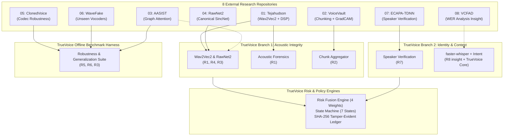

# TrueVoice Open-Source Capability Matrix

## 1. Overview
TrueVoice evaluates eight open-source and research repositories to extract algorithms, model architectures, preprocessing pipelines, and evaluation methodologies. This matrix maps system capabilities to their primary and secondary source repositories, detailing how each capability is integrated into the TrueVoice architecture.

---

## 2. Comprehensive Capability Mapping

| System Capability | Primary Repo | Secondary Repo | TrueVoice Component | Architectural Role | Implementation Status |
| :--- | :--- | :--- | :--- | :--- | :--- |
| **Self-Supervised Deepfake Detection** | `Tejahudson/voice-cloning-detector` | — | `models.wav2vec2_detector` | Branch 1: Acoustic Artifact Detection | Selected for Primary ML Branch |
| **Raw Waveform SincNet Detection** | `NTU-ROSE/RawNet2` | `snehalogic/VoiceVault` | `models.rawnet2_detector` | Branch 1: Lightweight Raw Audio ML Branch | Selected for Low-Latency Mode |
| **Graph Attention Anti-Spoofing** | `clovaai/aasist` | — | `models.aasist_detector` | Branch 1: Advanced SOTA Candidate | Candidate / Offline Benchmark Baseline |
| **DSP Acoustic Forensics (Pitch, Jitter, Shimmer, HNR)** | `Tejahudson/voice-cloning-detector` | — | `core.dsp.forensics` | Branch 1: Deterministic Physical Acoustic Engine | Selected for Real-Time DSP Branch |
| **Sliding Window Chunking & Score Smoothing** | `snehalogic/VoiceVault` | `Tejahudson/voice-cloning-detector` | `core.audio.chunk_aggregator` | Branch 1: Temporal Risk Smoothing | Selected for Ingestion Pipeline |
| **Explainable Saliency Heatmaps (Grad-CAM)** | `snehalogic/VoiceVault` | — | `core.explainability.gradcam` | Security Analyst Dashboard Diagnostics | Selected for Warning/Alert Trigger |
| **Speaker Embedding Extraction (192-d)** | `mpyt/Ecapa-TDNN` | — | `models.speaker_verifier` | Branch 2: Voice Biometric Verification | Selected for Identity Verification Branch |
| **Speaker Enrollment & Centroid Storage** | `mpyt/Ecapa-TDNN` | — | `core.identity.voiceprint` | Branch 2: Executive Voiceprint Vault | Selected for Database Storage Layer |
| **Telephony & Codec Perturbation Pipeline** | `audio-df-ucb/ClonedVoiceDetection` | — | `benchmarks.codec_augmenter` | Offline Benchmarking & Robustness Harness | Selected for Benchmark Pipeline |
| **Unseen Vocoder Multi-Generator Evaluation** | `RUB-SysSec/wavefake` | — | `benchmarks.datasets.wavefake` | Offline Benchmarking & Zero-Day Generalization | Selected for Validation Suite |
| **ASR Transcription Distortion / Confidence** | Independent Implementation (Insight from `pk9444/2xqcTCqAYvy0SJbK`) | — | `core.nlp.acoustic_consistency` | Branch 2: Whisper Token Log-Prob Analysis | Conceptual Adoption via `faster-whisper` |
| **Conversational Context & Social Engineering Intent** | TrueVoice Core Engine (Independent) | — | `core.nlp.intent_analyzer` | Branch 2: Keyword / Heuristic Risk Scoring | Custom Implementation (PRD/HLD Scoped) |
| **Risk Fusion & State Machine** | TrueVoice Core Engine (Independent) | — | `core.risk.fusion_engine` | Central Zero-Trust Orchestrator | Custom Implementation (PRD/HLD Scoped) |

---

## 3. Capability Coverage & Architectural Boundaries

---

## 4. Key Architectural Isolation Principles
1. **Separation of Verification and Detection**: Repo 07 (`mpyt/Ecapa-TDNN`) provides voice biometrics; it is isolated in Branch 2 and never evaluates synthetic artifacts. Repos 01, 02, 03, and 04 provide artifact detection; they are isolated in Branch 1 and never evaluate speaker identity.
2. **Deterministic DSP Guardrails**: Repo 01's mathematical DSP algorithms run in parallel with deep learning models, ensuring that even if an adversarial voice clone evades neural network activations, anomalous zero-crossing rates or pitch step jumps are captured deterministically.
3. **No Blind Dependency Chaining**: Rather than installing 8 separate external packages, TrueVoice cleanly extracts isolated algorithmic modules behind standard internal interfaces (`DeepfakeDetector`, `SpeakerVerifier`).
