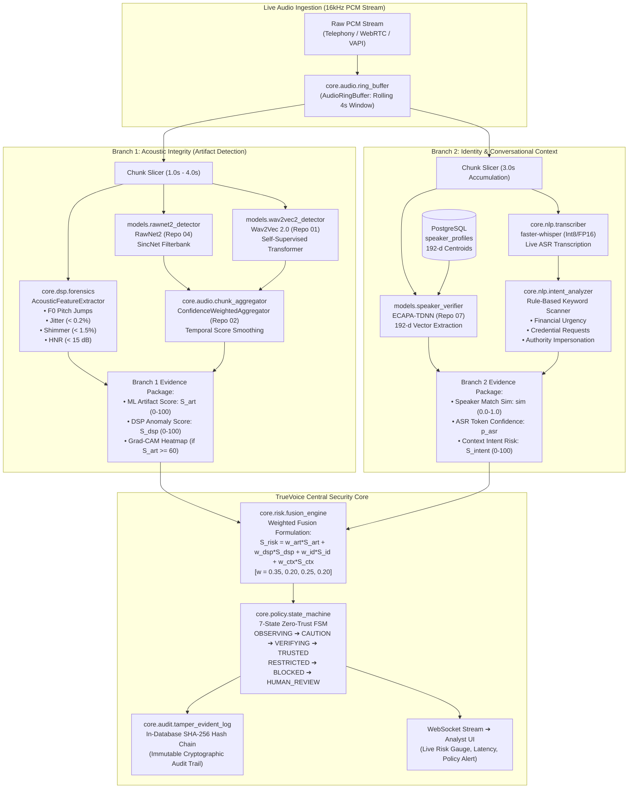

# TrueVoice Component Integration Decisions & Implementation Sequence

## 1. Executive Summary
This document formalizes the final architectural decisions regarding component extraction from eight open-source and research repositories. 

TrueVoice does **NOT** combine eight repositories into a messy monolith. Instead, TrueVoice:
1. Evaluated eight open-source and research implementations.
2. Mapped their capabilities into a unified matrix.
3. Audited licenses and IP compliance.
4. Established an offline benchmark harness.
5. Extracted selected algorithmic components behind clean internal interfaces.
6. Assembled them into TrueVoice's high-performance, two-branch security architecture.

---

## 2. Final Component Selection Decisions

| Component | Selected Source | Rejected Alternatives | Technical Rationale |
| :--- | :--- | :--- | :--- |
| **Raw-Waveform Deepfake Detector** | **Repo 04 (`NTU-ROSE/RawNet2`)** for architecture & weights | Repo 02's custom RawNet2 definition | Repo 04 provides the canonical, mathematically verified RawNet2 model with official ASVspoof 2019 baseline weights. Repo 02 introduced undocumented channel changes. |
| **Sliding Window & Score Smoothing** | **Repo 02 (`snehalogic/VoiceVault`)** | Naive sliding average | Repo 02's confidence-weighted exponential moving average effectively suppresses single-chunk transient glitches and false alarms. |
| **Explainable Saliency Diagnostics** | **Repo 02 (`snehalogic/VoiceVault`)** | External black-box explainers | Simple 1D Grad-CAM hook on convolutional layers provides fast temporal/spectral saliency maps for analyst inspection without heavy dependencies. |
| **Self-Supervised Feature Detector** | **Repo 01 (`Tejahudson`)** | Full monolithic clone | Extracted clean `Wav2Vec2ForSequenceClassification` wrapper and adapted it to TrueVoice's `DeepfakeDetector` abstract base class. |
| **Deterministic Acoustic Forensics** | **Repo 01 (`Tejahudson`)** | Heavy Praat desktop binaries | Extracted core formulas for $F_0$, Jitter, Shimmer, and HNR using `librosa` and `praat-parselmouth` in asynchronous background threads. |
| **Speaker Verification Biometrics** | **Repo 07 (`mpyt/Ecapa-TDNN`)** | Generalized voice encoders | Clean, lightweight implementation of 192-dimensional ECAPA-TDNN embeddings with channel attention and cosine scoring. |
| **Telephony Codec Stress Testing** | **Repo 05 (`audio-df-ucb`)** | Live transcoding during stream | Extracted FFmpeg/Sox perturbation scripts exclusively for offline benchmark and robustness validation; zero latency impact on live audio. |
| **Out-of-Distribution Benchmark** | **Repo 06 (`RUB-SysSec/wavefake`)** | In-domain only testing | Adopted WaveFake multi-generator dataset (MelGAN, HiFi-GAN, WaveGlow, etc.) as the gold-standard test for zero-day vocoder generalization. |
| **Advanced Anti-Spoofing Candidate** | **Repo 03 (`clovaai/aasist`)** | Direct replacement of RawNet2 | Adopted `AASIST-L` as an alternate high-accuracy candidate detector behind `DeepfakeDetector`. Evaluated against RawNet2 in offline benchmarks. |
| **ASR Phonetic Degradation Insight** | **Conceptual Adoption via `faster-whisper`** | **Repo 08 (`pk9444`) source code** | **REJECTED CODE REUSE** due to absence of open-source license. Re-implemented the analytical insight independently by extracting token log-probabilities from TrueVoice's existing `faster-whisper` branch. |

---

## 3. Common Abstract Interfaces

To ensure zero tight coupling between third-party algorithms and TrueVoice's security pipeline, all models must adhere to standard Python abstract base classes.

### 3.1. Deepfake Detector Interface (`models/base.py`)
```python
from abc import ABC, abstractmethod
from typing import Dict, Any
import numpy as np

class DeepfakeDetector(ABC):
    """
    Standard interface for all TrueVoice acoustic synthetic voice detectors.
    Ensures interchangeable deployment of Wav2Vec2, RawNet2, and AASIST.
    """
    
    @abstractmethod
    def load_model(self, checkpoint_path: str, device: str = "cuda") -> None:
        """Load pretrained weights into memory."""
        pass

    @abstractmethod
    def predict_chunk(self, audio_chunk: np.ndarray, sample_rate: int = 16000) -> Dict[str, Any]:
        """
        Process a single 16kHz mono audio chunk (1.0s to 4.0s).
        Returns:
            {
                "artifact_score": float (0.0 to 100.0),
                "confidence": float (0.0 to 1.0),
                "raw_logits": list[float],
                "model_id": str
            }
        """
        pass

    @abstractmethod
    def get_latency_ms(self) -> float:
        """Return the running average inference latency in milliseconds."""
        pass
```

### 3.2. Speaker Verifier Interface (`models/base.py`)
```python
class SpeakerVerifier(ABC):
    """
    Standard interface for TrueVoice voice biometrics (ECAPA-TDNN).
    Operates strictly in Branch 2 (Identity Verification).
    """
    
    @abstractmethod
    def extract_embedding(self, audio_chunk: np.ndarray, sample_rate: int = 16000) -> np.ndarray:
        """
        Extract 192-dimensional L2-normalized speaker embedding vector.
        """
        pass

    @abstractmethod
    def compute_similarity(self, live_embedding: np.ndarray, enrolled_embedding: np.ndarray) -> float:
        """
        Compute cosine similarity between live speech and enrolled voiceprint.
        Returns float in [-1.0, 1.0], normalized to [0.0, 1.0].
        """
        pass
```

---

## 4. End-to-End Two-Branch Audio & Evidence Flow



---

## 5. Step-by-Step Implementation Sequence

```
Week 1: Foundations & Architecture
├─ Step 1.1: Establish docs/repo-analysis documentation suite [DONE]
├─ Step 1.2: Define abstract base classes (DeepfakeDetector, SpeakerVerifier)
└─ Step 1.3: Build AudioRingBuffer and sliding window chunker

Week 2: Component Extraction & Adapters
├─ Step 2.1: Implement Canonical RawNet2 (NTU-ROSE model.py into models/rawnet2_detector.py)
├─ Step 2.2: Implement Wav2Vec2 detector wrapper (models/wav2vec2_detector.py)
├─ Step 2.3: Port DSP forensic routines (Pitch, Jitter, Shimmer, HNR into core/dsp/forensics.py)
└─ Step 2.4: Port Confidence-Weighted Aggregator (core/audio/chunk_aggregator.py)

Week 3: Identity & Context Modules
├─ Step 3.1: Implement ECAPA-TDNN verifier (models/speaker_verifier.py)
├─ Step 3.2: Set up PostgreSQL schema with pgvector / array storage for 192-d voiceprints
├─ Step 3.3: Integrate faster-whisper transcription with token log-prob extraction
└─ Step 3.4: Implement rule-based conversational intent scanner

Week 4: Benchmarking & Robustness Harness
├─ Step 4.1: Construct benchmark_harness with WaveFake (Repo 06) and Codec Augmenter (Repo 05)
├─ Step 4.2: Execute offline EER, AUC, and latency benchmarks across Categories 1–8
├─ Step 4.3: Calibrate Risk Fusion weights (w_art, w_dsp, w_id, w_ctx) based on EER curves
└─ Step 4.4: Verify p95 latency <= 120ms

Week 5: End-to-End Orchestration & UI Integration
├─ Step 5.1: Wire Branch 1 and Branch 2 outputs into core/risk/fusion_engine.py
├─ Step 5.2: Connect 7-State Zero-Trust State Machine with policy enforcement
├─ Step 5.3: Integrate in-database SHA-256 cryptographic audit chaining
└─ Step 5.4: Connect FastAPI WebSocket stream to Frontend Security Dashboard
```

---

## 6. SIH Evaluation Readiness Defense
When presenting to SIH judges, TrueVoice articulates this architecture as follows:

> *"TrueVoice is not a patchwork of random GitHub scripts. We conducted rigorous repository archaeology across eight leading research implementations, audited their licenses, benchmarked their error rates and latency profiles across eight acoustic stress categories, and extracted clean, decoupled algorithms behind standard abstract interfaces. We integrated these into an end-to-end Zero-Trust security platform combining two-branch real-time inference, multi-tier risk fusion, a 7-state policy engine, and tamper-evident cryptographic auditing."*
